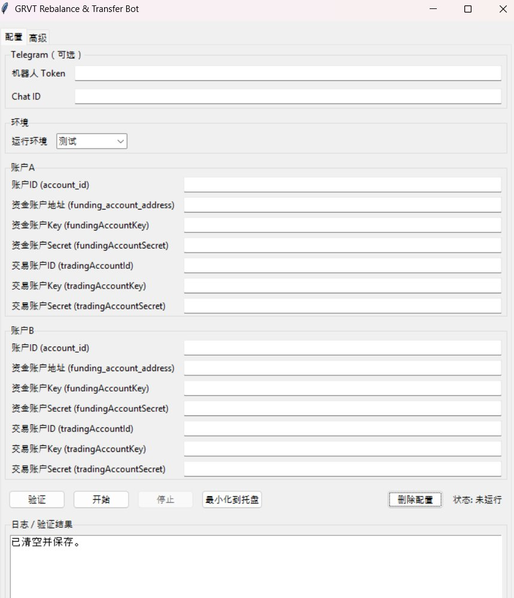
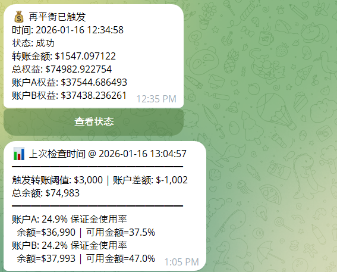
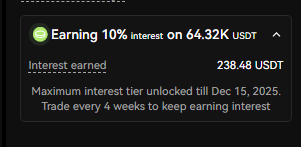
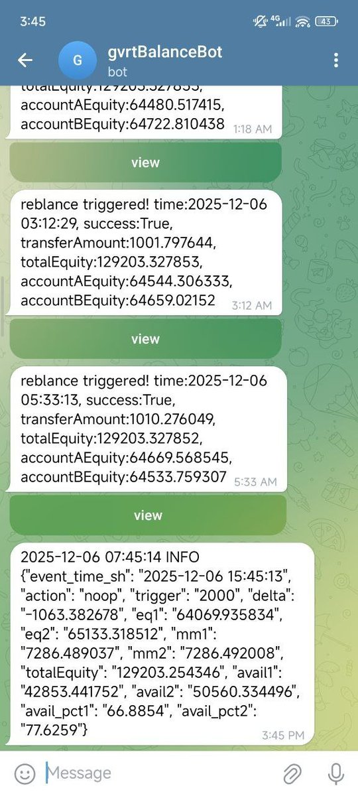

# GRVT 自動平衡腳本：高槓桿策略與風險控制

> **來源**: [@LumaoDoggie](https://x.com/LumaoDoggie/status/2012136028702986418) | [原文連結](https://x.com/LumaoDoggie/status/1997224101715587481)
>
> **日期**: Fri Jan 16 12:13:07 +0000 2026
>
> **標籤**: `GRVT` `DeFi` `自動交易` `槓桿` `風險管理`

---

## GRVT 自動平衡腳本：高槓桿策略與風險控制

**總覽**

| 功能           | 描述                                                                                                |
| -------------- | -------------------------------------------------------------------------------------------------- |
| 自動平衡      | 根據設定的閾值，自動在 GRVT 的 A/B 交易子帳戶間劃轉資金，維持帳戶餘額平衡。                             |
| 緊急減倉      | 在保證金使用率過高時，自動下市價單分批進行雙邊減倉，降低風險。                                             |
| Telegram 告警 | 提供 Telegram 告警功能，可即時接收帳戶狀態更新與異常通知。                                                    |
| 狀態查詢      | 可查詢腳本運行狀態，確保腳本正常運作。                                                                  |
| 手續費返還/積分加成 | 透過作者的推薦連結註冊 GRVT，可享受每月 35% 的交易手續費返還，以及 1.3 倍積分加成。                                      |

**背景介紹**

GRVT 是一個融資超過 3000 萬美元的去中心化交易所（Dex），預計在 2026 年第一季發幣。先前文章介紹了如何無損獲取 GRVT 積分，主要策略是透過雙帳號進行 BTC/ETH 對沖倉位，以賺取 IO 積分。然而，手動平衡倉位的方式，為了安全起見，倉位倍數通常限制在 15 倍以下。

**自動平衡腳本詳解**

本腳本旨在解決手動平衡的限制，提高 GRVT 交易效率的同時，控制風險。透過此腳本，用戶可以更安全地開到 25 倍槓桿。

**主要功能**

*   **資金平衡：**
    *   自動監控兩個 GRVT 交易子帳戶（A/B）的餘額。
    *   當 A/B 兩個帳戶的餘額差額超過預設閾值時，自動執行資金劃轉。
    *   劃轉路徑：帳戶 A 交易帳戶（trading 帳戶） --> 帳戶 A 資金帳戶（funding 帳戶） --> 帳戶 B 資金帳戶 --> 帳戶 B 交易帳戶。

*   **緊急減倉（可選）：**
    *   當保證金使用率過高時，腳本會自動下市價單，分批進行雙邊減倉。

*   **Telegram 告警 + 狀態查詢：**
    *   支援 Telegram 告警推送，即時通知帳戶狀態更新與潛在風險。
    *   可隨時查詢腳本運行狀態，確保腳本正常運作。

**使用方式**

*   Windows 用戶：提供圖形化介面方便設定。
*   Linux 和 Mac 用戶：建議使用 Docker + 命令行方式，具體操作參考 Github 頁面的說明。

**社群交流**

歡迎加入作者的 Telegram 群組，交流交易策略，並詢問腳本相關問題。

**推薦連結**

透過作者的邀請連結註冊 GRVT，即可享有以下優惠：

*   每月手動返還 35% 交易手續費（全網最高）。
*   1.3 倍積分加成。

