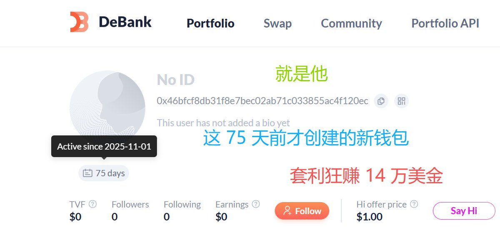
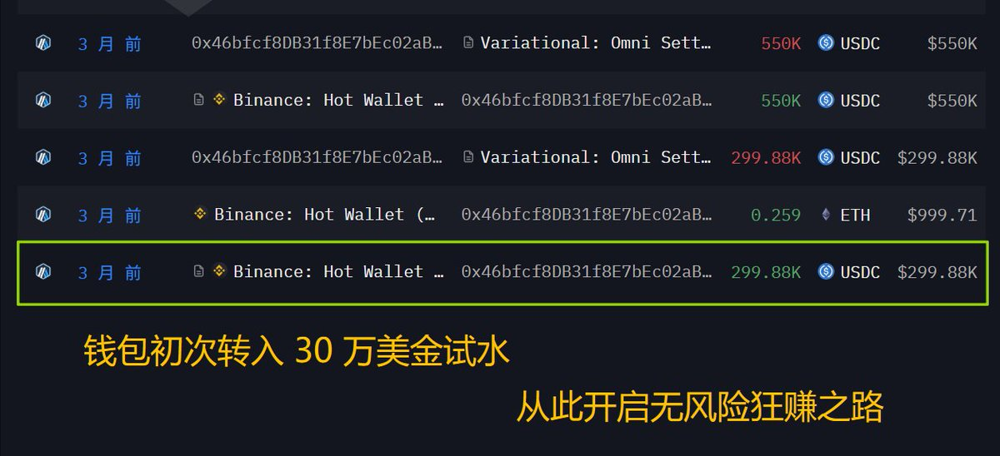
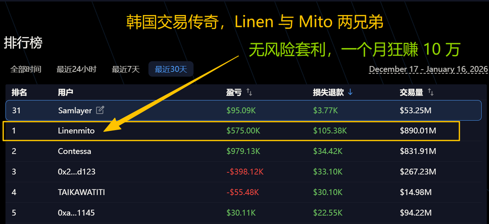

# Variational 平台套利策略分析與心得

> **來源**: [@Airdrop_Guard](https://x.com/Airdrop_Guard/status/2011989328495591788) | [原文連結](https://omni.variational.io/?ref=OMNICOOKIE)
>
> **日期**: Fri Jan 16 02:30:11 +0000 2026
>
> **標籤**: `Variational` `DeFi` `套利` `交易策略` `虧損返還`

---

## Variational 平台套利策略分析與心得

### 簡述

本文分析了一位交易者利用 Variational 平台的虧損返還機制進行無風險套利的策略。作者 @Airdrop_Guard (小熊饼干 . SOL⛵) 分享了他對該策略的觀察，以及自己在 Variational 平台上交易的心得，並推薦其他交易者加入。

### 核心觀點速覽

| 關鍵字          | 說明                                                                                       |
| -------------- | ------------------------------------------------------------------------------------------ |
| 無風險套利       | 透過 Variational 的虧損返還機制，創造虧損並從中獲利。                                                           |
| 虧損返還機制    | Variational 平台的核心特色，交易虧損可獲得返還，提高交易者的潛在勝率。                                                     |
| 交易策略       | 重倉大幣種，養出大額虧損倉位，利用每日 3 次的返還機會，持續從池子裡提款。                                                   |
| 主動觸發返還    | 建議高頻交易者主動控制觸發 “未成年人退款” 的節奏，因為每次返還機會是獨立計時 24 小時後解鎖，而非固定時間重置。                                |
| 51% 的勝率天平 | Variational 的虧損返還機制讓交易者在原本 50% 勝率的基礎上，提升到 51%，長期下來可望穩定獲利。                                              |
| 平台潛力       | 作者認為 Variational 不僅是 Perp，更是真正的流動性基礎設施，未來有機會擴展到 RWA、股票等領域，並吸引大型融資。                               |

### 套利策略分析

一位交易者透過以下方式，從 Variational 平台穩定獲利：

1.  **資金來源：** 從幣安提款 30 萬美金作為本金。
2.  **帳號設置：** 創建一個 75 天前的新錢包，專門用於套利，沒有其他 DeFi 交互紀錄。
3.  **操作手法：**
    *   重倉大幣種，建立大額虧損倉位。
    *   利用每日 3 次的虧損返還機會。
    *   在 24 小時後觸發第 4 筆返還，持續從池子中提款。

作者觀察到，由於該交易者的操作，Variational 池子裡的資金從 16 萬美金降至 6 萬美金，減少了 10 萬美金。這種套利方式無需擔心價格反向波動，只需創造虧損即可獲利。

### 交易者經驗分享

*   **主動觸發 “未成年人退款”：** 建議高頻交易者主動控制觸發返還的節奏。每日 3 次的返還機會並非固定時間重置，而是每次獨立計時 24 小時後解鎖。
*   **變身 51% 的勝率天平：** Variational 的虧損返還機制能提升交易勝率。即使原本只有 50% 的勝率，透過返還機制可以提升到 51%，長期嚴格交易可望穩定獲利。

### 作者心得

作者分享了交易員 @asifeth 在 Variational 平台做多 Lighter 的經驗。 @asifeth 忍痛割肉平倉，結果 3 萬美金全部返還到帳戶，他感動得哭了。

作者認為，虧損全額返還是一種跨時代的創新，真正讓用戶受益。他建議套利者、量化交易員、空投獵人、個人交易者盡快轉移到 Variational 平台進行交易。

作者強調，幣圈需要真正的創新，而 Variational 正是一家具有創新精神的企業。

### Variational 平台潛力

作者認為 Variational 的潛力不僅止於 30U / 分，它是一個真正的流動性基礎設施，未來有機會擴展到 RWA、股票等領域，並吸引大型融資。作者相信 Variational 有潛力從幣圈走向華爾街。

### 內測邀請碼

作者提供內測邀請碼，可獲得 100% 手續費返還，以及 VIP 等級加成 (+12% 積分)。
**(請注意：此邀請碼已過期，僅供參考)**
`https://t.co/NX9pCrxDoR`

