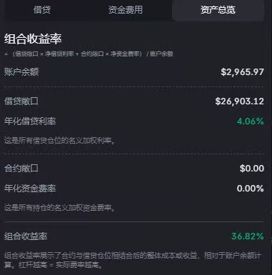
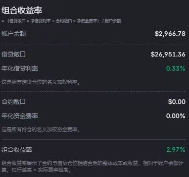

# BP DeFi 套利策略：無風險年化 15-20%?

> **來源**: [@Eno19988](https://x.com/Eno19988/status/2010343333483417822) | [原文連結](https://twitter.com/Eno19988/status/2010343333483417822/photo/1)
>
> **日期**: Sun Jan 11 13:29:35 +0000 2026
>
> **標籤**: `BP` `DeFi` `套利` `借貸` `年化收益`

---

## BP DeFi 套利策略：簡短筆記

**重點：**

*   **策略：** 透過 BP (名稱待考) 上的 U (穩定幣) 和 SOL (Solana) 的借貸利率差異進行套利。
*   **潛在收益：** 作者 @Eno19988 聲稱此策略理論上可實現 15-20% 的年化收益率，但根據最新測試，實際收益率約為 9-11%。
*   **風險：** 儘管作者聲稱是「無風險」，但DeFi套利存在波動性，收益率並非固定。
*   **參考：** 作者分享了使用 6000U 在 BP 開出 54000U 倉位的收益率截圖 (連結在原始推文中)。
*   **時效性：** 作者提到 BP 賽季還有三週結束，因此策略可能具有時效性。

**策略細節：**

該策略的核心是利用穩定幣 U 和 Solana (SOL) 在 BP 上的借貸利率差異。具體操作方法未在原文中詳細說明，需要自行研究 BP 平台的借貸機制。

**注意事項：**

*   DeFi 套利策略存在風險，包括智能合約風險、平台風險和市場波動風險。
*   作者聲稱的「無風險」可能僅指特定情況，實際操作前務必謹慎評估風險。
*   收益率具有波動性，實際收益可能低於作者的測試結果。
*   BP 平台賽季即將結束，策略可能失效。

**總結：**

此筆記整理了 @Eno19988 分享的 BP DeFi 套利策略，重點在於透過 U 和 SOL 的借貸利率差異獲利。儘管聲稱具有高年化收益，但提醒讀者務必謹慎評估風險，並注意策略的時效性。建議深入研究 BP 平台，瞭解具體操作細節。

