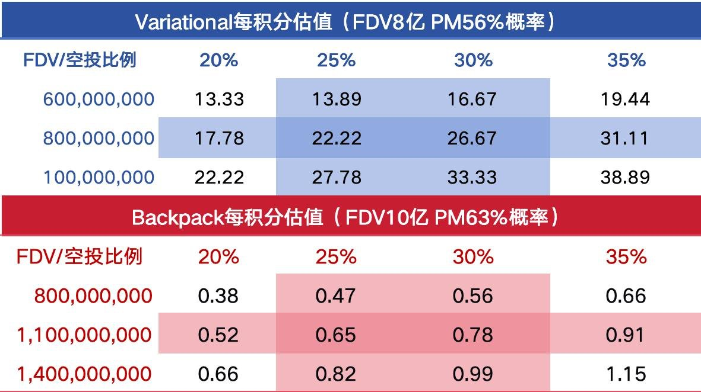

# VAR 與 Backpack 的 SOL 資費套利策略

> **來源**: [@0Xlynn03](https://x.com/0Xlynn03/status/2009834492954046719)
>
> **日期**: Sat Jan 10 03:47:38 +0000 2026
>
> **標籤**: `VAR` `Backpack` `SOL` `套利` `積分`

---

## VAR 與 Backpack 的 SOL 資費套利策略

### 總覽

本文整理了 @0Xlynn03 (邻山Lynn) 的 SOL 資費套利策略，主要利用 VAR 和 Backpack 兩個平台，透過現貨買入和合約做空的策略，賺取利息收益並積累積分。重點如下：

*   **目標：** SOL 資費套利，賺取利息並積累積分。
*   **平台：** VAR 和 Backpack。
*   **策略：** Backpack 購買 SOL 現貨，VAR 做空 SOL。
*   **預期收益：** Backpack 年化 5%，VAR 年化 11%。
*   **積分累積：** 重點放在 Backpack，目標三週內達到王者等級。

### 背景

作者觀察到 VAR 目前競爭激烈，且 TGE 時間較長，因此將重心轉移至 Backpack。Backpack 剩餘三週的積分活動，TGE 預計在 Q1 到來，且目前積分成本的性價比相對較高。

### 主要策略：SOL 資費套利

作者計劃在 VAR 和 Backpack 上進行 SOL 的資費套利，利用兩平台的特性賺取收益和積分：

*   **Backpack：** 購買 SOL 現貨，預期年化收益 5%。
*   **VAR：** 做空 SOL，預期年化收益 11%。

此策略旨在省心省力地賺取利息，並同時累積積分。

### 積分累積策略

除了主要的資費套利策略，作者也計劃進行小額資金的日內高頻交易，以加速積分累積。由於 VAR 目前過於競爭，策略重點將放在 Backpack 上。

*   **策略：** 小額資金的日內高頻交易。
*   **重點：** Backpack。
*   **目標：** 三週時間內達成 1 億積分，速通王者等級。

