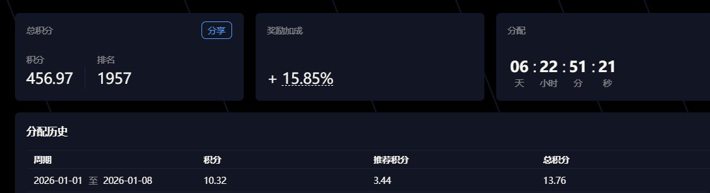

# Variational 交易所積分刷分策略實驗

> **來源**: [@sofa667788](https://x.com/sofa667788/status/2009438234577863160)
>
> **日期**: 2026-01-09
>
> **標籤**: `Variational` `積分策略` `刷分` `空投` `交易所`

---

作者在 Variational 交易所進行了多種刷分策略測試，實驗各種操作方式的積分效率。

## 測試策略

| 策略編號 | 操作方式 | 初步結論 |
|---------|---------|----------|
| 1 | 純 BTC、ETH 無腦刷量 | 效率極低 |
| 2 | 大幣打底倉 + 單品種小幣刷量 | 未明確 |
| 3 | 單號單幣種小幣刷量（15 幣種 15 號） | 未明確 |
| 4 | 單小幣持倉不刷分（5 幣種 5 號） | 未明確 |
| 5 | 同幣種不同保證金測試（5000U vs 10000U） | 效果微乎其微 |

## 實驗結果

- 該週獲得約 500 分（未達每週 2000 分目標）
- 作者表示已確定高效率策略並開始使用腳本批量操作
- 具體哪種策略最優未在文中明確說明

## 注意事項

- 缺乏具體數據對比
- 結論過於籠統，需搭配後續實驗驗證
- 保證金大小對積分影響極小
