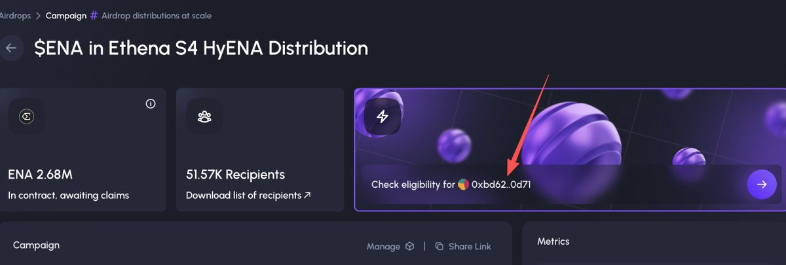
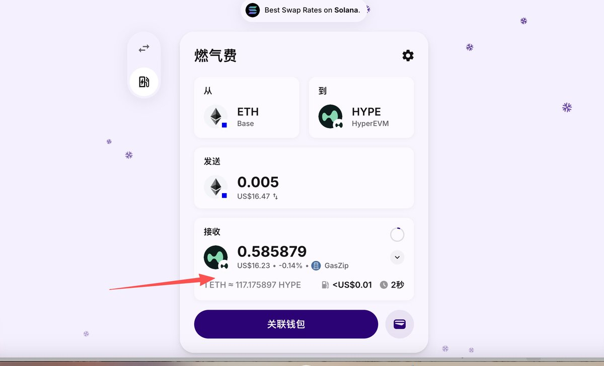
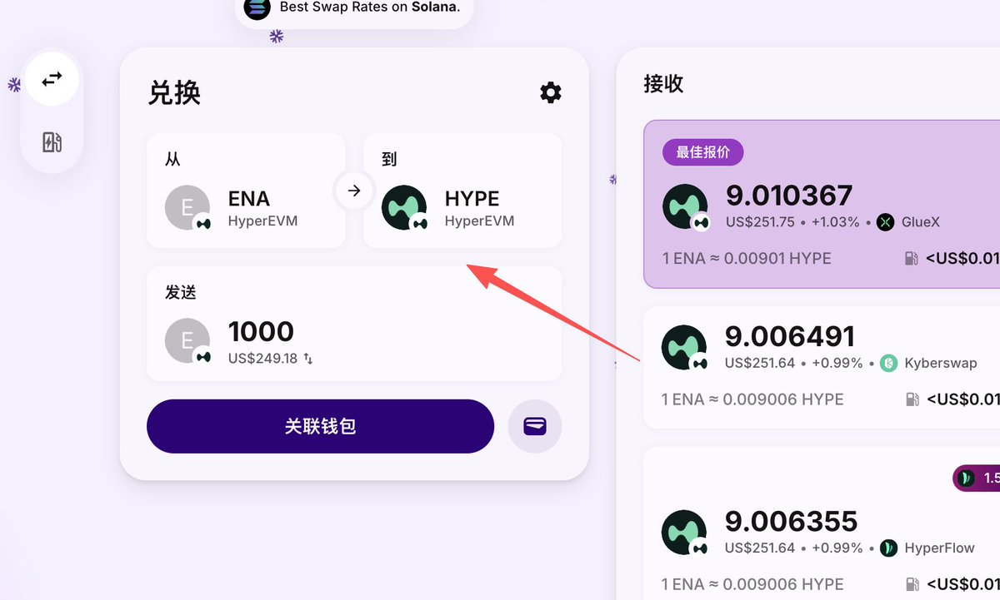
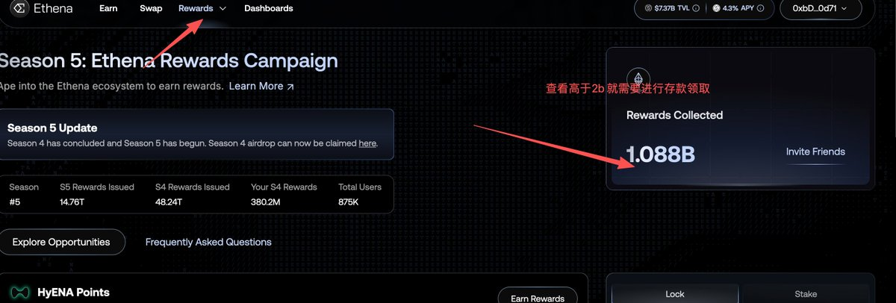
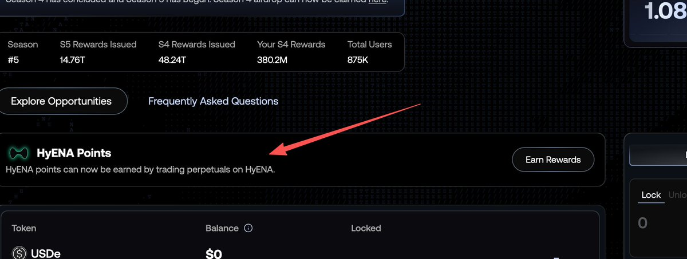
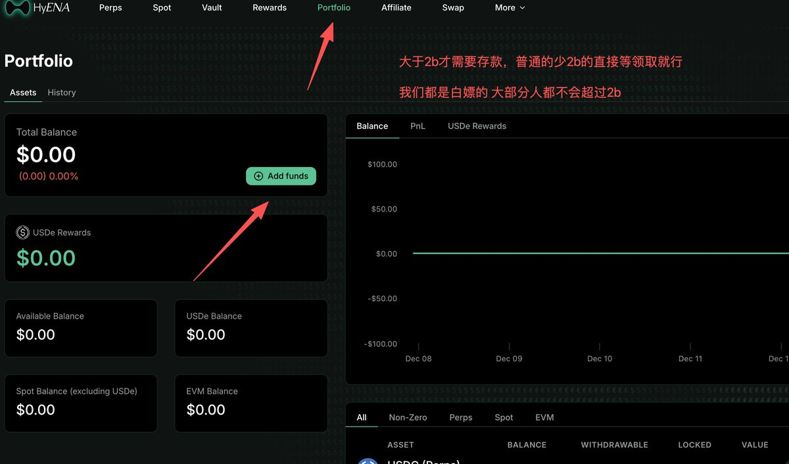

# Ethena S4 空投領取指南 - HyENA 平台操作教程

> **來源**: [@web3a99](https://x.com/web3a99/status/2008767048588136950) | [原文連結](https://app.sablier.com/airdrops/campaign/0xed5fbc25e730d5fba6949721d98fc444d4d36e1d-999)
>
> **日期**: Wed Jan 07 05:06:00 +0000 2026
>
> **標籤**: `空投領取` `DeFi 協議` `Ethena`

---








# Ethena S4 空投領取與操作完整指南

> **來源**: [@web3a99 (笑苍生.btc)](https://twitter.com/web3a99)
> **日期**: 2026-02-14
> **標籤**: `ethena` `airdrop` `defi` `hyena` `starta` `yield-farming`

---

## 快速總覽

| 項目 | 說明 |
|------|------|
| **領取平台** | HyENA（Hyperliquid EVM） |
| **資格查詢** | [Sablier Airdrop 頁面](https://app.sablier.com/airdrop/ethena-s4-hyena) |
| **解鎖進度** | S4 賽季已解鎖 2.5%，近期將再解鎖 1% |
| **領取條件** | <2 億積分：無條件領取<br>≥2 億積分：需存 USDe 兩週 |
| **存款比例** | 每 200 萬 ENA 積分需存 1 USDe |
| **後續機會** | S5 賽季空投仍可參與 |

---

## 一、領取前準備

### 1. 跨鏈準備
- **目標鏈**: Hyperliquid EVM
- **所需資產**: 約 3 USDT 等值資產（用於 Gas 費）
- **推薦跨鏈橋**: [HyENA Bridge](https://app.hyena.fi)

### 2. 添加代幣合約
領取後需手動在錢包添加 ENA 代幣：
- **ENA 合約地址**: `0x58538e6A46E07434d7E7375Bc268D3cb839C0133`
- 添加後即可在錢包顯示領取到的 ENA 數量

---

## 二、領取資格與存款要求

### 積分門檻與條件

| ENA 積分 | 領取條件 | 存款要求 |
|----------|----------|----------|
| **< 2 億** | 直接領取，無需存款 | - |
| **≥ 2 億** | 需在 HyENA 平台存 USDe | 連續持有兩週 |

### 存款計算公式
```
存款金額 = ENA 積分 ÷ 200 萬
```

**範例**：
- 10 億 ENA 積分 = 500 USDe
- 4 億 ENA 積分 = 200 USDe

### 存款時間規則
- **總時長**: 兩個月內任意階段
- **連續性**: 兩週持有期必須連續
- **彈性**: 可自行選擇開始時間點

---

## 三、HyENA 平台存款操作

### 步驟流程

1. **進入 HyENA 平台**
   - 連接錢包

2. **選擇存款介面**
   - 點選第一個選項（錢包）
   - 選擇穩定幣類別

3. **轉換與存入**
   - 輸入金額
   - 將 USDT 轉換為 USDe
   - 確認交易

---

## 四、ENA 代幣賣出流程

### 方法一：橋接兌換法

1. **ENA → HYPE**
   - 使用 [HyENA Bridge](https://app.hyena.fi)
   - 將 ENA 賣出為 HYPE

2. **HYPE → USDT**
   - 使用同一橋接工具
   - 將 HYPE 跨鏈回任意 EVM 鏈
   - 在 DEX 賣出 HYPE 為 USDT

---

## 五、風險與策略建議

### 原作者觀點

| 項目 | 說明 |
|------|------|
| **風險評估** | 當前已虧損約 70%（低息影響） |
| **操作建議** | 只白嫖不深度參與 |
| **後續機會** | S5 賽季仍可領取（Starta YT 用戶） |
| **項目態度** | 不建議新資金進入，等待主網表現 |

### 關鍵提醒

⚠️ **重要提示**：
- 低於 2 億積分用戶：直接領取即可
- 高於 2 億積分用戶：自行評估存款成本與收益
- Starta YT 用戶：S5 賽季仍有資格
- 項目風險：作者表示當前不看好深度參與

---

## 六、Starta YT 額外福利

### 優勢特點
- **多重收益**: 一魚多吃策略
- **S4 + S5**: 連續兩季空投資格
- **低息優惠**: 成本較低
- **歷史表現**: 作者評價為「最爽的 YT 項目」

### 注意事項
- 主網上線表現仍需觀察
- YT 玩法已普及，競爭加劇
- 風險控制優先於收益追求

---

## 總結

Ethena S4 空投為 Starta YT 白嫖用戶提供了低門檻的領取機會，但需注意：

1. **低積分用戶**：無腦領取，無需額外操作
2. **高積分用戶**：需評估存款成本（Gas + 時間成本）
3. **風險管理**：作者建議只白嫖，不追加投資
4. **後續機會**：S5 賽季仍可參與，保持關注

記得在領取後妥善保管 ENA 代幣，並根據市場情況決定是否立即賣出或持有等待 S5 空投。
