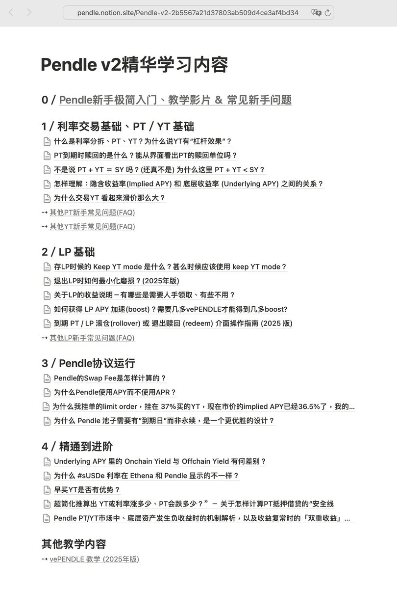
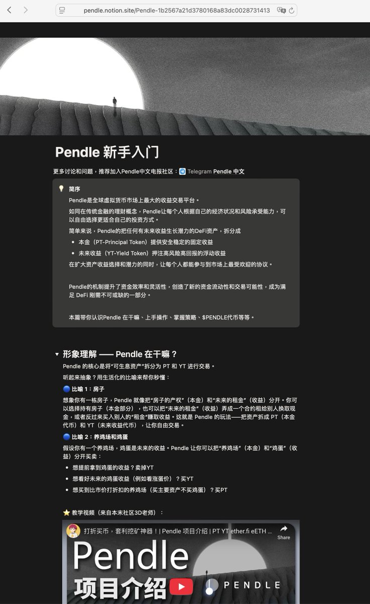
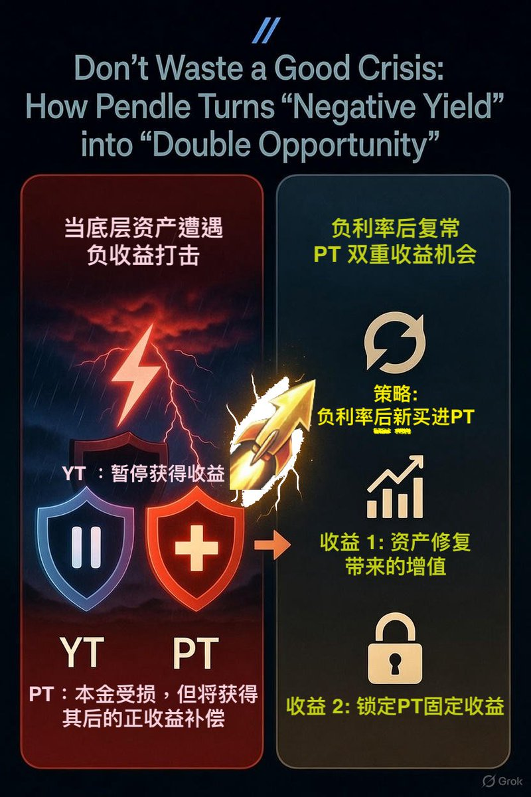
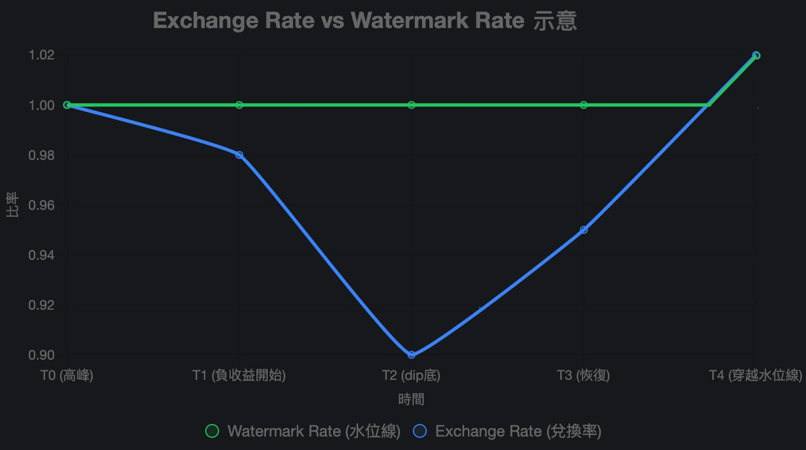

# Pendle PT/YT 負收益機制解析與雙重收益策略

> **來源**: [@ViNc2453](https://x.com/ViNc2453/status/2003450525862474016) | [原文連結](https://pendle.notion.site/Pendle-v2-2b5567a21d37803ab509d4ce3af4bd34)
>
> **日期**: 
>
> **標籤**: `Pendle` `負收益` `PT交易策略`

---

完美！我看到：
- DeFi 分類目前最新是 026
- 所以這篇 Pendle 文章應該是 **027**
- 圖片已經正確放在 `knowledge-base/assets/defi/027-pendle-pt-yt-negative-yield-mechanism-{1-5}.jpg`

現在我來整理文章內容。這是一篇非常詳細的技術解析文章，我會保持其結構完整性：

根據原始內容，我整理如下：

---

## 概述

Pendle 協議允許將生息代幣（Interest-Bearing Token, IBT）拆分為本金代幣（PT）和收益代幣（YT）。當底層資產產生負收益時，Pendle 透過 **Watermark Rate**（水位線利率）和 **Exchange Rate**（兌換率）機制來處理收益分配，確保 PT 持有者優先獲得補償，同時創造了「雙重收益」的策略機會。

| 關鍵概念 | 說明 |
|---------|------|
| **PT** (Principal Token) | 本金代幣，到期時可贖回底層資產 |
| **YT** (Yield Token) | 收益代幣,獲取資產產生的利息 |
| **Exchange Rate** | IBT 與會計資產的即時官方兌換比率 |
| **Watermark Rate** | IBT 與會計資產的歷史最高兌換率（水位線基準） |
| **「水下」狀態** | Exchange Rate < Watermark Rate 的情況 |

---

## 1. 底層資產為何會產生負收益？

傳統生息資產（如 Aave USDC、DAI Saving Rate、stETH）通常只產生正收益，不會主動扣減本金。但某些 DeFi 產品為實現風險分層或槓桿效果，允許負收益：

### 典型案例

**🔸 Hyperliquid $HLP 及相關金庫**
- 作為永續合約流動性提供者
- 賺取資金費率（funding rate）
- 極端走勢時可能承擔做市或資金費率損失

**🔸 Strata $jrUSDe（Junior Tranche USDe）**
- 基於 Ethena sUSDe 的次級分層（劣後級）產品
- 為優先級產品 srUSDe 提供保證收益（如不低於 Sky Saving Rate）
- 當 sUSDe 整體收益低於目標時，jrUSDe 承擔負年化以補足高級層

**🔸 槓桿金庫產品**
- 採用循環貸款策略（反覆抵押並貸出資金）
- 重複買入收益標的以實現槓桿收益
- 市場極端表現（如穩定幣脫錨）或標的違約時可能產生重大虧損

> 💡 這些負收益源於協議的風險分配機制，旨在優化資本效率，但也引入本金侵蝕風險。

---

## 2. Pendle 如何處理底層資產的負收益？

Pendle 透過兩個關鍵指標管理負收益：

### 核心機制

| 指標 | 定義 | 作用 |
|------|------|------|
| **Exchange Rate** | IBT 與會計資產的即時官方兌換比率 | 反映 IBT 的實際價值，正收益時上升，負收益時下降 |
| **Watermark Rate** | IBT 與會計資產的歷史最高兌換率 | 作為「水位線」基準，用於判斷是否進入「水下」狀態 |

💡 **如果資產從未發生負收益，則 Exchange Rate 一直等於 Watermark Rate**

### 「水下」期間的收益分配（Exchange Rate < Watermark Rate）

**🔸 YT（收益代幣）**
- ❌ 停止累積任何收益
- ❌ 即使底層資產恢復正收益，YT 也無法獲取
- ⏸️ 直到 Exchange Rate 回升至 Watermark Rate 之上才恢復

**🔸 PT（本金代幣）**
- ⚠️ 承擔全部負收益損失
- ✅ 享有恢復期的正收益補償
- 📊 到期時可贖回的會計資產數量依 Exchange Rate 計算
- 💰 若到期時 Exchange Rate 仍低於入場時的水平，將承擔一定本金損失

> 🧠 **關鍵洞察**：只要 PT 持有者在到期日之前、Exchange Rate 位處歷史新高，代表過程中的正年化收益可以完全覆蓋負年化的損失，那中間的過程對 PT 而言便不重要，PT 不會遭受到任何損失。

### 不同持有者視角

**從 YT 持有者視角：**
- ✅ Exchange Rate 持續新高期間（正年化）→ 拿到利息
- ⏸️ Exchange Rate 上升但還沒回到歷史最高點 → 沒有利息
- ❌ Exchange Rate 下降期間（負年化）→ 沒有利息

**從 PT 持有者視角：**
- ⚠️ 只有當 Exchange Rate 斜率為向下的期間持有 PT，才需要承擔負收益損失
- ✅ Exchange Rate 回升期間，PT 獲取全部恢復收益

---

## 3. 負收益期後新進 PT 的機會：雙重收益策略

若用戶在 Exchange Rate 已在「水下」後**新進場購買 PT**（假設無先前持有底層資產），將享有雙重好處：

### 雙重收益來源

| 收益類型 | 說明 |
|----------|------|
| **🅰️ Exchange Rate 兌換率升值** | 從當前低點回升至 Watermark Rate 的價差，作為額外資本利得（補償先前的下降） |
| **🅱️ PT 固定收益** | 購入 PT 的固定年化（按 PT = 1 - YT 公式，只要 YT 價格非零則購入 PT 必然從會計資產獲得買入折價） |

### 策略時機

在正常分配機制下，Exchange Rate 升值歸屬於 YT。但在負收益發生後，**Exchange Rate 升值將轉為歸屬 PT 直至回到「水上」**。

**理想進場點（圖中 T2）：**
- Exchange Rate「觸底」後
- 從 T2 時點入場至 T4 到期
- 持有者獲取：藍線升值（0.90→1.00）+ PT 固定收益

### 策略風險

⚠️ **有效市場假設**
- PT 價格可能已經反映資產回復正收益的預期
- PT 的 Fixed APY 可能已經相應下降

⚠️ **負收益持續風險**
- 若負收益意外持續發生
- Exchange Rate 進一步下跌
- 策略可能承受本金損失

---

## 4. 如何在「水下」時期閱讀 Pendle PT 交易界面

### 真實案例：mFARM 池子

mFARM 池子在 11 月曾發生一次性負收益，之後 PT 圖表顯示的 APY 高達 **59.5%**。為什麼這麼高？

| APY 類型 | 數值 | 含義 |
|----------|------|------|
| **圖表/市場總覽顯示的 APY** | 59.5% | 假設 Exchange Rate 能在到期前返回「水上」的「雙重收益」預期 APY（Exchange Rate 上升 + PT 固定收益） |
| **Effective Fixed APY** | 7% | 不考慮 Exchange Rate 回升與否，單純來自 PT 固定收益的 APY（由 YT 價值提供的 PT 購入折扣） |

### 收益情境分析

**✅ 完全收復情境**
- mFARM 在到期前成功收復全部 Exchange Rate < Watermark Rate 的失地
- 加上約 7% PT 本身的 Fixed APY
- 此刻進場（假設在負收益期間沒有持有資產）
- 將獲得一共約 **59.5%** 的年化

**⚠️ 部分收復情境**
- Exchange Rate 只能部分收復失地
- 預期年化將介乎 **~7% 至 ~59.5%** 之間

---

## 總結

✅ 生息代幣（IBT）負收益放大持倉風險，但也創造機會

✅ 投資相關資產前，請監控 Watermark 視圖

✅ DYOR（Do Your Own Research）

### 監控工具

用戶可在 Pendle 市場頁面（Market Page）切換至「Watermark Rate」視圖，查看即時數據及警示。

---

**備註**：本文為「精通 Pendle 學習系列」，已收錄於 Pendle 中文官方 Notion。更多教學內容請參考原始來源。
