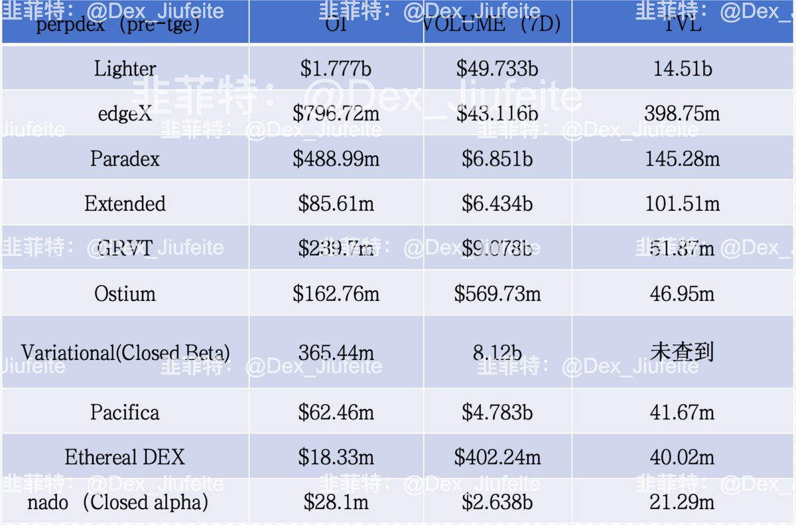

# 永續 DEX 項目分析：10 大平台積分賽季與部署進度

> **來源**: [@Dex_Jiufeite](https://x.com/Dex_Jiufeite/status/2000462939934089315) | [原文連結](https://x.com/Dex_Jiufeite/status/1999018305563083020)
>
> **日期**: Mon Dec 15 07:08:26 +0000 2025
>
> **標籤**: `永續 DEX` `積分賽季` `資金效率`

---



> **來源**: [@Dex_Jiufeite (韭菲特-dextrader)](https://twitter.com/Dex_Jiufeite)
> **日期**: 2025-01-XX
> **標籤**: `perp-dex` `積分賽季` `代幣化金庫` `defi`

---

## 概述

本文對標主流永續 DEX 平台，根據 TVL 排名分析 10 大項目的積分賽季進度與 TGE 時程。作者重點關注「代幣化金庫」模式與自動返佣機制，並分享個人參與策略。

## 10 大平台概覽

| 項目 | 積分賽季狀態 | 預計 TGE | 特色亮點 |
|------|-------------|----------|---------|
| **Lighter** | 接近尾聲 | 2025/01 | - |
| **edgeX** | 已結束 | 2025/01 | - |
| **Paradex** | 接近尾聲 | 2025/01底 | - |
| **Extended** | 進行中（始於5月） | 未定 | 代幣化金庫、最高90%資金可用於交易 |
| **GRVT** | 第二季進行中 | 2025/03底 | - |
| **Ostium Labs** | 進行中 | 未定 | 主打 RWA |
| **Variational** | 進行中 | 未定 | RFQ 模式、亏損返還 |
| **Pacifica** | 邀請制進行中 | 未定 | Solana 最大 perp DEX、FTX 前 COO 團隊 |
| **Ethereal** | 邀請制進行中 | 未定 | ENA 鏈、TVL 曾達 15 億美元 |
| **Nado** | Alpha 封測 | 積分準備中 | Kraken 官方項目、INK 鏈、Nado + INK 雙空投預期 |

## 重點項目深度分析

### Extended — 代幣化金庫模式

**核心機制**：
- **資金效率最高**：存入金庫的資金可同時享受兩種收益
  - 金庫年化收益（當前約 7.52%）
  - 50%~90% 資金可用於合約交易（當前 50%，逐步推進至 90%）

**實際運作範例**：
```
存入 1000 USDC 至 Vault
├─ 獲得金庫年化收益 7.52%
└─ 同時可用 500 USDC（50%）開合約單
   └─ 適用場景：量化套利、趨勢交易、網格策略等
```

**返佣與優惠**：
- Taker 手續費：0.0225%（萬 2.25）
- 15% 積分加成
- 30% 自動返佣（每日 8 點結算，portfolio → transfer 查詢 rebates）

**註冊細節**：
1. 使用推薦連結註冊 → 10% 手續費折扣
2. 邀請碼：`JIU`
3. 積分加成計算：`左上角積分 ÷ (總積分 - 左上角積分) = 15%`

### Pacifica — Solana 最大 Perp DEX

**團隊背景**：FTX 前 COO 創辦，團隊以亞裔/華人為主

**參與方式**：
- 邀請制，15% 自動返佣 + 積分加成
- 可用邀請碼（部分）：
  - P59YP5YSM0CMCD9F
  - 3EQ72CBGH305A5NQ
  - ET28Q6T2H7214T8K

### Variational — RFQ 創新模式

**特色**：
- RFQ（Request for Quote）機制
- 虧損返還機制
- TVL 數據未在主流網站披露（作者徵求數據來源）

### Nado — Kraken 官方項目

**潛在優勢**：
- Kraken 背書
- INK 鏈生態
- 雙空投預期（Nado + INK）

**當前狀態**：
- Alpha 封測階段（預計本月結束）
- 積分系統準備中（官網已有 points 頁面）
- 一碼難求，可排隊申請或社群獲取

## 作者策略與數據來源

**核心關注項目**：「兩E一V」
- **edgeX**
- **Extended**
- **Variational**

**調研數據來源**：
- [數據網站 1](相關連結)
- [數據網站 2](相關連結)

**免責聲明**：純個人調研，NFA，DYOR。市場動態變化，關注重點會隨時調整。

---

★ Insight ─────────────────────────────────────

**永續 DEX 積分賽季的參與邏輯**：
1. **代幣化金庫**是資金效率的突破 — Extended 模式讓閒置 LP 資金同時參與交易，相當於「雙重收益」而非機會成本二選一
2. **自動返佣機制**比單純手續費折扣更有吸引力 — 每日結算的現金流對高頻交易者是實質收益
3. **團隊背景**是風險評估關鍵 — Kraken 官方（Nado）、FTX 前 COO（Pacifica）等傳統 CEX 基因的項目，在合規性和產品成熟度上通常更可靠

─────────────────────────────────────────────────
