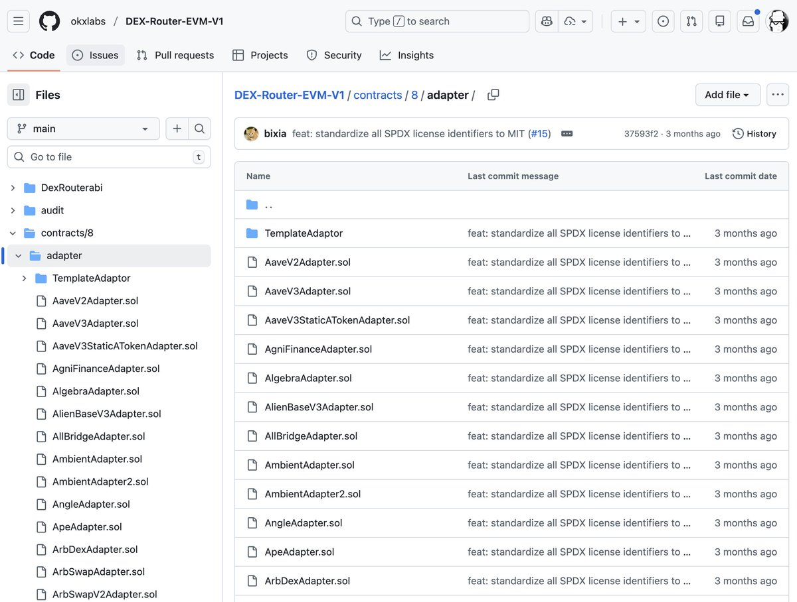
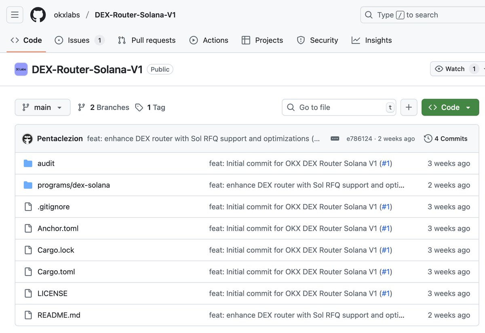

# OKX DEX Router EVM 開源合約指南

> **來源**: [@0xAA_Science](https://x.com/0xAA_Science/status/1999873173014430077) | [原文連結](https://github.com/okxlabs/DEX-Router-EVM-V1)
>
> **日期**: Sat Dec 13 16:04:54 +0000 2025
>
> **標籤**: `路由合約` `DEX聚合` `鏈上套利`

---




我會幫你整理這篇關於 OKX DEX Router EVM 開源合約的文章。

★ Insight ─────────────────────────────────────
1. OKX 開源策略：繼 Solana Router 後再次開源 EVM 版本，顯示其在 DEX 聚合器領域的技術實力
2. 生態影響：許多交易所和錢包的路由參考 OKX 實作，開源精神促進整個生態發展
3. 套利價值：80+ 適配器覆蓋主流 DEX，適合鏈上套利和交易機器人開發
─────────────────────────────────────────────────

## 專案概述

OKX 開源了 EVM 版本的 DEX 路由合約（[DEX-Router-EVM-V1](https://github.com/okxlabs/DEX-Router-EVM-V1)），這是繼 Solana Router 後的又一重要開源貢獻。該專案提供統一介面，支援跨多個流動性來源和協議進行高效代幣交換。

### 核心特性

| 特性 | 說明 |
|------|------|
| **多協議聚合** | 整合 Uniswap V2/V3、Curve 及其他主流 DEX |
| **分散交易** | 可將單筆交易拆分至多個流動性來源以獲得最優價格 |
| **Gas 優化** | 高效路由演算法，最小化交易成本 |
| **擴展架構** | 模組化適配器系統，易於整合新協議 |

### 規模與相容性

- **市場覆蓋**：100+ 個市場
- **適配器數量**：80+ 個 DEX 適配器
- **開源授權**：MIT License

## 專案結構

```
DEX-Router-EVM/
├── contracts/8/
│   ├── DexRouter.sol                    # 主路由合約（精確輸入）
│   ├── DexRouterExactOut.sol            # 精確輸出路由
│   ├── UnxswapRouter.sol                # Uniswap V2 路由
│   ├── UnxswapV3Router.sol              # Uniswap V3 路由
│   ├── UnxswapExactOutRouter.sol        # Uniswap V2 精確輸出
│   ├── UnxswapV3ExactOutRouter.sol      # Uniswap V3 精確輸出
│   ├── adapter/                         # 80+ DEX 適配器
│   │   ├── UniV3Adapter.sol
│   │   ├── PancakeswapV3Adapter.sol
│   │   ├── CurveAdapter.sol
│   │   └── ...
│   ├── interfaces/                      # 協議介面
│   ├── libraries/                       # 工具庫
│   └── utils/                           # 工具合約
├── hardhat.config.js
├── foundry.toml
└── package.json
```

## 快速開始

### 環境設置

```bash
# 克隆專案
git clone https://github.com/okxlabs/DEX-Router-EVM-V1.git
cd DEX-Router-EVM-V1

# 安裝依賴
npm install

# 安裝 Foundry（若尚未安裝）
curl -L https://foundry.paradigm.xyz | bash
foundryup

# 安裝 Forge 依賴
forge install

# 編譯合約
forge build

# 執行測試
forge test

# 部署至網路
forge script src/deploy/XXX.s.sol \
  --rpc-url <rpc-url> \
  --private-key <private-key> \
  --broadcast
```

## Solidity 整合範例

### 智能合約交換實作

以下範例展示如何在智能合約中整合 OKX DEX Router 進行代幣交換，包含雙推薦人佣金系統：

#### 合約初始化

```solidity
contract SmartSwap {
    address internal constant _ETH = 0xEeeeeEeeeEeEeeEeEeEeeEEEeeeeEeeeeeeeEEeE;
    
    DexRouter public dexRouter;
    address public tokenApprove;
    address public refer1;  // 推薦人 1
    address public refer2;  // 推薦人 2
    uint256 public rate1;   // 佣金比例 1（< 10^9）
    uint256 public rate2;   // 佣金比例 2（< 10^9）
    
    constructor(
        address _dexRouter,
        address _tokenApprove,
        address _refer1,
        address _refer2,
        uint256 _rate1,
        uint256 _rate2
    ) {
        dexRouter = DexRouter(payable(_dexRouter));
        tokenApprove = _tokenApprove;
        refer1 = _refer1;
        refer2 = _refer2;
        
        // 佣金比例驗證
        require(_rate1 < 10**9, "rate1 must be less than 10**9");
        require(_rate2 < 10**9, "rate2 must be less than 10**9");
        require(
            _rate1 + _rate2 < 0.03 * 10**9,
            "rate1 + rate2 must be less than 0.03"
        );
        
        rate1 = _rate1;
        rate2 = _rate2;
    }
}
```

#### 核心交換函數

```solidity
function performTokenSwap(
    address fromToken,
    address toToken,
    uint256 amount,
    uint256 minReturn,
    address adapter,
    address poolAddress,
    bool isFromTokenCommission
) external payable {
    // Step 1: 代幣授權
    fromToken = fromToken == address(0) ? _ETH : fromToken;
    if (fromToken != _ETH) {
        IERC20(fromToken).approve(tokenApprove, type(uint256).max);
    }
    
    // Step 2: 驗證佣金計算
    if (isFromTokenCommission) {
        uint swapAmount = amount;
        uint amountTotal = (amount * 10**9) / (10**9 - rate1 - rate2);
        // 驗證餘額充足
    }
    
    // Step 3: 建立交換資訊結構
    SwapInfo memory swapInfo;
    
    // Step 4: 設定基本請求參數
    swapInfo.baseRequest.fromToken = uint256(uint160(fromToken));
    swapInfo.baseRequest.toToken = toToken;
    swapInfo.baseRequest.fromTokenAmount = amount;
    swapInfo.baseRequest.minReturnAmount = minReturn;
    swapInfo.baseRequest.deadLine = block.timestamp + 300; // 5 分鐘期限
    
    // Step 5: 設定批次金額
    swapInfo.batchesAmount = new uint256[](1);
    swapInfo.batchesAmount[0] = amount;
    
    // Step 6: 設定路由批次
    swapInfo.batches = new DexRouter.RouterPath[][](1);
    swapInfo.batches[0] = new DexRouter.RouterPath[](1);
    
    // 配置適配器
    swapInfo.batches[0][0].mixAdapters = new address[](1);
    swapInfo.batches[0][0].mixAdapters[0] = adapter;
    
    // 配置資產目標地址
    swapInfo.batches[0][0].assetTo = new address[](1);
    swapInfo.batches[0][0].assetTo[0] = adapter;
    
    // 配置原始數據：reverse(1byte) + weight(11bytes) + poolAddress(20bytes)
    swapInfo.batches[0][0].rawData = new uint256[](1);
    swapInfo.batches[0][0].rawData[0] = uint256(
        bytes32(abi.encodePacked(uint8(0x00), uint88(10000), poolAddress))
    );
    
    // 配置適配器額外數據
    swapInfo.batches[0][0].extraData = new bytes[](1);
    swapInfo.batches[0][0].extraData[0] = abi.encode(
        bytes32(uint256(uint160(fromToken))),
        bytes32(uint256(uint160(toToken)))
    );
    
    // Step 7: 執行交換並處理佣金
    bytes memory swapData = abi.encodeWithSelector(
        dexRouter.smartSwapByOrderId.selector,
        swapInfo.orderId,
        swapInfo.baseRequest,
        swapInfo.batchesAmount,
        swapInfo.batches,
        swapInfo.extraData
    );
    
    bytes memory data = bytes.concat(
        swapData,
        _getCommissionInfo(
            true,
            true,
            isFromTokenCommission,
            isFromTokenCommission ? fromToken : toToken
        )
    );
    
    (bool success, bytes memory result) = address(dexRouter).call{
        value: msg.value
    }(data);
    require(success, string(result));
}
```

#### 佣金資訊編碼

```solidity
function _getCommissionInfo(
    bool _hasNextRefer,
    bool _isToB,
    bool _isFrom,
    address _token
) internal view returns (bytes memory data) {
    _token = _token == address(0) ? _ETH : _token;
    
    uint256 flag = _isFrom
        ? (_hasNextRefer ? FROM_TOKEN_COMMISSION_DUAL : FROM_TOKEN_COMMISSION)
        : (_hasNextRefer ? TO_TOKEN_COMMISSION_DUAL : TO_TOKEN_COMMISSION);
    
    bytes32 first = bytes32(
        flag + uint256(rate1 << 160) + uint256(uint160(refer1))
    );
    bytes32 middle = bytes32(
        abi.encodePacked(uint8(_isToB ? 0x80 : 0), uint88(0), _token)
    );
    bytes32 last = bytes32(
        flag + uint256(rate2 << 160) + uint256(uint160(refer2))
    );
    
    return _hasNextRefer
        ? abi.encode(last, middle, first)
        : abi.encode(middle, first);
}
```

### 關鍵參數說明

| 參數 | 說明 |
|------|------|
| `fromToken` | 源代幣地址（`0x0` 或 `_ETH` 代表原生 ETH） |
| `toToken` | 目標代幣地址 |
| `amount` | 交換金額 |
| `minReturn` | 最小返回金額（滑點保護） |
| `adapter` | DEX 適配器地址 |
| `poolAddress` | 流動性池地址 |
| `isFromTokenCommission` | 是否從源代幣收取佣金 |

### 佣金模式

- **FromToken Commission**: 交換金額 + 佣金 = 100%，從輸入代幣扣除
- **ToToken Commission**: 從輸出代幣扣除佣金
- 支援雙推薦人分潤，總佣金上限 3%

## 適用場景

### 開發者應用

| 應用場景 | 優勢 |
|----------|------|
| **鏈上套利** | 整合 100+ 市場，快速發現價差機會 |
| **交易機器人** | 模組化設計，易於整合自動化策略 |
| **聚合器開發** | 完整的路由邏輯參考實作 |
| **錢包整合** | 提供最優交換路徑，提升用戶體驗 |

## 社群與貢獻

### 參與方式

- **加入討論**：透過 Discord 社群進行技術交流
- **回報問題**：在 GitHub Issues 回報 bug 或提出功能建議
- **提交 PR**：貢獻程式碼改進

### Pull Request 準則

1. 非瑣碎的變更需先在 issue 中討論
2. 新功能需包含測試
3. 更新相關文件
4. 在 changelog 中描述變更內容

## 版本資訊

- **最新版本**：v1.0.7-multi-commission（2025-12-02）
- **開源授權**：MIT License
- **主要語言**：Solidity 98.8%, JavaScript 1.2%
- **社群數據**：230 stars, 106 forks

## 技術亮點

### 與競品比較

| 專案 | 開源狀態 | 特色 |
|------|----------|------|
| **OKX Router** | ✅ 完全開源 | 80+ 適配器，雙推薦人佣金系統 |
| **Jupiter (Solana)** | ❌ 未開源 | 僅限 Solana 生態 |
| **1inch** | 部分開源 | 路由演算法未完全公開 |

### 架構優勢

- **模組化適配器**：新增協議支援無需修改核心邏輯
- **Gas 優化**：批次處理與路徑優化減少交易成本
- **靈活佣金**：支援多種佣金收取模式
- **完整測試**：Foundry 測試框架確保合約安全性
