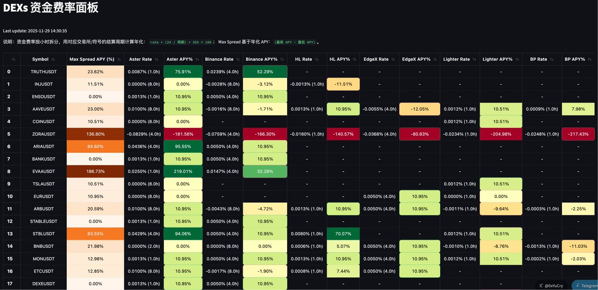

# DEX 資金費率監控面板

> **來源**: [@0xYuCry](https://x.com/0xYuCry/status/1994655465410891961) | [原文連結](https://twitter.com/safety/unsafe_link_warning?unsafe_link=http://nova-btc.xyz)
>
> **日期**: Sat Nov 29 06:31:36 +0000 2025
>
> **標籤**: `資金費率` `套利機會` `DEX 聚合`

---

## 專案介紹

上一條推文，很多人對 1693% 的資金費年化很驚訝。

我做了全網第一個 DEXs 資金費率面板，永久免費 & 開源。

🌐 https://t.co/3KQYdmrWBM

實時監控費率變化，資金費機會自動高亮。

## 功能特色

功能比較簡單：

- 聚合多個 DEX 的資金費率
- 自動換算成統一的 APY
- 計算跨平台的最大資金費路徑
- 實時更新，並把潛在套利機會標出來

📦 專案地址，歡迎貢獻！

https://t.co/jejjreN51F
