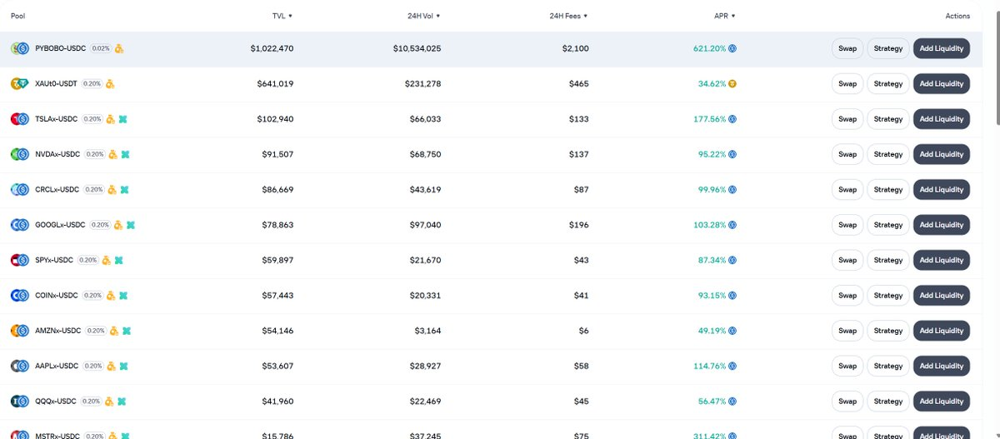
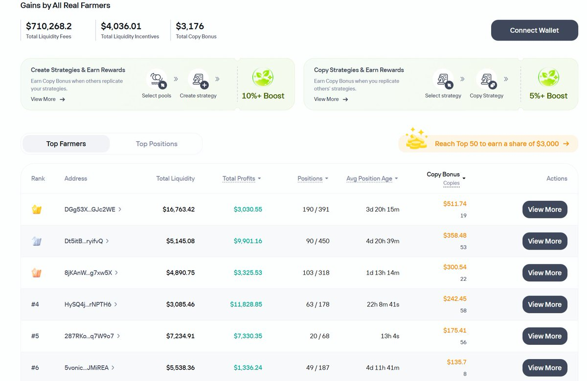
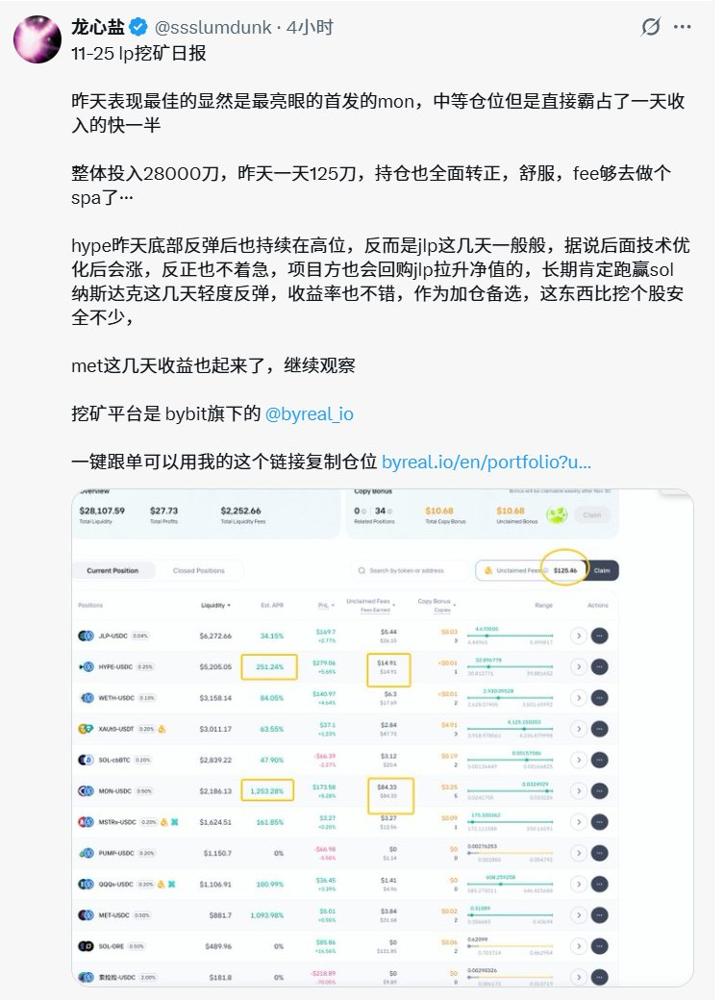

# Byreal.io SOL 鏈 DEX：LP 組隊農場搬磚策略

> **來源**: [@zhamomo666](https://x.com/zhamomo666/status/1993216413268627564) | [原文連結](https://twitter.com/zhamomo666/status/1993216413268627564/photo/1)
>
> **日期**: 
>
> **標籤**: `DEX交易所` `LP流動性挖礦` `套利機制`

---

## 平台介紹

Byreal.io 是一個由 Bybit 孵化的 Solana 鏈 DEX（去中心化交易所）。該平台提供以下功能：

- SOL 鏈上的代幣交易
- 美股相關代幣交易
- 農場 LP（流動性提供者）組隊功能

## 套利策略

作者在 Byreal.io 上進行搬磚套利，表示效率不錯。平台支援組 LP 跟單功能，適合想要參與流動性挖礦的用戶。

## 參考資訊

- 平台：[@byreal_io](https://twitter.com/byreal_io)
- 詳細收益數據參考：[@ssslumdunk](https://twitter.com/ssslumdunk) 老師有提供詳細的組 LP 收益數據

## 注意事項

本推薦為個人使用經驗分享，非商業廣告。
