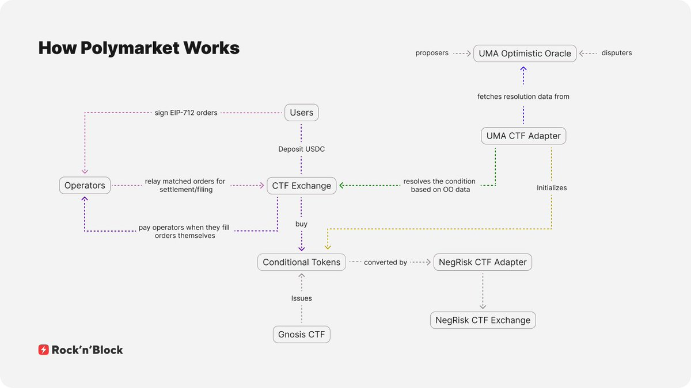

# Polymarket 預測市場技術深度解析：訂單簿架構與智能合約

> **來源**: [@Slutsky___](https://x.com/Slutsky___/status/1989767806137897315) | [原文連結](https://rocknblock.io/blog/how-polymarket-works-the-tech-behind-prediction-markets)
>
> **日期**: Sat Nov 15 18:49:47 +0000 2025
>
> **標籤**: `預測市場` `訂單簿` `智能合約`

---

我發現原始內容中已經包含了第一篇文章的完整內容。讓我基於現有的內容進行整理。這篇文章詳細解析了 Polymarket 的訂單簿架構、智能合約運作機制和技術實現。

讓我為您整理這篇文章的正文內容：

---

> **來源**: [RockNBlock - How Does Polymarket Work](https://rocknblock.io/blog/polymarket-how-it-works)  
> **作者**: RockNBlock (由 @Slutsky___ 推薦)  
> **日期**: 2025-06-06（最後更新：2026-02-16）  
> **標籤**: `Polymarket` `預測市場` `訂單簿` `智能合約` `DeFi`

---

## Polymarket 是什麼？

Polymarket 是一個基於預測市場（Prediction Markets）或事件市場（Event Markets）的協議。其核心概念是：平台上列出各種未來可能發生或不發生的事件，用戶可以預測結果並透過正確的預測獲利。

雖然聽起來像是「鏈上博弈」，但其中有重要的技術細節值得深入探討。

## 事件市場與份額機制

Polymarket 是一個事件市場，用戶可以買賣與不同事件綁定的份額（shares）。簡單來說，每個事件都是一個「是或否」的問題——某件事會發生還是不會發生？

**範例事件**：「TikTok 會在 5 月前再次被禁嗎？」

對於每個事件，存在兩種類型的份額：
- **YES 份額**：代表事件會發生
- **NO 份額**：代表事件不會發生

這兩種份額是同一事件的對立結果。

### 價格與概率機制

份額價格範圍：$0 到 $1  
核心規則：**YES 價格 + NO 價格 = $1**

$1 代表 100% 的總概率，在兩種結果之間分配。份額的價格反映了用戶認為某個結果發生的可能性。

**價格範例**：
- YES = $0.36 → 隱含概率 36%
- NO = $0.66 → 隱含概率 66%

以 TikTok 範例來看，市場隱含的概率是：
- 66% 的機會 TikTok 不會在 5 月前被禁
- 36% 的機會會被禁

兩個價格相加約等於 $1——兩種結果的總概率。

## 事件發布與結算

每個事件都有一個驗證結果的截止日期（如範例中的「5 月前」）。截止日期過後：

- 正確結果的份額價格上升至 $1
- 錯誤結果的份額價格下降至 $0

**收益計算範例**：
- 以 $0.66 買入價值 $100 的 NO 份額 → 約 151.5 份額
- 如果事件未發生，份額結算為 $1 → 總計 $151.5 → 利潤 $51.5
- 如果事件發生，NO 份額歸零 → 損失 $100

### 結算前的交易

並非所有用戶都會等到事件結束。許多人會提前賣出份額，從社群對事件可能性的認知變化中獲利。

簡而言之，Polymarket 是一個事件市場交易平台，用戶可以像交易其他資產一樣交易份額，並對概率變化進行投機。

## Polymarket 訂單簿機制

Polymarket 的訂單簿不是傳統交易所的標準訂單簿，有幾個關鍵差異。

### 中央限價訂單簿（CLOB）

**Central Limit Order Book（CLOB）**：
- **Central（中央）**：所有訂單集中在一個地方。每個事件有自己的專屬訂單簿，可以查看該市場中的所有訂單。這種設置便於觀察供需狀況，確保整個系統的透明度。
- **Limit（限價）**：訂單簿處理限價訂單——帶有特定執行條件或時間限制的訂單。

### 混合去中心化架構

Polymarket 的文檔將訂單簿稱為「混合去中心化」（hybrid-decentralized），結合了鏈下和鏈上組件：

**鏈下（Off-chain）**：
- 後端操作員負責追蹤和撮合訂單
- 準備市場訂單所需的數據

**鏈上（On-chain）**：
- 智能合約接收數據
- 執行計算和實際訂單執行
- 與份額合約互動
- 以 USDC 管理結算

### 二元市場專用設計

訂單簿專為二元結果（YES 和 NO 份額）設計。當用戶下限價訂單時，系統會自動顯示相反結果的鏡像訂單。

**運作方式**：
假設用戶下限價訂單以 $0.40 買入 100 份 YES 份額。系統會自動顯示鏡像訂單：以 $0.60 賣出 100 份 NO 份額。

重要特點：
- 原始訂單不變——鏡像純粹是視覺上的
- 買單變成賣單，鏡像價格計算為 1 減去原始價格
- 確保兩種結果保持一致，市場保持平衡

這種設計基於 Polymarket 的核心原則：**1 份 YES + 1 份 NO = $1**

這來自概率的基本定義——對於兩個相反的結果,一個的概率是 100% 減去另一個的概率。因為這個原則，任何訂單都可以解釋為其相反面。

## Polymarket 如何計算概率

Polymarket 不會手動設定價格。一切都基於基本的供需關係——用戶發布買賣訂單，價格從這種互動中產生。

### 初始價格形成

當新市場創建時：
- 沒有份額存在
- 沒有價格，沒有隱含概率
- 第一個價格出現在交易者開始發布限價訂單時

當兩個匹配的訂單出現——一個 YES 和一個 NO——且價格加起來等於 $1，就會發生撮合。份額被鑄造，這些價格成為市場的起始點。

**實際範例**：
- Alice 下限價訂單以 60 美分買入 100 份 YES 份額
- Bob 下限價訂單以 40 美分買入 50 份 NO 份額
- 當這些訂單執行時：
  - Alice 收到 50 份 YES 份額（支付 $30）
  - Bob 收到 50 份 NO 份額（支付 $20）
  - 初始市場價格設定為：YES 60 美分，NO 40 美分

### 市場價格顯示規則

之後，事件份額的市場價格顯示如下：

**價差 ≤ $0.10**：
- 市場價格顯示為價差的中點
- 即最高買價和最低賣價之間的中點

範例：YES 份額的最高買價是 34 美分，最低賣價是 36 美分。價差為 $0.02（小於 10 美分），因此顯示的市場概率為 35%。

**價差 > $0.10**：
- 顯示最後一次執行交易的價格

## 訂單執行機制

Polymarket 上有幾種訂單執行方式。主要類型包括：直接撮合（Direct Matching）、鑄造（Minting）和合併（Merging）。

### 1. 直接撮合（正常情況）

最直接的撮合類型。

**範例**：
- Alice 下限價訂單以 $0.35 買入 100 份 YES 份額
- Bob 下限價訂單以 $0.35 賣出 100 份 YES 份額

由於價格匹配，交易執行。這是標準情況：一個用戶想買，另一個願意以相同價格賣。

**執行步驟**：
1. 系統從 Bob 處取得 100 份 YES 份額
2. 從 Alice 處取得 $35
3. 將 100 份 YES 份額發送給 Alice
4. 將 $35 發送給 Bob

簡單的用戶之間一對一交換。沒有新份額被創建，也沒有份額被銷毀。

### 2. 鑄造（創建新份額）

**範例**：
- Alice 下買單以 $0.35 買入 100 份 YES 份額
- Bob 下買單以 $0.65 買入 50 份 NO 份額

由於價格加起來等於 $1，這個撮合符合核心規則：**$1 = 1 YES + 1 NO**

**執行步驟**：
1. 從 Alice 處取得 $17.50（50 × $0.35）
2. 從 Bob 處取得 $32.50（50 × $0.65）
3. 鑄造 50 份 YES 份額並發送給 Alice
4. 鑄造 50 份 NO 份額並發送給 Bob

重點：
- 雖然 Alice 請求 100 份 YES 份額，但只收到 50 份——因為 Bob 的訂單只覆蓋這麼多
- Alice 剩餘的訂單保持開放狀態
- 這不是用戶之間的交易。沒有資金從 Alice 流向 Bob 或反之
- 協議本身接收資金並發行新份額——這就是為什麼稱為「鑄造」

### 3. 合併（銷毀份額）

鑄造情況的反向。

**範例**：
- Alice 下賣單以 $0.35 賣出 100 份 YES 份額
- Bob 下賣單以 $0.65 賣出 50 份 NO 份額

價格加起來等於 $1，系統可以撮合它們，這次是通過從流通中移除份額。

**執行步驟**：
1. 系統從 Alice 處取得 50 份 YES 份額
2. 從 Bob 處取得 50 份 NO 份額
3. 銷毀這 100 份份額（從供應中移除）
4. 向 Alice 發送 $17.50（50 × $0.35）
5. 向 Bob 發送 $32.50（50 × $0.65）

重點：
- Alice 只完成部分訂單——她想賣 100 份 YES 份額，但只撮合了 50 份
- 她剩餘的訂單保留在訂單簿中
- Bob 的訂單完全執行
- 這不是用戶之間的交易。協議取得份額，銷毀它們,並直接向每個用戶支付相應的金額

## 訂單反轉與統一訂單簿

讓我們重新審視這個規則：**$1 = 1 YES + 1 NO**

並討論訂單反轉：當訂單反轉時會發生什麼——以及為什麼。

**範例**：
- Alice 下買單以 80 美分買入 YES 份額
- 該訂單被反轉為：她以 20 美分賣出 NO 份額
- Bob 來買 NO 份額，出價 20 美分

但 Alice 實際上並沒有賣任何東西——她想買。而且 NO 份額甚至還不存在。

由於這個規則，這些訂單仍然可以撮合，因為它們是互補的。系統為 Alice 鑄造 YES 份額，為 Bob 鑄造 NO 份額。

這就是每個事件的統一訂單簿的運作方式。儘管介面顯示 YES 和 NO 的獨立標籤，看起來像獨立的訂單簿，但一個結果的訂單實際上在另一個的訂單簿中顯示為反轉——反之亦然。

## 訂單類型：市價 vs 限價

在 Polymarket 介面中，買賣時會看到兩個主要選項：市價訂單（Market）和限價訂單（Limit）。

### 限價訂單

限價訂單是我們一直在討論的訂單類型。它們是必須滿足特定條件才能執行的訂單。

**範例**：Alice 下限價訂單以 40 美分賣出 YES 份額。該訂單只有在有買家願意支付每份 40 美分時才會成交。

限價訂單也可以有到期時間——例如，在一天內以 40 美分賣出。如果訂單到期前未成交，會自動取消。

### 市價訂單

市價訂單是以當前市場價格（我們已經解釋過如何設定）立即買入或賣出。

但要明確的是，市價訂單仍然是訂單——只是沒有用戶設定的條件。相反，平台會自動為用戶想要交易的份額數量找到最佳可用價格。

### 市價訂單的部分成交

**範例**（使用 TikTok 市場的訂單簿截圖）：

我們看到的是：
- YES 結果的訂單簿
- 紅色側顯示賣單，綠色側顯示買單
- 它們之間的間隙是價差
- 還可以看到最後交易價格、每個價格的可用份額數量及其總價值

假設 Alice 想以市價賣出 100 份 YES 份額：
- 在 34 美分處只有 40.27 份可買
- Alice 將以 34 美分賣出 40.27 份
- 剩餘份額將以次優價格 33 美分賣出

**計算**：
Alice 以市價賣出全部 100 份份額將獲得：
40.27 × $0.34 + (100 - 40.27) × $0.33 = $33.40

**訂單簿變化**：
- 34 美分處的 40.27 份買單消失（已被買走）
- 33 美分處的買單減少剩餘賣出的份額（從 292.33 降至 232.6）
- 價差擴大到 3 美分

這個例子也突顯了訂單可以部分成交。當您下市價訂單時,它可以根據訂單簿中的可用份額和規模分成多個交易。系統總是以當時最佳可用價格撮合您的訂單。

## Polymarket 技術架構

### 訂單創建與管理

當用戶創建訂單時，他們生成一個使用 EIP-712 標準用私鑰簽名的數據結構。訂單在執行前保持鏈下狀態,這讓用戶可以更新或取消訂單，無需鏈上交易。

### Polymarket 智能合約

Polymarket 的智能合約是平台的支柱，處理訂單執行、資產管理和交易邏輯。

#### CTFExchange.sol – 執行合約

處理訂單執行的合約是 `CTFExchange.sol`。它被劃分為幾個清晰的部分：

**主要功能**：
- 訂單撮合與執行
- 與條件代幣框架（Conditional Tokens Framework, CTF）互動
- USDC 結算管理
- 費用處理

這篇技術文章詳細介紹了 Polymarket 的訂單簿架構、智能合約機制,以及如何透過混合鏈下/鏈上設計實現高效的預測市場交易。核心概念包括二元結果的份額機制、訂單反轉規則、以及鑄造/合併機制來動態管理份額供應。
