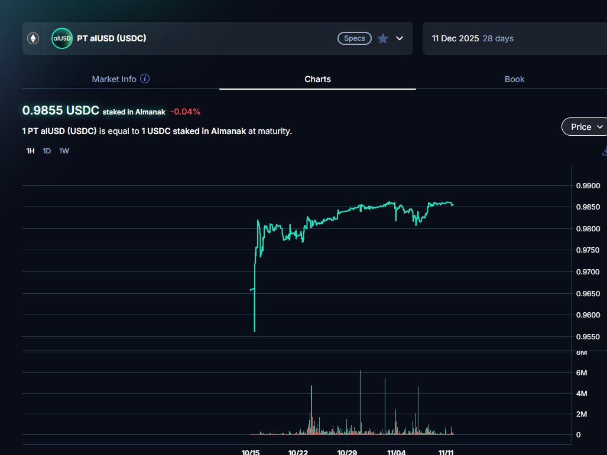

# Pendle YT 認購 Almanak 代幣——以 0.107 價格打新的機會

> **來源**: [@beiyue66](https://x.com/beiyue66/status/1988626554398937408) | [原文連結](https://pendle-moonshot-calculator.netlify.app/)
>
> **日期**: Wed Nov 12 15:14:52 +0000 2025
>
> **標籤**: `Pendle` `Almanak` `YT 認購`

---

> **來源**: [@beiyue66 (beiyue1)](https://twitter.com/beiyue66)  
> **日期**: 2025-12-11  
> **標籤**: `pendle` `yt-token` `almanak` `alusd` `打新` `空投`

---

## 核心概念

現在購買 YT-alUSD，相當於以 **0.107** 的價格認購 Almanak 的代幣。

## Almanak 專案背景

- **融資情況**：在 Legion 上以 90M 的價格完成過一輪融資
- **現況數據**：
  - TVL：180M
  - 融資額：8.65M
  - 領投方：HashKey
- **歷史 ICO**：曾在 Legion 以 0.09 的價格 ICO 過一次

## 收益計算機制

官方提供[計算器](https://t.co/0Y61Ld3Dsy)，收益計算方式如下：

**範例：買入 1000 USDC 的 YT**

1. **積分獎勵**：到期可獲得 6,893 points
   - 兌換比例：1 points = 1 token
   - 即可獲得 6,893 個代幣

2. **代幣價值估算**（以不破發為前提）：
   - 以 ICO 價格 0.09 計算，開盤代幣價值約 683 USDC

3. **持有收益**：
   - 持有 YT 可獲得 4.73% 的 APY
   - 到期可獲得約 259.7 USDC 的本金收益

4. **實際打新成本**：
   - 相當於以 **0.107** 的價格打新

## 額外獎勵機制

除了 YT 持有收益外，還可以透過以下方式獲得額外空投：

- 發表 Almanak 相關文章
- 參與社群互動（[@almanak](https://twitter.com/almanak)）

## Pendle Moonshot 計算器詳情

### 積分分配機制

**每日總積分：333,333**

- **95% (316,666) 分配給 TVL 倉位**：
  - 根據加權 TVL 按比例分配
  - 不同倉位有不同的 boost 加成
  - **注意**：PT 持有者獲得 0 積分！
  - 10 月 23 日市場不計入積分

- **5% (16,667) 分配給推薦獎勵**

- **Pendle 協議費用**：從 YT 積分中抽取 5% 作為協議費

### Boost 加成倍數

- YT 倉位：**5x**
- 12 月 11 日 LP：**1.5x**
- 其他倉位：**1x**

### 最低資金要求

計算器提供最低資金計算功能，顯示在每個活躍池中每天至少獲得 1 積分所需的最低代幣數量（已考慮 boost 倍數）。

### 交易執行資訊

- 輸入金額
- 需支付金額
- 收到的 YT 數量
- 交易手續費
- 到期預估積分
- 到期時總收益

### ROI 情境分析

根據不同的 Almanak FDV（完全稀釋估值）情境，計算器會顯示：

- ROI（投資回報率）
- 總收益（USDC）
- 到期天數
- 損益平衡點

收益包括底層收益 + 淨積分價值（扣除 Pendle 費用後）。

### 重要提醒

⚠️ **警告**：這些數據為粗略估計。由於有 5% 保留給推薦獎勵，實際積分可能會根據最終分配而有所不同。
