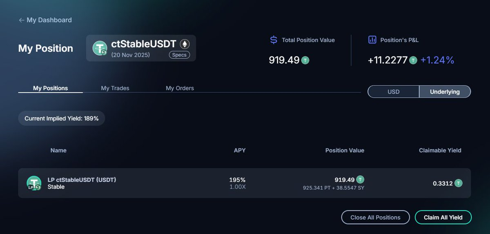

# Pendle LP 穩定收益策略：突破溢價困境的 Alpha 機會

> **來源**: [@an_le23998](https://x.com/an_le23998/status/1986582858060996984)
>
> **日期**: 
>
> **標籤**: `Pendle` `LP 策略` `穩定幣溢價`

---

> **來源**: [@an_le23998 (XC)](https://x.com/an_le23998)
> **日期**: 2024-11-03
> **標籤**: `Pendle` `LP策略` `風險管理` `DeFi` `穩定幣`

---

## 策略修正：重新理解 Pendle LP 機制

之前的策略存在嚴重錯誤，對 Pendle 的 LP 機制沒有正確理解。

**關鍵認知**：LP 就是 LP，沒有辦法鎖定價值，只能鎖定份額。SY/PT 的比例會跟隨市場不斷調整比例。如果市場看多收益，就會出售更多的 PT，那麼你的 PT 還會逐漸變多。

由於 PT 折價巨大，APY 主要靠這部分的收益來彌補溢價帶來的損失。

**LP 需要關注的指標**：
- PT 在池子中的比例
- APY 是否能夠維持
- 市場利率是否維持或上漲

頁面顯示的 SY + PT 的數量是**預測回報**，是基於當前池子中的比例維持不變的情況下來計算。

---

## Stable 項目 10% 溢價下的 Alpha 機會

### 市場背景

關於 Stable 項目本身不過多介紹，金庫代幣溢價 10% 足夠說明一切。

那麼問題來了：在溢價 10 個點的情況下，我們是否還能找到參與角度？

經過 Alpha 小組的深入研究，答案是：**有的**。

得益於該市場的火爆程度，在 Pendle 上，該 LP 的收益率高達 **300% APY**。

### Pendle LP 機制速覽

很多人不理解 Pendle LP 的運作方式，這裡簡單說明：

#### LP 組成
- Pendle LP = PT (Principal Token) + SY (Standardized Yield)
- 添加流動性時，資產會自動轉換為這兩種代幣的組合
- **LP 的資產配比在加入時就鎖定**（這很關鍵）後續的 APY 變化不會影響你鎖定時的資產比例

#### 收益來源
- **PT 升值**：PT 在到期前折價交易，到期時 1:1 贖回
- **交易手續費**：LP 從每筆交易中分成
- **PENDLE 代幣激勵**：額外的流動性挖礦獎勵

### 當前池子數據

- **總 APY**: 299% (Unboosted)
  - PT Yield: 283%
  - LP Yield: 16.11%
    - 交易費: 0.55%
    - PENDLE 激勵: 15.57%
- **到期時間**: 2024 年 11 月 20 日（剩餘 17 天）

### 實戰案例分析

#### 初始投入
- 投入：1000 USDT
- 獲得：900 ctStableUSDT
- 表面損失：100 USDT (10% 溢價)

#### 投入 LP 後的鎖定數據

將 900 ctStableUSDT 投入 LP 後，可以看到：
- PT 數量：已鎖定
- SY 數量：已鎖定
- **17 天後預計持有**：963.89 個代幣（幣本位增長 13.9%）

### 收益情景推演

#### 情景 A：ctStableUSDT 維持溢價（1.11 USDT）

17 天後：
- 963.89 × 1.11 = 1,069 USDT
- 投入：1,000 USDT
- **純收益**：+69 USDT (+6.9%)
- 額外獲得：SY 積分
- **17 天 6.9% 收益，年化約 148%**

#### 情景 B：ctStableUSDT 跌回 1:1

17 天後：
- 963.89 × 1.0 = 963.89 USDT
- 投入：1,000 USDT
- **虧損**：-36 USDT (-3.6%)
- 獲得：部分 SY 積分（可能抵消部分損失）

### 風險收益分析

#### 看多理由

1. **項目極度火爆**：10% 溢價本身說明市場需求旺盛
2. **時間窗口短**：僅 17 天，溢價崩盤的時間不多
3. **多重收益**：幣本位增長 13.9% + SY 積分額外獎勵 + 可能的 PENDLE 代幣獎勵
4. **Pendle LP 機制**：提供交易深度，溢價有一定支撐

#### 風險點

**脫錨風險**：如果 ctStableUSDT 跌回 1:1，虧損 3.6%

#### 盈虧平衡點

**關鍵數字**：ctStableUSDT ≥ 1.037 時盈虧平衡
- 計算：1,000 ÷ 963.89 = 1.037

也就是說：
- ctStableUSDT 只需維持 **3.7% 的溢價**即可保本
- 當前溢價 11%，有 **7.3% 的安全邊際**
- 即使溢價縮窄到 3.7%，仍不虧損

---

**策略風險依舊，DYOR**
