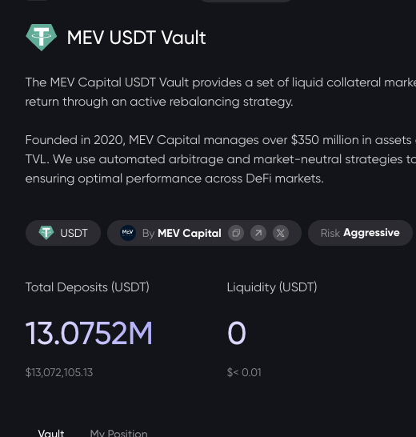
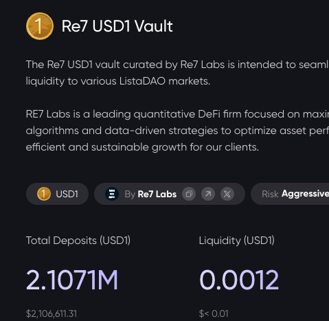
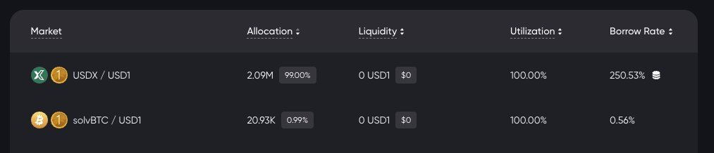
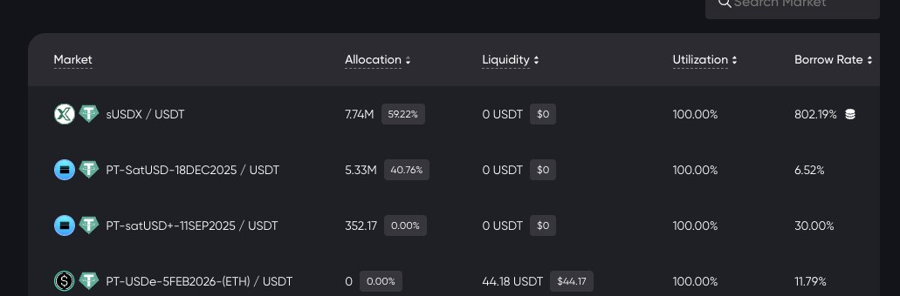

# Euler/Lista 救援開源腳本：自動監測提取與換倉工具

> **來源**: [@hklst4r](https://x.com/hklst4r/status/1986467704904069284) | [原文連結](https://x.com/hklst4r/status/1986419422316134482)
>
> **日期**: 
>
> **標籤**: `DeFi 風險管理` `清算防護` `自動化工具`

---

> **來源**: [@hklst4r (Weilin (William) Li)](https://x.com/hklst4r)
> **日期**: 2026-02-17
> **標籤**: `DeFi` `Euler` `Lista` `智能合約` `救援腳本` `自動化工具`

---

## 概述

開源 Python 腳本用於 Euler/Lista 協議救援，已成功挽救 $26k 資金。腳本持續監測 Lista 金庫餘額，一旦檢測到資金即自動執行提款操作。

## 功能特性

### 已實現功能

- **Lista 金庫監測**：持續讀取 Lista 金庫餘額並自動提款
- **資金追蹤**：已成功救援 $26k 資金

### 開發中功能

1. **Euler 腳本**：正在開發 Euler 協議的監測與提款腳本
2. **Lista 換倉功能**：使用換倉方法將資金轉移到 satUSD 市場

## 開源地址

專案代碼已開源，可於 GitHub 獲取：https://t.co/KzLI5DJqDq

## 原文

> Wrote a short python script to keep monitoring Lista balances and withdraw from them.  
> (1) Euler's script is on the way.  
> (2) Lista Position-altering on the way.
