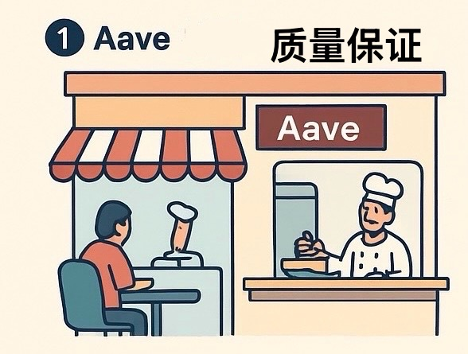

# 無許可市場 vs 治理許可市場：DeFi 借貸協議的架構差異

> **來源**: [@liu_web3](https://x.com/liu_web3/status/1986285507698135344)
>
> **日期**: 
>
> **標籤**: `DeFi協議` `風險管理` `市場結構`

---

> **來源**: [@liu_web3 (Alex Liu)](https://x.com/liu_web3)  
> **標籤**: `DeFi` `借貸協議` `Morpho` `Euler` `Aave` `風險管理`

---

## 核心概念：無許可市場 vs 治理許可市場

很多朋友不懂 @MorphoLabs、@eulerfinance 等協議和 @aave 的區別,在 xUSD 脫錨中遭受損失,以下做個科普：

我們以去餐館吃飯來比喻借貸,那麼有存借需求的用戶就是食客,借貸協議是餐館,而「可以存什麼、可以借什麼」的一個 Market(市場)就是一道菜。

## Aave：治理許可市場 (Governance Permissioned Markets)

**通俗說法**：它只賣自己的菜,由利益相關者投票決定菜品是否合格可上市,所以品質有保障。

**術語版**：Aave 是 Governance Permissioned Markets —— 需經過治理許可的市場。

什麼資產可以作抵押物、什麼資產可借、具體參數如何,都需官方、專業風險評估方(如 @gauntlet_xyz、@chaoslabs)及治理投票共同決定。

**特點**：
- 統一的流動性
- 如果協議出現壞帳,將是全局的(所有用戶共同買單)

## Morpho 和 Euler：無許可市場 (Permissionless Markets)

**通俗說法**：這裡很多菜品外包,第三方借餐館設施做菜並給餐館抽水,官方不對這部分菜品質量負責。並且此地不設門禁,誰都可以來此賣菜(部署借貸市場)。

**術語版**：Morpho 和 Euler 是 Permissionless Markets —— 無需許可的市場。

誰都可以通過二者提供的基礎設施無需審核地部署市場。這些部署 Market(市場)、管理資金池(Vaults)的角色叫做 **Risk Curators**(風險策展人)。

**風險特性**：
- 如果 Risk Curator 風控不到位,引入如 xUSD 的不良資產做抵押物,對應的 Market 可能出現壞帳
- 在該 Market 部署資金的 Vault 則遭受資金損失(如無流動性提現)
- 這種架構更模塊化,流動性更碎片化
- 但爆雷的 Market 和 Vault 不會影響其他市場,**壞帳不共享,風險隔離**

## 結論

### Aave 的優勢與風險
- 在 Aave 上存錢有官方、專業的第三方和大戶們為風險保駕護航,是一個很好的從眾選擇
- 所以大家說「Just use Aave,只用 Aave 就好了」
- **但不代表 Aave 絕對安全,出事了大家一起完蛋**

### Morpho 和 Euler 的使用建議
- 即使 Morpho 和 Euler 的代碼安全可信賴,在上面存錢還需要找到靠譜的、風控好的 Risk Curator
- 目前看做得不錯的有 @SteakhouseFi、@k3_capital 等
- **你需要了解自己所處 Market、Vault 背後的資產敞口和 Curator 風控水平**
- xUSD 讓 Euler 和 Morpho 上多了不少壞帳,但協議其他市場仍然安全

## 趨勢展望

筆者認為 Permissionless Markets 是 DeFi Lending 的發展大趨勢。

Aave 極有可能走向只上架最優質資產的路徑,而許多次優資產、長尾資產乃至於垃圾資產,也渴望解放流動性。
