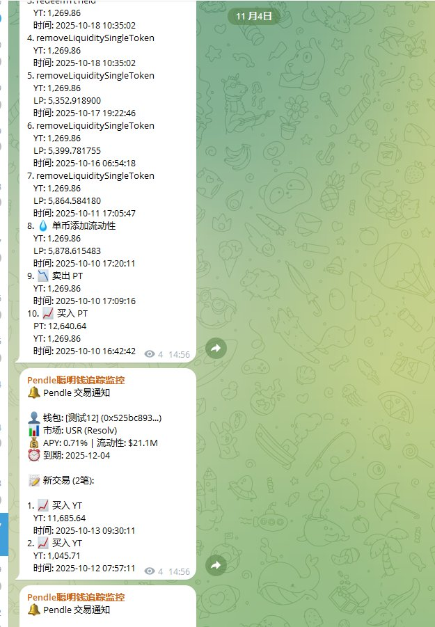

# Pendle 鏈上聰明錢監控系統

> **來源**: [@beiyue66](https://x.com/beiyue66/status/1985745870571389413)
>
> **日期**: 
>
> **標籤**: `DeFi監控` `聰明錢追蹤` `Pendle協議`

---

> **來源**: [beiyue1 (@beiyue66) on X](https://x.com/beiyue66)
> **日期**: 2025-02-17
> **標籤**: `Pendle` `鏈上監控` `聰明錢` `DeFi工具` `YT/PT交易`

---

## 專案概述

花幾天時間撸了個 Pendle 的全鏈監控系統。目前完成的功能包括追蹤聰明錢（買賣 YT/PT、組 LP 都可以監控到）、監控市場波動，以及聰明錢的購買趨勢。

系統一直在做優化，目前基本上可以達到毫秒級的響應速度。

## 後續計劃

接下來打算繼續完善 vePendle 相關的一些監控功能，包括：

- 監控投票
- 各個協議 TVL

## 當前問題

現在的主要問題是樣本太少，沒什麼聰明錢。軟件有了，但數據沒有。感覺抓聰明錢是一個非常麻煩的事情，一個個找真的要暈過去了。

需要找到好辦法能夠將聰明錢的篩選量化起來。
