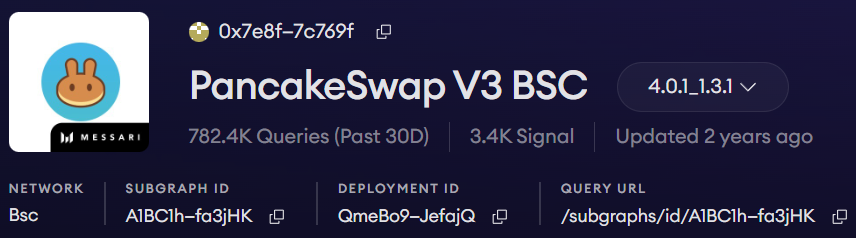

# PancakeSwap V3 LP 狀態監控工具

> **來源**: [@dxh430](https://x.com/dxh430/status/1984264278267077037)
>
> **日期**: Fri Oct 31 14:20:44 +0000 2025
>
> **標籤**: `LP管理` `PancakeSwap` `監控工具`

---

> **來源**: [@dxh430 (DXH430725)](https://twitter.com/dxh430)
> **日期**: 2026-02-17
> **標籤**: `DeFi` `PancakeSwap` `流動性挖礦` `監控工具` `The Graph`

---

## 工具簡介

PancakeSwap V3 LP 狀態獲取與通知工具，用於監控流動性提供者(LP)的倉位狀態。

## 問題背景

組 LP 時，經常會遇到出區間了自己不知道的情況。作者之前使用的其他 DEX 都有 SDK 可以方便地獲取狀態，但是 PancakeSwap 沒有。

## 解決方案

經過研究後發現，可以通過 The Graph 子圖介面獲取 LP 狀態。作者已將工具開源供大家使用。

## 注意事項

- 該程式只能監控 BSC 鏈 V3 池
- 如需監控其他鏈，可以參照尋找對應的子圖來實現
