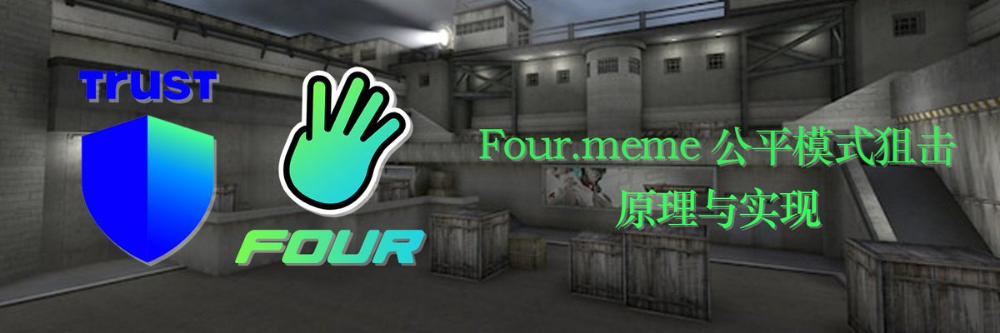
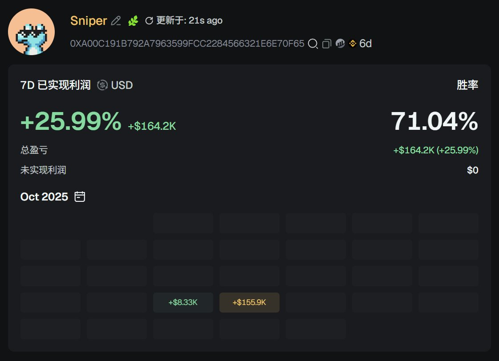
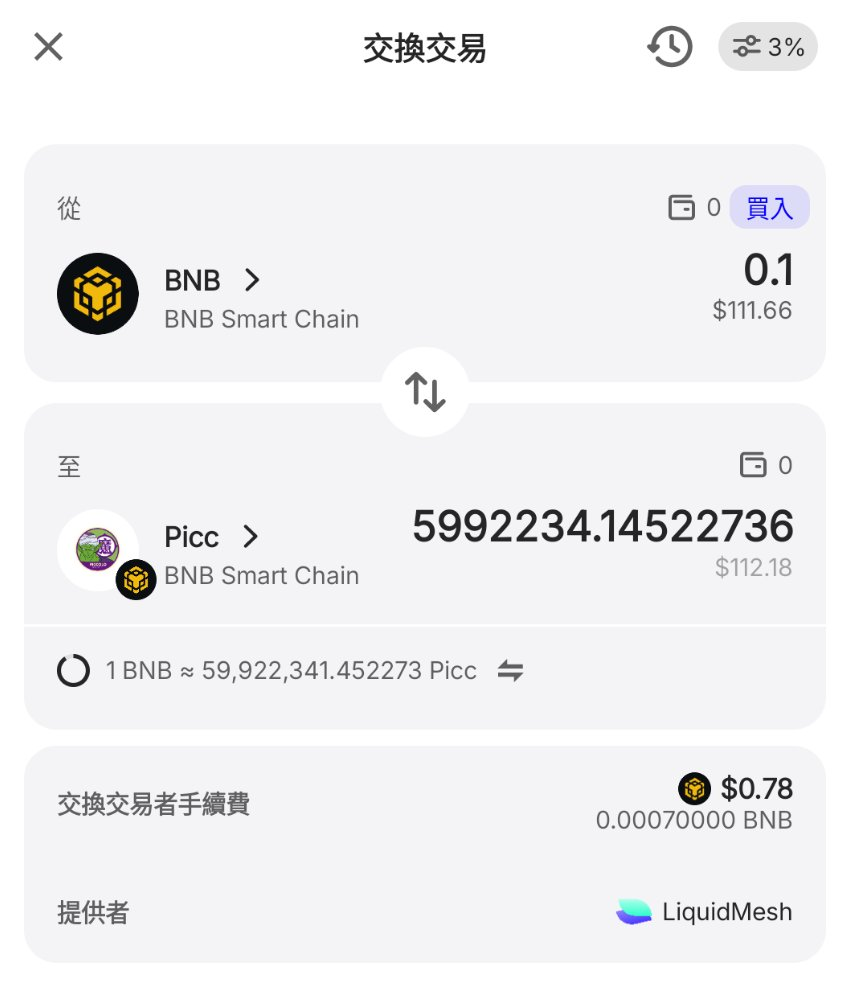

# 公平模式代幣狙擊原理與實現——TrustWallet Swap API Hook 技巧

> **來源**: [@CryptoNyaRu](https://x.com/CryptoNyaRu/status/1983485182754816093) | [原文連結](https://four.meme/)
>
> **日期**: Wed Oct 29 10:44:53 +0000 2025
>
> **標籤**: `狙擊交易` `公平模式` `MEV套利`

---

> **來源**: [@CryptoNyaRu (加密貓雷)](https://twitter.com/CryptoNyaRu)
> **日期**: 2026-02-17
> **標籤**: `DeFi` `公平啟動` `狙擊交易` `套利` `智能合約` `BNB Chain`

---

## 狙擊實戰記錄

這是我的狙擊地址: `0xA00C191B792a7963599FcC2284566321e6E70F65`

- **第一天**: 游龍，甚至做到許多代幣 0 區塊買入，獲利 16WU
- **第二天**: TrustWallet 不再能交易公平模式代幣內盤，無法狙擊
- **第三天**: TrustWallet 恢復交易公平模式代幣內盤，但某一交易中的簽名不再能複用到其他代幣，無法狙擊

## Four.meme 新機制更新

明天開始，以下更新將應用到 Four.meme 的公平模式：
- 新創建的代幣實施階梯稅率：從 100% 稅率起，逐區塊降低至 1%
- 公平模式代幣內盤不再要求使用幣安無私鑰錢包

我的狙擊方式失效了，舊機制也要向我們說再見了。現在公佈原理與實現給感興趣的朋友們。

---

## 簽名機制原理

理解簽名機制的核心要點：
- 買入公平模式代幣內盤，需要特定 Signer 的簽名
- 簽名的有效期是 1 分鐘
- 簽名的內容僅有交易的發起人與簽名過期時間

**關鍵發現**：既然買入某一公平模式代幣內盤的簽名，可以複用於其他代幣，那麼我們只需要持續更新拿到的簽名，確保它不會過期。

---

## 簽名獲取方案探索

### 方案一：LiquidMesh Swap API（失敗）

試圖從使用了 LiquidMesh Swap API 的服務中獲取簽名：
- LiquidMesh 似乎與幣安關係密切
- LiquidMesh 為公平模式代幣內盤提供路由服務

**結論**：不可行，使用了 LiquidMesh 的第三方服務無法為公平模式代幣內盤提供報價。

### 方案二：移動端幣安無私鑰錢包 Swap API（失敗）

試圖從移動端幣安無私鑰錢包的 Swap API 中獲取簽名：
- 移動端幣安無私鑰錢包的 Swap 區別於網頁端，在本地有簽名動作

**結論**：不可行，抓包未發現存在請求返回了待簽名的 Swap 交易，也許返回的數據在 WebSocket 流中，但未驗證。

### 方案三：TrustWallet Swap API（成功）

試圖從 TrustWallet 的 Swap API 中獲取簽名：
- TrustWallet 無需幣安帳號即可創建錢包，且可交易公平模式代幣內盤

**結論**：可行，抓包發現存在請求返回了完整的 Swap 交易，其中包含有效期 1 分鐘的簽名。但相關請求的 Header 攜帶加密參數，不可重放，需要逆向獲得這些參數是如何計算的。

---

## Hook TrustWallet API 實現方案

此時發現了 TrustWallet 的特性：Swap 界面會每 10 秒更新一次 Swap 報價，簽名也一併更新。

因此換個思路，不由我們自己構造請求，而是在外部 Hook TrustWallet Swap API 返回的結果。

### 所需工具

- **Charles**：用於抓包調試與生成自簽 SSL 證書  
  [https://www.charlesproxy.com/](https://www.charlesproxy.com/)

- **go-mitmproxy**：用於搭建 Proxy Server 以 Hook TrustWallet Swap API 返回的結果  
  [https://github.com/lqqyt2423/go-mitmproxy](https://github.com/lqqyt2423/go-mitmproxy)

### 實現步驟

1. Charles 生成自簽名 SSL 證書，並在安裝了 TrustWallet 的移動設備上信任該證書
2. 導入 go-mitmproxy，使用剛才生成的證書運行一個 Proxy Server
3. 移動設備連接到剛才運行的 Proxy Server，打開 TrustWallet 的 Swap 界面，選擇任意公平模式代幣內盤，輸入 AmountIn 後掛機

此時，在 Proxy Server 中我們就能實時 Hook TrustWallet Swap API 返回的交易信息，並從中提取簽名。

如此一來，最困難的簽名問題就解決了，我們的狙擊地址總能持有一個未過期的簽名。

---

## 其他技術細節

而之後就是比較基礎的問題了，比如：
- 如何從給定的 Swap 交易 Calldata 中剔除額外手續費
- 如何在鏈下預計算將要創建的代幣地址
- 如何使用 MEV 服務發送 Bundle

這裡不再贅述，善用搜索，多積累經驗就能解決這些問題。

---

## 結語

雖然狙擊方式失效，但我仍希望分享的思路對感興趣的朋友們有所啟發。

明天新機制上線，我們鏈上再見。
