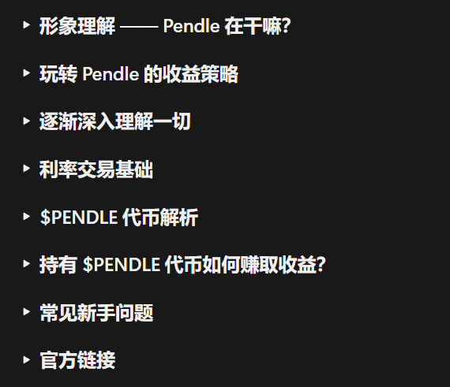
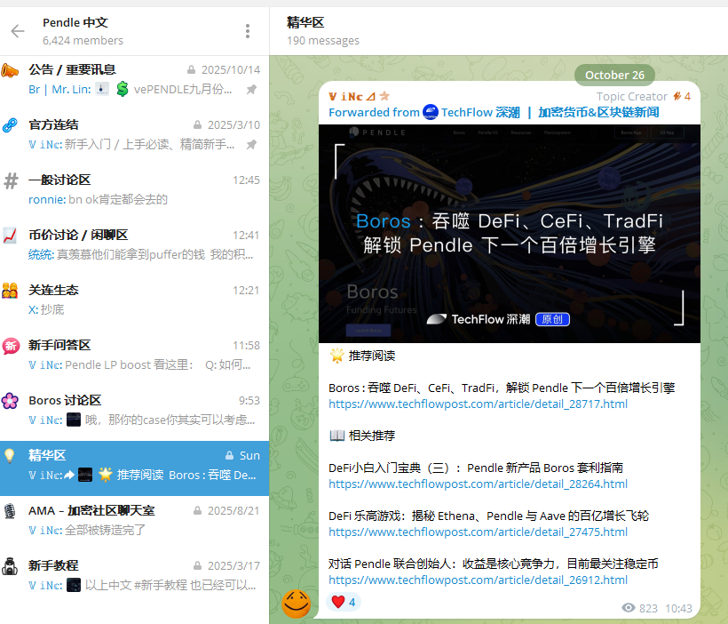

# DeFi 採用障礙與理財心態：為什麼多數人還在賭而不是學

> **來源**: [@ScarlettWeb3](https://x.com/ScarlettWeb3/status/1983040629165928480) | [原文連結](https://pendle.notion.site/Pendle-1b2567a21d3780168a83dc0028731413)
>
> **日期**: 
>
> **標籤**: `DeFi心態` `收益交易` `財富焦慮`

---

> **來源**: [@ScarlettWeb3 (Jingle Bell 初号机)](https://twitter.com/ScarlettWeb3)  
> **日期**: 2026-02-17  
> **標籤**: `DeFi` `投資心態` `Pendle` `理財策略`

---

## DeFi 採用的三大障礙

前幾天在 Kamino 飯局上，我說：其實，我們都活在自己的資訊繭房裡。

我在字節太久，身邊都是聰明人；現在做 Web3，接觸的大多又是 KOL。所以我總覺得——DeFi 很常見。但其實，整個幣圈大多數人，根本不用 DeFi。

他們只知道：
- 交易所買比特幣、以太坊，低買高賣
- 再進階一點，就是打土狗、打新
- 再往上一步？DeFi，看不懂、太複雜、算不明白

### 🎯 1、覺得太慢

DeFi 做槓桿風險高，30%-50% 就已經了不起了。可打土狗，分分鐘 100x、1000x，反饋來得快得多。即時反饋不一樣，多巴胺問題。

### 🎯 2、倉位太低

我只有 10w，我拿 10x 才 100w  
你有 1000w，你吃 5% 就 50 萬

5% 和 1000% 之間差了 500 倍  
5% 很容易，但 10 倍很難  
大戶的一點理財利息，就是我的一輩子  
我只能賭。

### 🎯 3、太複雜

看不明白，算不明白，懶得學。所以越是下沉的市場就越容易戳中人的奶頭樂本性：刷抖音、吃外賣、meme = 懶和賭，難以克服。

## 幣圈的殘酷現實

但不是這樣，現在的幣圈難度是地獄級。每一分錢都來之不易，都是刀尖舔血拼來的。

每次看到那些爆倉的大戶，我都在想：「都有幾千萬了為什麼還要賭？」

可真相是——他們不是不懂，而是無法守財，無法安靜。永遠追求刺激、追求瞬間高潮。

**他們沒有學會，慢就是快。**

## 二八定律的另一種體現

20% 知道 DeFi 的人，拿著幣圈 80% 的資金。這何嘗又不是另一種二八定律呢？

## 關於 Pendle

如果你真想學點 DeFi，不妨看看 @pendle_fi

Pendle 是全球虛擬貨幣市場上最大的收益交易平台，也是目前最被低估的 DeFi 賽道之一。

- 一文看懂 Pendle：https://t.co/xEtEgpMgeJ
- TG 精華區：https://t.co/HiLGQmGD3w

來源：中文區 Pendle 第一人，推特搜尋：ViNc2453

## 關於 Kamino

前幾天我發的 @kamino 策略也值得收藏：https://t.co/eu3eOabkSm

Kamino 是 SOLANA 生態最大的借貸市場（佔據了 50% 左右的 SOLANA 市場），但中文區竟然沒多少人知道 #kamino。
