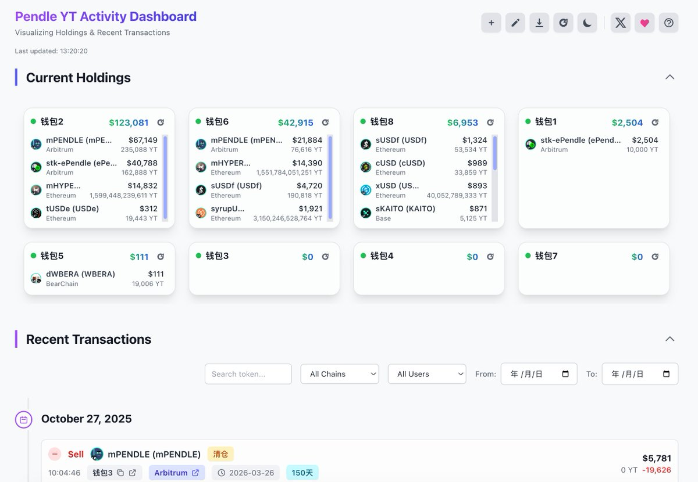

# Pendle 聰明錢追蹤儀表板 - YT 持倉監控工具

> **來源**: [@Hollow2077](https://x.com/Hollow2077/status/1982682591624065239) | [原文連結](https://pendle-activity-dashboard-167435137175.us-west1.run.app/)
>
> **日期**: Mon Oct 27 05:35:40 +0000 2025
>
> **標籤**: `Pendle` `聰明錢追蹤` `YieldTrading`

---

## 來源資訊

> **來源**: [@Hollow2077 (小骑士)](https://twitter.com/Hollow2077)  
> **連結**: [Pendle Activity Dashboard](https://pendle-activity-dashboard.example.com)  
> **標籤**: `Pendle` `DeFi` `聰明錢追蹤` `數據工具`

---

## 工具介紹

這是一個由 AI 輔助開發的 Pendle YT (Yield Token) 聰明錢追蹤工具，開發者無程式基礎背景。

## 核心功能

- **YT 持倉監控**：追蹤 Pendle 聰明錢地址的 YT 代幣持倉狀況
- **購買記錄追蹤**：記錄並顯示這些地址的 YT 購買歷史
- **網頁儀表板**：提供視覺化的網頁介面查看數據

## 使用場景

適合用於：
- 追蹤 Pendle 協議中經驗豐富交易者的操作
- 學習聰明錢在 YT 市場的配置策略
- 發現潛在的收益交易機會
