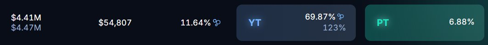
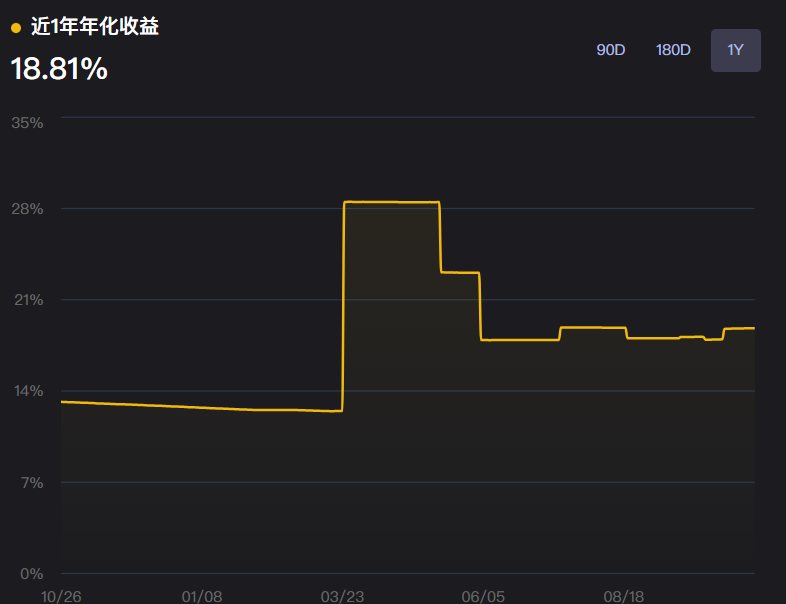

# BNB 空投收益 240 天 70% 報酬率策略（Pendle YT 槓桿交易）

> **來源**: [@dxh430](https://x.com/dxh430/status/1982452361864872132)
>
> **日期**: Sun Oct 26 14:20:49 +0000 2025
>
> **標籤**: `Pendle` `收益交易` `BNB 空投`

---

> **來源**: [@dxh430](https://twitter.com/dxh430)  
> **日期**: 2025-02-17  
> **標籤**: `DeFi` `Pendle` `BNB` `收益策略` `YT槓桿`

---

## 策略概述

silsBNBx 新一期已經於 Pendle (@pendle_fi) 上線，為期 240 天，底層收益來自 BNB holder 的空投收益，長期穩定在 10-12% 的年化。

目前 YT 有 23.6x 的槓桿，可使持有年化升高至 **123%**，240 天總收益約 **70%**。

## 策略優勢

由於底層資產是 BNB，如果 BNB 在此後長期上漲，甚至可能 U 本位又吃又拿——在持有一段時間後賣出 YT，不僅由於 BNB 上漲 U 本位不會虧損，還有空投可拿。

## 空投領取說明

該 YT 的空投收益通常在幣安發放後 7 天內，在指定網站以不能賣形式發放。

## 風險提示

- 以上僅為資訊分享，非投資建議，請務必自行做好研究
- YT 槓桿交易存在價格波動風險，需注意 BNB 價格變動對收益的影響
