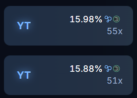
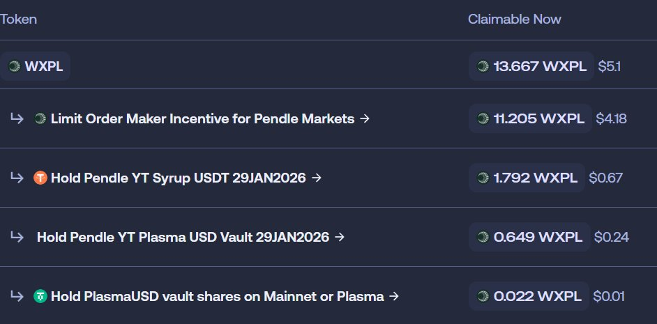

# Pendle Plasma 鏈 YT 買入與挂單雙重收益策略

> **來源**: [@dxh430](https://x.com/dxh430/status/1982103415087149162)
>
> **日期**: Sat Oct 25 15:14:14 +0000 2025
>
> **標籤**: `Pendle` `YT 收益` `挂單套利`

---

> **來源**: [@dxh430 (DXH430725)](https://x.com/dxh430)
> **日期**: 2026-02-17
> **標籤**: `Pendle` `Plasma` `YT` `DeFi` `掛單獎勵`

---

## 策略概述

Plasma 鏈 Pendle YT 買入與掛單雙重收益策略，結合底層收益與掛單獎勵，三日年化可達 1200%，底層年化 70+%。

## 核心機制

Plasma 鏈 Pendle 近期持續提供：
- **Merkle 外部獎勵**
- **掛單獎勵**

## 收益來源

1. **YT 底層收益**
   - Plasma USDT 和 Syrup USDT 等資產的 YT underlying 獎勵高於 imply 收益
   - 買入後即可享受 YT 收益

2. **掛單獎勵**
   - 雙邊掛買賣單
   - 高拋低吸的同時獲取掛單獎勵

## 實際收益

近三天波段收益與掛單收益已達到 10% 左右。
