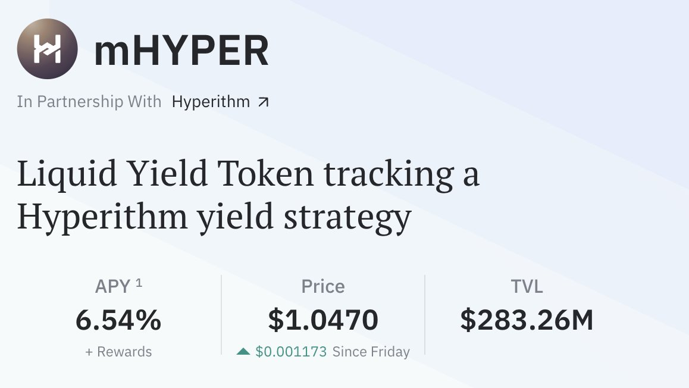

# Pendle mHYPER YT 套利策略分析

> **來源**: [@0xlemoneth](https://x.com/0xlemoneth/status/1981679938978930978)
>
> **日期**: Fri Oct 24 11:11:29 +0000 2025
>
> **標籤**: `Pendle` `YT套利` `DeFi策略`

---

## 策略背景

今天 @pendle_fi 的 mHYPER 池出現了一個套利機會。@stable 開放額度後立即被老鼠倉和科學家吃完，但在此期間，@MidasRWA 的金庫 mHYPER 透過借貸給 Hyperithm 25M 的資金，間接投入了 Stable 的預存款中。

根據 @CryptoBigBeartw 的貼文，Hyperithm 保證了 20% 的借款利息，並保留更高收益的潛在利潤。

**風險聲明**：以下討論均建立在無 DeFi 風險、無項目方被盜和 RUG 風險、Hyperithm 無償還資金及利息問題的前提下，請自行斟酌。

## 池子結構分析

mHYPER 在主網和 plasma 上有兩個池：

- **主網池**：期限一個月
- **Plasma 池**：期限三個月，額外可獲得 $XPL 補貼，底層收益較高

根據目前的說法，Stable 可能的空投收益會在收到之後變成 mHYPER，然後透過 @merkl_xyz 每小時快照分配。如果按照每個時間段的權重都一樣的情況來考慮，等於先拿或後拿 YT，對於 Stable 可能的空投收益都是一樣的（時間加權平均值）。

## 兩種套利策略

### 策略一：保守型（1/3 資金買 YT）

**操作方式**：
1. 去 plasma 買 20% PT
2. 主網用 1/3 PT 賺的錢買 13% YT

**邏輯**：
因為時間差三倍，所以用 PT 多的錢 1/3 買 YT（只花一個月的利息錢）。假設一個月後主網的 YT 到期，plasma 一樣可以用 20% 買回 YT 出場的話，等於本金在此期間是 1.5 倍收益。

**風險**：
plasma YT 一個月後超過 20%，導致買不回來。不過穩定幣的年化不太可能長期維持 20-30% 以上的 IY，所以這部分風險不大。就算真的維持長時間高位直到結束，也只是用 20% 的年化多賣出兩個月，算下來也不會虧。

### 策略二：激進型（全部資金買 YT）

**操作方式**：
1. 去 plasma 買 20% PT
2. 主網用全部收益買 13% YT

**邏輯**：
把未來三個月的所有資金都先存在池內，然後全部轉換成未來一個月內領到任何空投收益，並且加成 1.5 倍。放到三個月後到期能保證本金不減少，而且空投和利息收益大概率也會比本來高。

**優勢**：
這種方式可以保證以本金本位不會虧，除非後兩個月的 YT 高於 30% 以上才會少賺（因為以 20% 的價格把收益權賣出，買入 13% 的權益，等於數量 1.5 倍的 YT，所以價值約 30%）。

## 策略評估

這兩種方式對比的都是直接存入協議金庫。如果是 @MidasRWA 長期主義者，按照這個策略來說絕對不會錯，會比單純直接存在金庫裡更好。但如果是一般人想要吃 Stable 這波的話就還要再考慮看看，畢竟相對於買 YT，是把所有本金都曝險在協議之下。

## 未知風險因素

1. 不知道最後超過 20% 的部分分配方式及比例
2. 不確定之後分配獎勵的時間區間和執行力

## 收益計算分析

目前金庫內有 283M 資金，借出 25M，保證利息 20%。

按照這部分來說，等於金庫 10% 資金可以多收到 14% 年化收益 + 未來空投預期。只看年化的部分，對於整體本金只有 1.4% 加成，也就是讓 APY 從 6.54% 變成 8%。

就算和幣安 $XPL 一樣，能夠存一個月本金+8%，年化 100%，對於整個金庫來說也只能夠讓 APY + 10%，也就是變成 16% 左右。

另外一個點就是這是按照金庫 TVL 都不增加來算的，萬一增加了，25M 的部位比例又會下降更多，拉低整體 TVL。

## 結論

對於是否要購買目前主網 15% 的 YT，單純因為這理由有點貴了。

當初作者人剛好在外面，用手機稍微看到這件事就提了一下，再打開電腦想操作時就發現價差從 7% 變成 2% 了。
