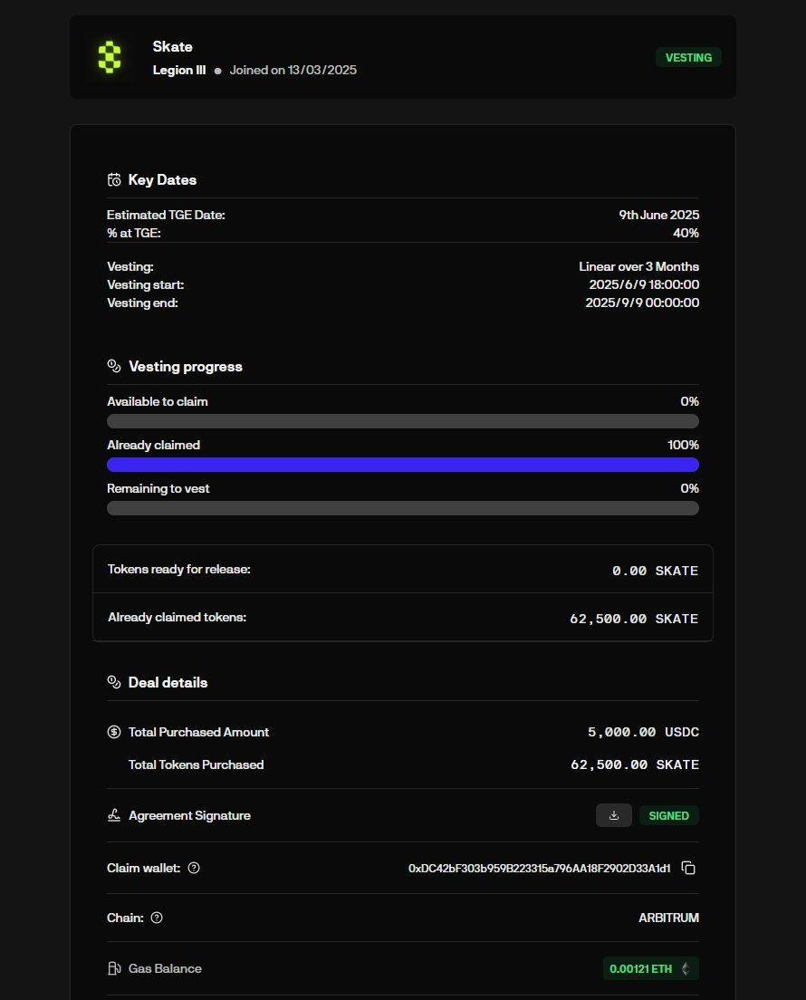
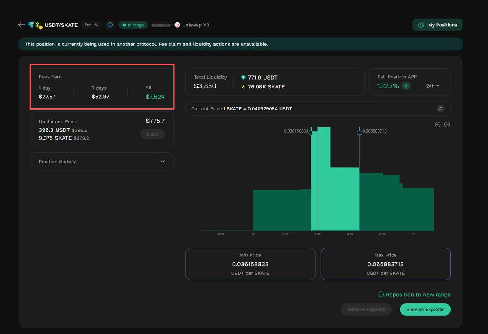
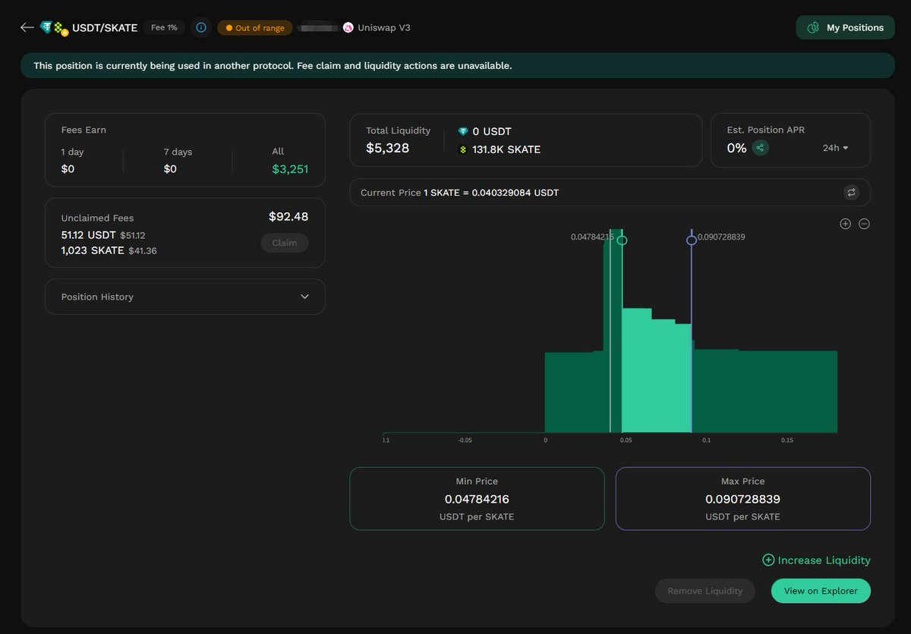

# LP 流動性挖礦回本策略 — Skate 案例分析

> **來源**: [@scuptone](https://x.com/scuptone/status/1981291705409425921)
>
> **日期**: 
>
> **標籤**: `LP策略` `複投技巧` `風險管理`

---

> **來源**: [@scuptone (猫老师scupt)](https://x.com/scuptone)
> **日期**: 2026-02-17
> **標籤**: `DeFi` `流動性挖礦` `LP策略` `回本策略`

---

今天分享一下今年純靠 LP 回本到現在賺 1 萬美金以上的案例。

## 案例背景

本期主角：@skate_chain

我為了刷 @legiondotcc 的打新分，當然也有想賺錢的心思，打了 5 千美金的 Skate 的打新。故事大家也知道了，成本 0.08 美金，價格到現在都 0.04 美金。

## 回本策略

我分析了所有 Skate 所有鏈的交易，找到了最佳的 fee/TVL 的池子 — BSC 的 1% 的池子，然後做了複投。

花了 5 個月不到，成本全回來了，利潤還有 1 萬美金以上。

## 策略總結

所以遇到幣價被坑的，如果項目方還在做事，可以直接和我一樣直接做 LP 回本，時間換空間基本 3 個月左右都可以回本。

## 注意事項

但是需要注意 3 個事情：

1. **一定要把 APR 做到 400 以上**
2. **複投儘可能只複投 token，U 不複投進去**
3. **複投可以在價格跌下去再複投，不要添加過多的 U 進去**
