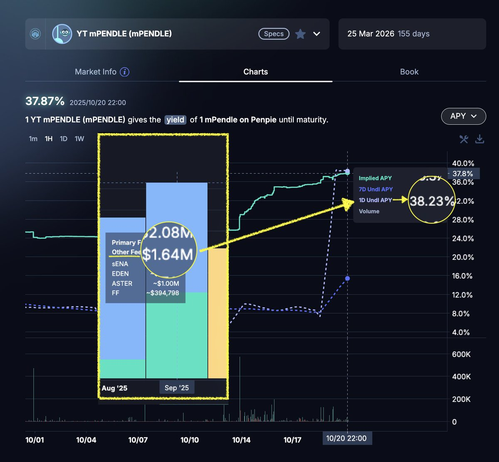
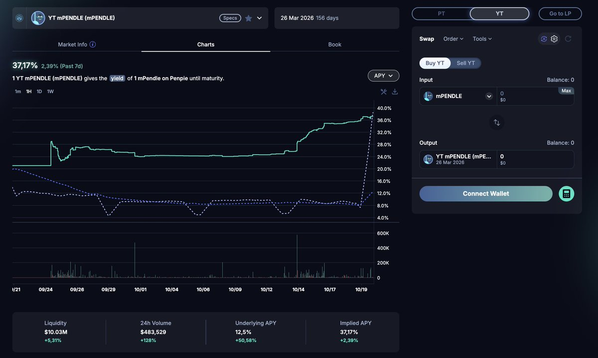

# mPendle 與 Penpie 收益耕種完整指南

> **來源**: [@ViNc2453](https://x.com/ViNc2453/status/1980559353515241916) | [原文連結](https://t.me/PendleFinance_CN/32/107064)
>
> **日期**: 
>
> **標籤**: `Pendle` `mPendle` `收益農業`

---

根據 CLAUDE.md 的描述，我知道應該有 `defi` 分類目錄。現在我會幫你整理這篇文章的正文內容：

---

## 什麼是 mPendle？什麼是 Penpie？

mPendle 是由 Penpie 發行的 vePENDLE 流動質押封裝代幣，每 1 mPendle 代表 Penpie 持有的 1 永久鎖倉的 vePENDLE。由於 vePENDLE 不能轉移、不能提早解鎖或賣出,所以 mPendle 主打一個提供部份 vePENDLE 收益、以及在 Pendle 上挖礦的機會,同時又可供隨時賣出套現的選擇。

Penpie 可以想像成 Pendle 的 DAT／微策略,目的就是捕獲並質押更多 $PENDLE 永久鎖倉成為更多 vePENDLE 以最大化 Pendle 的分紅收益。由於坐擁大量 vePENDLE,Penpie 可以為 Pendle LP 提供 LP 年化 boost 服務,從中抽成服務費。

## mPendle 可以吃到哪些 vePENDLE 收益？

vePENDLE 有三種收益：Airdrop、Base、Voter

- **Airdrop 收益**：mPendle 拿全部 Airdrop 收益（加上 $PNP 排放＋LP 質押業務的 $PENDLE 抽成）
- **Base 收益**：部份收益（約一半）用來回購市面上的 mPendle 以支持匯價
- **Voter 收益**：全部屬於 $PNP 代幣的質押用戶通過參與 vlPNP 每週投票獲得,不屬於 mPendle

### 為什麼不選擇直接自己鎖倉 vePENDLE？

- vePENDLE 不能轉移也不能賣出,但 mPendle 可以
- 除了來自 vePENDLE 的收益,mPendle 也可以獲得額外來自 Penpie 的收益,以及在 Pendle 上的挖礦機會

## 質押 mPendle 能獲得哪些收益？

質押 mPendle 的收益包括：

1. 全部 vePENDLE 的空投收益（空投會轉換成 $PENDLE 發放）
2. $PNP 排放獎勵
3. Penpie 的 LP 質押業務的 $PENDLE 收入分成

### 如何獲得和質押 mPendle？

由於 mPendle 兌 PENDLE 的匯價大部份存在折價,所以只需在市場直接買入 mPendle 即可獲得（流動性池子主要在 Arbitrum Pancake、建議使用像 Kyberswap 一類的聚合器買入）。

mPendle 質押可以去 Penpie 官網並切到 Arbitrum,找到主頁的 mPendle Staking 即可質押。

## Pendle 上的 mPendle LP 池子與 YT-mPendle

Pendle 上的 mPendle 池子的底層資產,正正就是質押版本 mPendle,所以不論 LP 和 YT 都可以吃到上述的收益（YT 更有槓桿放大的作用）。

有一個差別,就是 Pendle 上的 mPendle 池子會把原本的 $PENDLE 收益轉化為 mPendle 發放,所以不論是 LP 還是 YT 都會獲得更多 mPendle。

### 為什麼會有人存 Pendle 上的 mPendle LP 池子？

因為一如任何 Pendle 上的 LP 池子,這個 mPendle LP 還可以吃到額外的 $PENDLE 排放以及池子交易費分成；mPendle LP 的構成是 PT-mPendle + SY-mPendle,部份 mPendle 會轉化為 PT 產生固定收益。

### YT-mPendle 的風險

買入 YT-mPendle,則相當於支付一個固定的借貸成本,獲得一筆槓桿放大數量的 mPendle 去質押挖收益。YT 是一個不保本的高風險槓桿產品。

## 什麼是 Peg？為什麼 mPendle 會折價？

所謂 Peg 就只是說 mPendle/PENDLE 之間的匯價,這完全是自由市場浮動決定。

每一 mPendle 代表的是一個永久鎖倉的 vePENDLE,所以 mPendle 並沒有「贖回」PENDLE 的功能,是單向列車。想「提出」就只能在市場賣掉,造成賣壓。

早年,當 vePENDLE 本身收入低微、年化不足 5% 的時候,mPendle 挖礦提供了遠高於 vePENDLE 本身的年化,所以當時 mPendle 的需求更大。今時今日,vePENDLE 本身的年化已經高達 ~40%,加上 $PENDLE 本身挖礦通脹排放越來越低,現時 mPendle 的挖礦年化相對沒 vePENDLE 那麼吸引,就難以帶動足夠的市場買入需求去支持更高的 peg 了。

但是,Penpie 正在每月以來自 vePendle 的 Base 收益,部份（約一半）用來回購 mPendle 改善 Peg。長遠而言,Penpie 打算最終買光市場上所有的 mPendle。

由於質押 mPendle 可獲得全部 Penpie 應占的 vePENDLE 空投收益,在空投暢旺的季節,質押年化便會突然拉升,自然也會有更多人買入 mPendle 也會拉高匯價。

## 為什麼最近 mPendle 的 Underlying APY 急升？

由於質押 mPendle 可獲得全部 Penpie 應占的 vePENDLE 空投收益,在空投暢旺的季節,質押年化便會突然拉升。

九月份 vePENDLE 總共獲得了 $1.6M 的空投收益（主要來自 $ASTER、$ENA、$FF）,Penpie 占大約三成份額,Penpie 把這些代幣賣了換成 $PENDLE 發放到 mPendle 的 Underlying APY 裡。

在發放空投收益前,mPendle 底息約為 8%,由昨天起開始派發九月度的空投收益,底層總年化漲至 38%。

精算師們早在空投發放之前便預期了這波收益上升,所以 YT 圖表裡早在 10/11 就有人開始在部署 YT 了。

## 十月份的空投／年化會更高嗎？

預期會。目前預期 Ethena S4 空投將在 10 月發放,預計 vePENDLE 的 Ethena 空投金額可能達 $7.5M（按 $ENA 現價約算）,假計十月先假鎖三分二,即單單來自 Ethena 空投的收益已經有 $5M。

對比九月份的空投收益是 $1.6M 把 mPendle 底層年化拉升到 38%,那麼十月暴漲到 $5M+ 空投收益,可以算一下到十一月發放時的年化能到哪裡。

不過提醒一下,這個 YT 的到期日是在明年三月,所以在考慮 YT 的整體估值時,理論上應同時考慮未來 5 個月的平均底層收益,而不僅僅是一個月份的收益。

## 空投收益的發放時間表

vePENDLE 在每月的中下旬（約 15 至 20 號左右）就會發放自上月以來領到的空投代幣,例如最近一次是在 10 月 14 日發放了九月中至十月中間期 Pendle 獲得的空投。

而 Penpie 一般需要大約一週的時間處理這些空投,把他們賣出換成 $PENDLE,然後在接著的週日開始為期四週的發放。

## 參與風險

除了一般的項目／合約風險,主要就是底層收益年化和 Peg 的波動風險：

- 空投收益並非常規收益、主要要看哪個高價值項目在什麼時候發了空投、以及空投到了 vePENDLE 真的派發之間幣價也可能出現下跌
- Peg 波動風險
- YT 的到期日風險：當前 YT 到明年三月到期,考慮 YT 的整體估值時,理論上應同時考慮未來 5 個月的平均底層收益,而不僅僅是一個月份的收益

## 常見問題

**Q: mPendle 要獲取空投收益,需要在快照之前嗎？**

不需要,只要在 mPendle 派發空投收益期間,參與質押 mPendle、或存到 Pendle 上的 mPendle LP 池子（包括把 LP 質押到其他協議的）、或持有 YT,都能獲得空投收益。

**Q: YT 需要質押嗎？**

不需要。

**Q: 我獲得得空投收益的形式是…？如何領取？**

如果你存的是 Pendle 上的 mPendle 池子 LP 或 YT,你收到的將是 $mPendle（此外也有 $PNP 排放收益）。如果你是 LP,收益會自動滾存到 LP 裡不用領取,至於 YT 則可在 Pendle Dashboard 內按 Claim 領取。

否則,如果你直接在 Penpie 的質押畫面質押而非 Pendle LP,你獲取的就會是 $PENDLE 並在 Penpie 內領取。

---

★ Insight ─────────────────────────────────────
這篇文章已整理完成,完整保留了原文的所有技術細節：
- mPendle/Penpie 機制說明（9 大核心問題）
- 收益來源拆解（Airdrop/Base/Voter）
- 風險評估（Peg 波動、YT 到期、空投不確定性）
- 實際操作流程（買入管道、質押位置、收益領取）

請提供你希望的檔案編號和 slug,我會為你建立完整的 markdown 文件。
─────────────────────────────────────────────────

請告訴我：
1. 這篇文章應該放在 `defi` 分類下的哪個編號？（例如：001, 002...）
2. 你希望的英文 slug 是什麼？（例如：`mpendle-penpie-yield-farming`）
