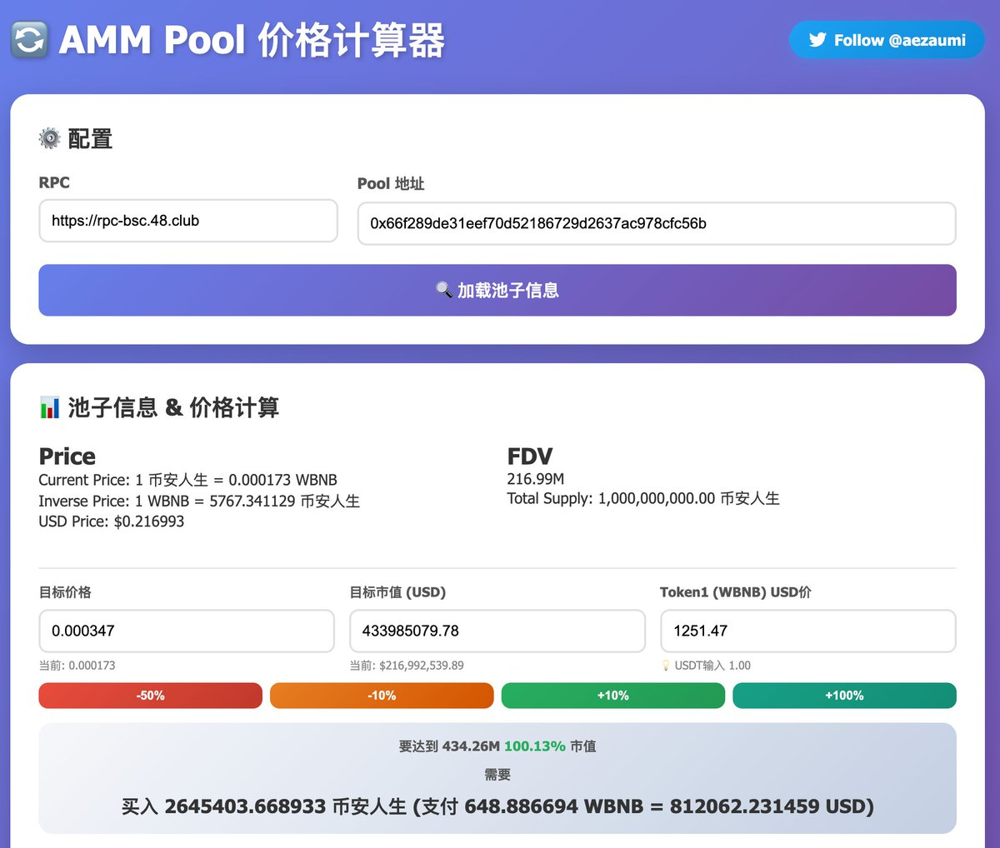
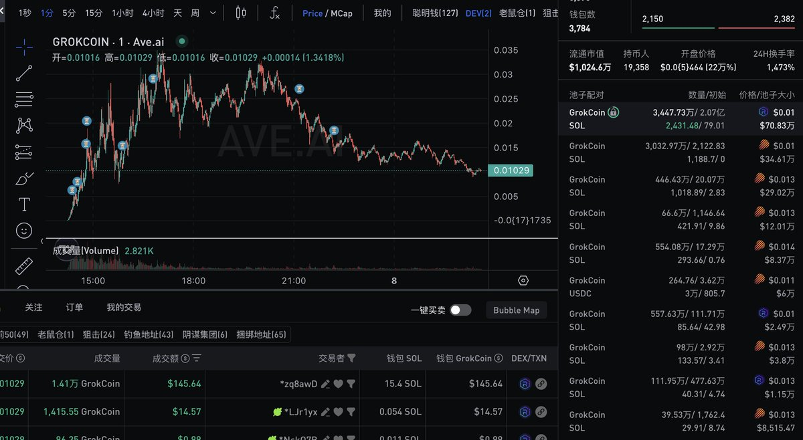
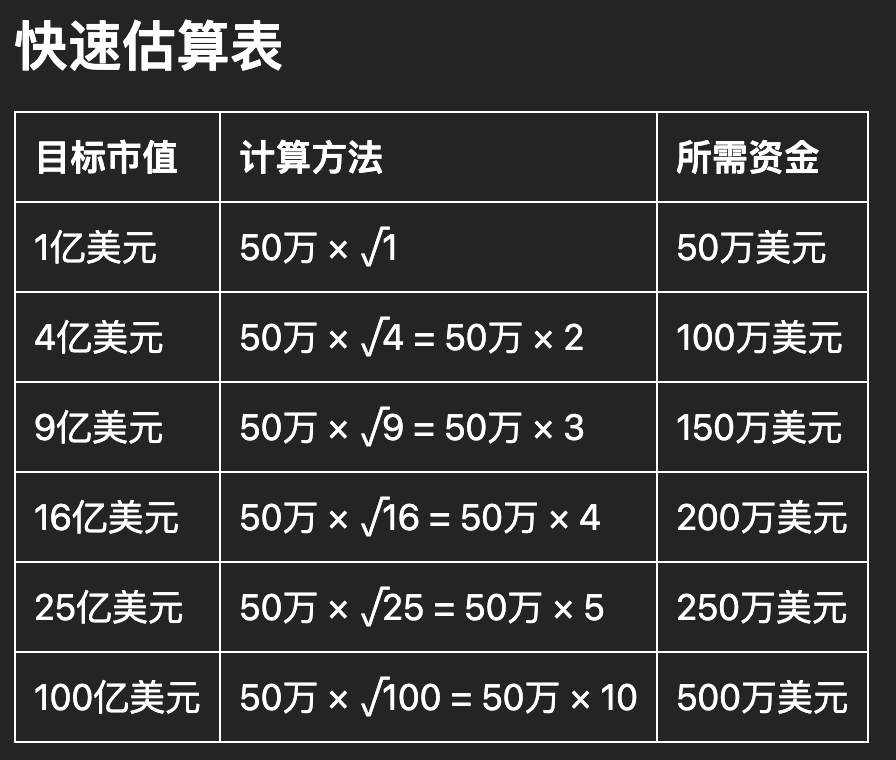
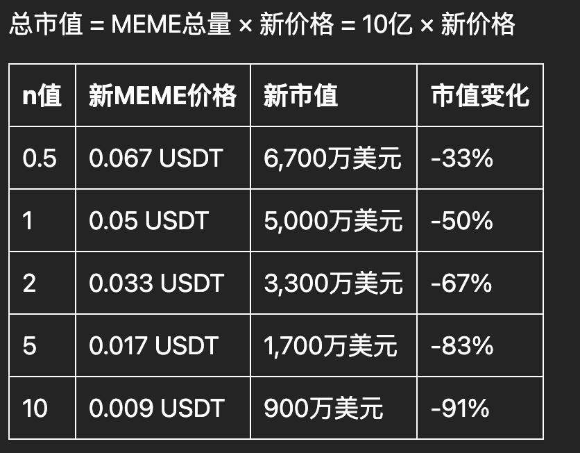

# 狗幣庄拉盤計算器 - DeFi 池子分析工具

> **來源**: [@aezaumi](https://x.com/aezaumi/status/1976604636577702072) | [原文連結](https://x.com/wsjack_eth/status/1898233695523553410)
>
> **日期**: Fri Oct 10 11:04:03 +0000 2025
>
> **標籤**: `DeFi池子` `拉盤計算` `流動性分析`

---

> **來源**: [@aezaumi (umi)](https://twitter.com/aezaumi)
> **參考**: [@wsjack_eth 的原始帖子](https://t.co/tr028tHZlr)
> **標籤**: `DeFi` `流動性池` `拉盤計算` `狗幣莊家`

---

## 工具簡介

根據 @wsjack_eth 之前的帖子，開發了一個自動撈池子計算的狗幣莊拉盤計算器。

**工具連結**: https://t.co/uxjGqRxAU1

## 計算假設

這個計算器的結論建立在以下理想假設上：

- 假定只有一個流動性池子
- 無交易手續費

雖然是理想化的假設，但大致能看出拉盤到某個數量級所需的資金量。

## 實用性

透過這個工具，可以快速估算莊家需要投入多少資金才能將價格拉到目標價位，對於分析狗幣專案的拉盤成本和風險評估有參考價值。
