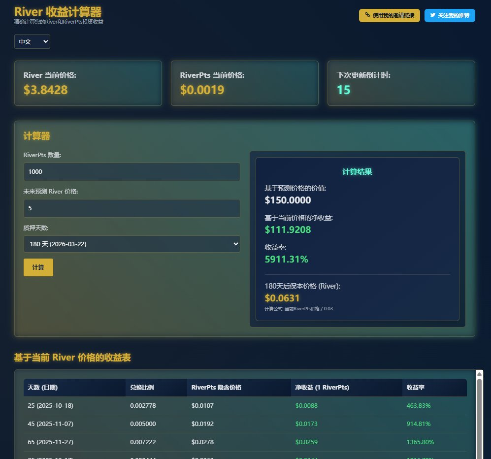

# River PTS 收益計算器 1.0 上線

> **來源**: [@xiogdmonng81069](https://x.com/xiogdmonng81069/status/1979810278792716436) | [原文連結](https://gdx520.github.io/river/river.html)
>
> **日期**: Sun Oct 19 07:22:08 +0000 2025
>
> **標籤**: `收益計算` `River生態` `空投工具`

---

> **來源**: [@xiogdmonng81069 (古德)](https://twitter.com/xiogdmonng81069/status/xxx)
> **日期**: 2026-02-17
> **標籤**: `River` `RiverPTS` `收益計算器` `工具`

---

## 工具簡介

River PTS 收益計算器 1.0 正式上線，專為 River 社群設計的收益追蹤工具，幫助用戶即時掌握積分價值與投資收益。

**工具網址**: https://t.co/sGadowwZ3Y

## 功能特色

### 多語言支援
- 包含中文、英文、韓文三種語言介面

### 即時數據追蹤
- **即時價格監控**: 自動更新 $RIVER 最新行情
- **River 當前價格**: 動態顯示
- **RiverPts 當前價格**: 動態顯示
- **自動更新倒數計時**: 每 60 秒刷新一次

### 收益計算功能
- **動態收益計算**: 按照當前 PTS → RIVER 兌換比例，即時計算潛在收益
- **輸入積分數量**: 立即顯示可兌換的 $RIVER 數量與對應美元價值
- **未來預測功能**: 可設定 River 價格預測值
- **質押天數計算**: 支援自訂質押天數進行收益模擬

### 數據視覺化
- **價格曲線展示**: 
  - River 價格曲線圖
  - RiverPts 價格曲線圖
- **收益表格**: 基於當前 River 價格的詳細收益表，包含：
  - 天數與日期
  - 兌換比例
  - RiverPts 隱含價格
  - 淨收益（1 RiverPts）
  - 收益率

## 合約資訊

- **River 合約**: `0xda7ad9dea9397cffddae2f8a052b82f1484252b3`
- **RiverPts 合約**: `0xfc6be825925b7a83d131e33b46efef9084f0e014`

## Vote4Creators 更新

根據官方 @River4fun 公告，投票功能將延遲 24-48 小時上線，規則調整如下：

- **投票權重調整**: 1 Staked River Pt ≠ 1 票
- **每日投票上限**: 基於質押量和創作者活躍度
- **新用戶投票權**: 新用戶和非質押者也將獲得投票權

最終規則和啟動時間將另行公告。

## 相關連結

- 官方帳號：@River4fun @RiverdotInc
- River 貢獻者：@bibisister0508 @Abrlien @hyp19880807 @Joensmoon @AWeb3Going @JAGER_PERSON
- 計算器靈感來源：煉金叔叔 @AirdropAlchemis
