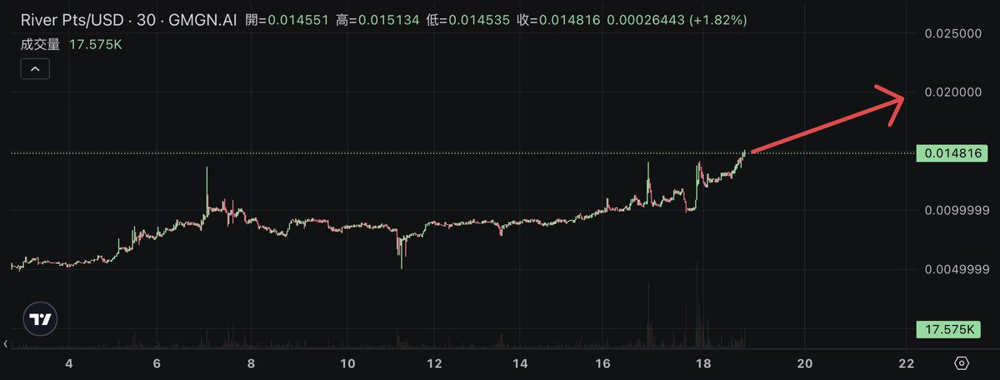

# River Pts 動態轉換機制全攻略

> **來源**: [@trader_alvin](https://x.com/trader_alvin/status/1979532945842135468)
>
> **日期**: Sat Oct 18 13:00:06 +0000 2025
>
> **標籤**: `River Pts` `動態轉換` `DeFi 策略`

---

> **來源**: [@trader_alvin (Alvin)](https://x.com/trader_alvin)
> **日期**: 2025-01-XX
> **標籤**: `River` `River Pts` `DeFi` `積分機制` `收益優化`

---

這是一篇 @RiverdotInc 的 River Pts 動態轉換機制全攻略，如果不懂的兄弟們，看這篇就夠了！我會從最基本的 River Pts 開始介紹，也會談買賣 River Pts 的時機＆可能的機會，祝各位發財！🤑

由於很多人不理解 @RiverdotInc 的動態轉換機制精髓在哪，特此寫一篇文介紹，說明為何我看多 River Pts 😎

**注意：以下觀點皆建立在 $RIVER 價格不變的狀況。**

## 個人觀點

我認為幾週內 River Pts 將從 0.015 漲到 0.02 。

## TLDR

1. 動態轉換機制將大幅減少 $RIVER 拋壓，創造更好的籌碼結構，有利 $RIVER 後續價格走勢。
2. River Pts 未來必定「規律且持續」上漲，且漲幅超越 $RIVER。
3. 現階段該將手上所有的 $RIVER 換成 River Pts。

以下是個人不負責任價格預測圖 🫣

