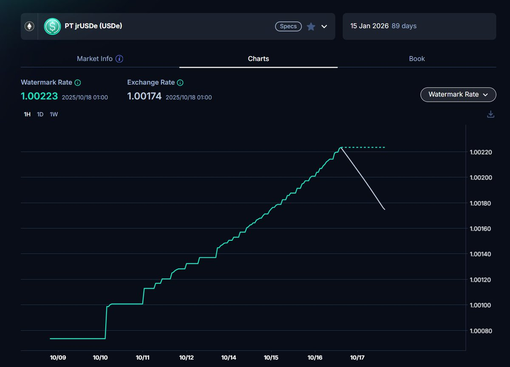
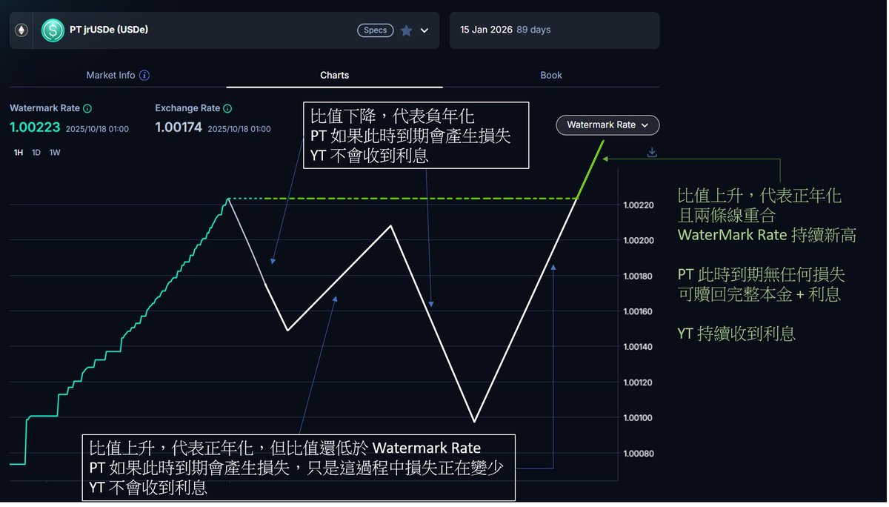
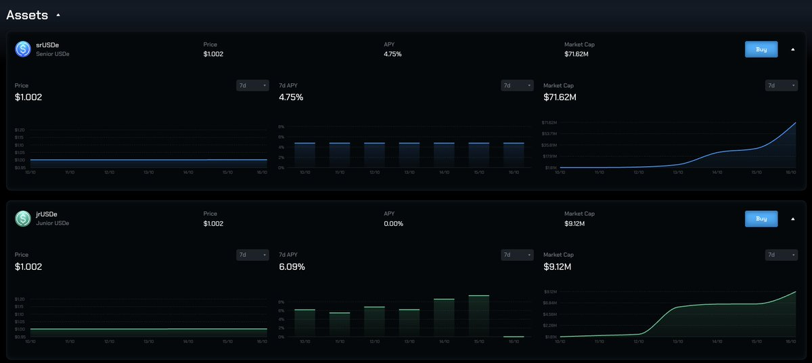

# jrUSDe 在 Pendle 負年化機制解析

> **來源**: [@0xlemoneth](https://x.com/0xlemoneth/status/1979391393916424562)
>
> **日期**: Sat Oct 18 03:37:38 +0000 2025
>
> **標籤**: `Pendle` `jrUSDe` `負年化`

---

> **來源**: [@0xlemoneth](https://twitter.com/0xlemoneth)
> **日期**: 2024-10-18
> **標籤**: `Pendle` `jrUSDe` `負年化` `DeFi` `Ethena`

---

## Pendle PT/YT 機制基礎

在 Pendle 中，代幣分為兩種：
- **PT (Principal Token)**：本金代幣
- **YT (Yield Token)**：權益代幣

jrUSDe 市場的特殊之處在於：
- **底層資產**：jrUSDe
- **會計資產**：USDe
- **價值計算方式**：用會計資產和底層資產的比值去計算底層資產的價值

## PT 的「幣本位保本」前提

PT 的「幣本位保本」建立在『底層資產的價值不會減少』的前提上，也就是 jrUSDe 對應 USDe 的比值不會減少。在這個前提下：
- YT 的權益就是拿走 jrUSDe 對應 USDe 比值增加的部分
- 當比值增加（正年化），YT 持有者獲得收益

## 負年化如何產生

jrUSDe 可能會因為 **sUSDe 年化低於 Sky Saving Rate** 而導致負年化，這個過程會使用 `jrUSDe : USDe` 比值減少來達成。

當負年化發生時：
- YT 沒有收益（因為沒有增長）
- **底層資產的會計價值減少**
- 總有一個人要負責承擔這部分的虧損
- 無法向 YT 持有者收錢
- **因此這部分的虧損由 PT 承擔**

結果：**PT 到期贖回本金時，可能拿不到原本預期的底層資產數量**

## Watermark Rate 補償機制

看起來 PT 持有者很吃虧：
- 年化正的時候權益被 YT 拿走
- 年化負的時候本金還會變少

因此 Pendle 引入了 **Watermark Rate（水位線）機制**：

1. 當比值從歷史最高點開始因為負年化而下降時，會記錄一個 **Watermark Rate（綠色線）**
2. 從這之後的比值只要持續保持在這 Watermark Rate 之下時（白色線，也就是現在的實際比值）
3. **就算年化回正，產生的收益都不會分派給 YT 持有者**
4. 而是拿來補償 PT 持有者的損失
5. 直到比值創新高之後才會繼續分派利息給 YT 持有者

## 關鍵結論

### 對 PT 持有者
只要在到期日之前，比值是歷史新高，代表過程中的正年化收益可以完全覆蓋負年化的損失，那中間的過程對你而言便不重要，**你不會遭受到任何損失**。

### 對 YT 持有者
- 在比值上升期間（正年化）→ 拿到利息
- 在比值上升但還沒回到歷史最高點 → **沒有利息**
- 在比值下降期間（負年化）→ **沒有利息**

### 一句話懶人包
- **白線重合綠線** → 一切正常
- **白線在綠線下** → PT 贖回有損失，YT 沒有利息

## 實際案例：Strata Protocol 的負年化事件

ENA 新協議 @strata_money 第一次運行就要賠錢！

### 數據計算
根據打到合約的 USDT 數量與目前質押在 sUSDe 合約的數量來計算：
- 下週 sUSDe 收益只有 **2.25%**
- 為了維持 srUSDe 的 **4.75%** 年化（Sky Saving Rate）
- 必須從 jrUSDe 負利率來扣

### 損失分配
目前 srUSDe 的 TVL 是 jrUSDe 的 **8 倍**，為了彌補不足 Sky Saving Rate (4.75%) 這部分的 2.5% 損失：
- jrUSDe 必須給出 **-20%** 的年化
- 扣掉原本的 2.25%
- jrUSDe 下週可能是 **-17.75%** 年化

### Pendle 池子的影響
由於 jrUSDe 在 Pendle 有池子：
- 購買 YT 的人頂多是拿不到利息
- 無法扣他的本金
- **這部分的本金損失應該是由 PT 來承擔**

## 連鎖效應

### sUSDe 循環貸風險
由於 sUSDe 達到近期新低，各種循環貸都要開始賠錢：
- 之前和 Aave 的活動導致大量循環貸
- 雖然已經退出不少，但留在裡面的量體也還是很多
- 可能導致負溢價越來越嚴重

### 套利機會
目前 sUSDe 的負溢價已經是 **-0.3%**：
- 花 7 天解鎖年化已經達到 **16%**
- 如果繼續上升，又相信 Ethena USDe 的穩定性
- 可以當作七天高息短期定存來用

### Binance 用戶的勝利
照目前的情況看來，最勝利的還是放在 Binance 裡面吃固定 12% 的人：
- 雖然 10/11 跌到 0.65 導致爆倉
- 但根據身邊有玩的人回報，損失都已經收到賠償
- 現在利息只有 2% 但他們還可以繼續吃 12% 的年化收益

## 中心化 vs 去中心化的矛盾

這模式等於**交易所用戶吸血鏈上協議用戶**：
- 為了給 Binance Alpha 或其他交易所做活動
- 項目方送出大量籌碼
- 這部分只能從自己協議的用戶上扣
- 刷交互參與項目的使用者都不滿
- 但對交易所用戶來說卻是日常的一次「大毛」

### 展望
好在幣安的活動只剩下一個禮拜，再加上 sUSDe 一個禮拜的獎勵延遲：
- 等到 10 月底利率應該就能回穩一點
- 至少可以和國債利率差不多
