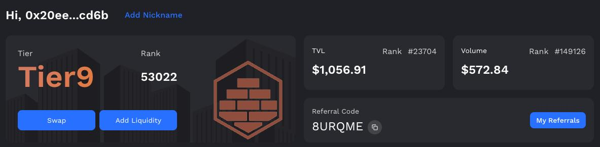
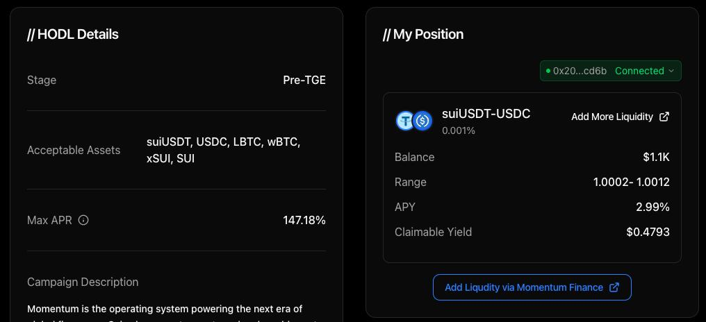
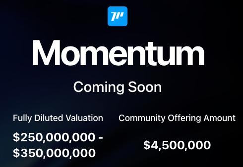

# MMTFinance 大戶認購指南：Tier 等級與 LP 策略

> **來源**: [@TobiChicken](https://x.com/TobiChicken/status/1979453230951338087)
>
> **日期**: Sat Oct 18 07:43:21 +0000 2025
>
> **標籤**: `打新策略` `流動性挖礦` `認購額度`

---

> **來源**: [@TobiChicken (Tobi Chicken 投幣雞)](https://x.com/TobiChicken)  
> **日期**: 2024-10-22  
> **標籤**: `MMTFinance` `BuidlPad` `IDO` `LP策略` `DeFi`

---

## Tier 等級與認購額度

### 方式一：Wagmi 升級（需大量資金）

在 @MMTFinance 的 Wagmi 排到 Tier 5 以上，現在從 0 開始至少要放 10 萬刀在 LP + 再多 Swap 才有機會達標（卷爛）

**各 Tier 認購額度：**

- 🔸 Tier 1：$10,000
- 🔸 Tier 2：$8,000
- 🔸 Tier 3：$6,000
- 🔸 Tier 4：$5,000
- 🔸 Tier 5：$4,500

### 方式二：HODL LP 存款（推薦）

從 @buidlpad 的 HODL 去 @MMTFinance 存 5 萬刀以上的 LP，LP 越大，認購額度越高。

**各 LP Size 認購額度級距：**

- 🔸 LP size ≥ $500,000：$20,000
- 🔸 LP size ≥ $400,000：$15,000
- 🔸 LP size ≥ $300,000：$13,000
- 🔸 LP size ≥ $200,000：$10,000
- 🔸 LP size ≥ $100,000：$7,000
- 🔸 LP size ≥ $50,000：$4,000

## 最佳策略建議

根據研究，**存 $3,000 LP 換 $3,000 認購額度 + $250M 估值是資金使用率最高組合**，也是上一篇提到的最佳策略。

有閒置資金的巨鯨可以參考看看。

## BuidlPad 打新活動詳情

### 活動時間

**第一階段**  
📅 10/22 18:00 - 10/25 18:00 UTC+8  
➡️ 完成 KYC + Subscribe 才能參與後續認購（之前做過 KYC 的不用重做）

**第二階段**  
📅 10/27 18:00 - 10/28 18:00 UTC+8  
➡️ 正式丟錢認購,可用 $BNB $SUI $USD1

### Tier 選擇策略

#### Tier 2（最簡單）

- 認購估值：350M
- 上限：2,000U

**參加步驟：**
1. 第一階段完成 KYC + Subscribe
2. 第二階段丟 $2,000U 完事 ✅

#### Tier 1（更劃算，推薦）

- 認購估值：250M
- 上限：3,000U
- 比 Tier 2 更划算，但多做一步

**參加步驟：**

1. 在 10/25 10:00 UTC+8 前，至 @buidlpad 的 @MMTFinance 池子組 3,000U 等值的 LP
   - 建議選「穩定幣對穩定幣」池較不會有磨損
   - 🎯 注意：務必在 @buidlpad 連 Sui 錢包

2. 組好後務必確認你的 LP 有出現在 @buidlpad 上，才算成功

3. 照流程：
   - 第一階段：完成 KYC + Subscribe
   - 第二階段：丟 3,000U 認購

✅ 完成！就能拿到更低估值、更高上限的 Tier 1 配額

### 結論

手頭閒置 U 多的巨鯨一律推薦走 Tier 1：
- 估值少 100M
- 上限高 1,000U
- 多賺不虧
- 市場震盪時期穩賺理財局好好把握

## 新組隊機制

這次還能組戰隊，分 Priority 額度！想寫文分享或帶人參加的可以組戰隊，每人可加入一隊 + 可組一戰隊，份額可疊加。

## 歷史表現參考

上期 @falconfinance 低保號認購等值 117U 的 $FF，開盤賣 7x 報酬、約賺 680U。第五期 @MMTFinance 也是必搞！從第一期 @solayer_labs 到現在都有參與。
