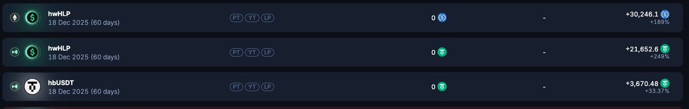
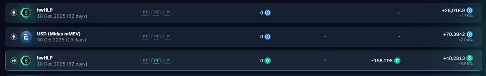

# Pendle YT 高倍杠杆策略回盤：HWHLP、HBUSDT、WVLP 收益複盤

> **來源**: [@807743450Li](https://x.com/807743450Li/status/1979461383231279167) | [原文連結](https://x.com/ThinkingUSD/status/1976766847551713443)
>
> **日期**: Sat Oct 18 08:15:45 +0000 2025
>
> **標籤**: `Pendle YT` `高倍杠杆` `流動性挖礦`

---

> **來源**: [@807743450Li (LI HD)](https://x.com/807743450Li)
> **日期**: 2025-01-14
> **標籤**: `Pendle` `YT` `收益複盤` `槓桿策略` `DeFi`

---

## 收益總結

深度複盤 hwhlp、hbusdt、wvlp Pendle YT，每個翻 2-3 倍，淨賺 14 萬 U。

個人收益約 4 萬 U，朋友收益約 10 萬 U，合計 14 萬 U。具體收益如下圖所示：

## 核心收益來源

10 月 11 日市場大暴跌，Hyper 的金庫 HLP 一天獲利 4000 萬 U，而總的 TVL 只有 4 億，收益率達到了日化 10%。

YT 具有高倍槓桿特性，可以做到日化好幾倍的收益。

## 三個池子複盤

以下針對 hwhlp、hbusdt、wvlp 三個池子分別進行複盤，過程其實還挺波折的。
