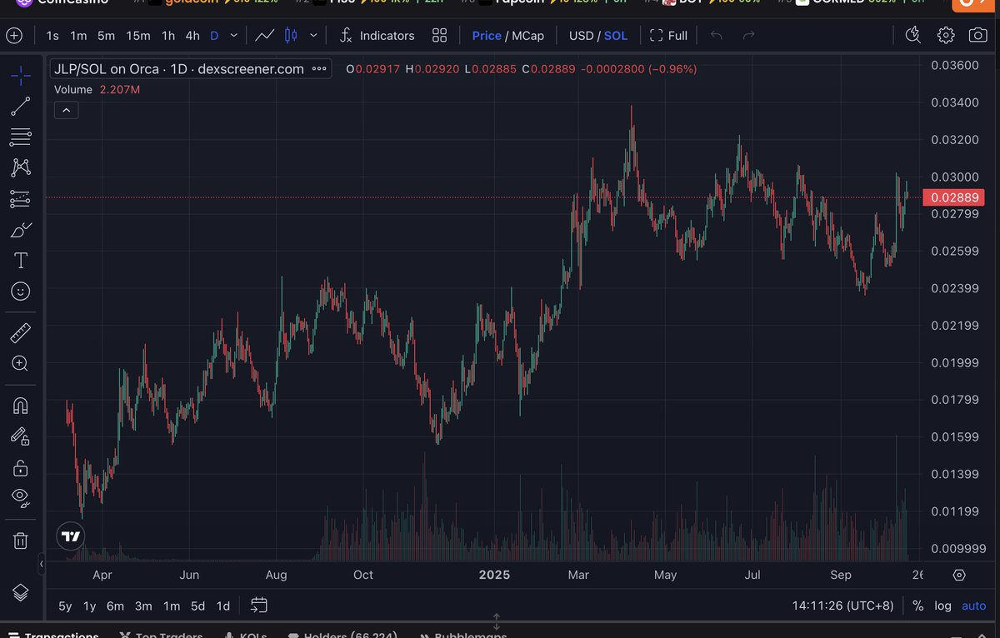
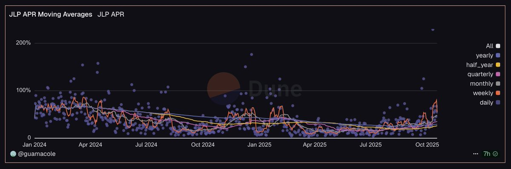
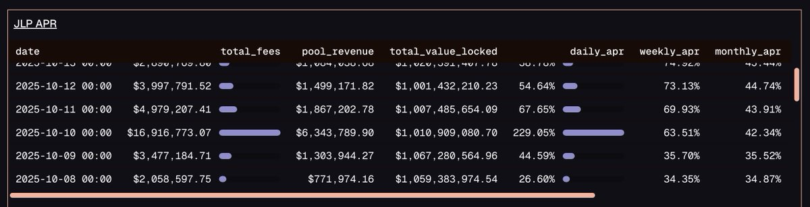

# JLP/SOL 單邊 LP 波段操作策略

> **來源**: [@gch_enbsbxbs](https://x.com/gch_enbsbxbs/status/1979431899660718246)
>
> **日期**: Sat Oct 18 06:18:35 +0000 2025
>
> **標籤**: `JLP` `流動性挖礦` `Solana`

---

> **來源**: [@gch_enbsbxbs (C J)](https://x.com/gch_enbsbxbs)  
> **標籤**: `JLP` `SOL` `單邊LP` `波段操作` `Jupiter` `DeFi策略`

---

## 策略核心：借 SOL 組單邊 JLP/SOL LP

說到 JLP 大家應該不陌生，分享一個乾貨玩法。我以前玩了很長一段時間這個策略，當時收益非常猛，APR 能做到 200 以上，關鍵是在我看來風險很低。

當然現在很卷了，核心原因是 fee 少了，達不到如此之高的收益。有興趣的朋友想玩還是能玩，但對我吸引力不大了。

**策略本質**：借 SOL，組單邊 JLP/SOL 的 LP。

## JLP/SOL 價格走勢特性

從上圖可以看到，K 線走勢非常有規律和穩定。

**核心規律**：
- **大部分時間**：JLP 跑贏 SOL
- **唯一例外**：SOL 暴漲時，JLP 跑不贏

所以這個 LP 的操作邏輯很清楚——根據 K 線找到切入點干進去就可以了。

**為什麼 K 線如此有規律？**  
這跟 JLP 的成分有關係（這屬於比較基礎的知識，不展開解釋）。

## 進階玩法：直接波段

如果你認為自己能力更強，可以不組 LP，直接波段操作。因為現在 fee 收益確實不算高，主要收益來自波段。

**如何用 LP 做波段？**  
請查看我的歷史推文，有講過如何在 Meteora 組頭部幣的 LP 波段玩法。

---

## 補充：JLP 的對賭本質

引用 [@gm365](https://x.com/gm365) 的觀察：

### 暴跌行情中的 JLP 表現

上週市場突發暴跌，清算了相當多的合約持倉。作為合約用戶對賭方的 $JLP，則迎來暴擊：
- **當天 APR**：229%
- **過去 7 天平均 APR**：50%
- 大幅超越以往平均值

**資料來源**：Dune Query by guamacole

### JLP 收益來源

- **價格**：主要來自底層資產波動
- **APR 收益**：主要來自於做 Jupiter 合約用戶的對手方

**持有 JLP = 跟所有合約用戶對賭**
- 合約用戶賺錢 → 你虧錢
- 合約用戶虧錢 → 你賺錢

但 JLP 幾乎一路向上的價格，說明一個潛在的殘酷事實：

📉 **市場上絕大多數合約用戶都在不斷虧錢**

打敗市場，歸根結底，是一件極難的事。
