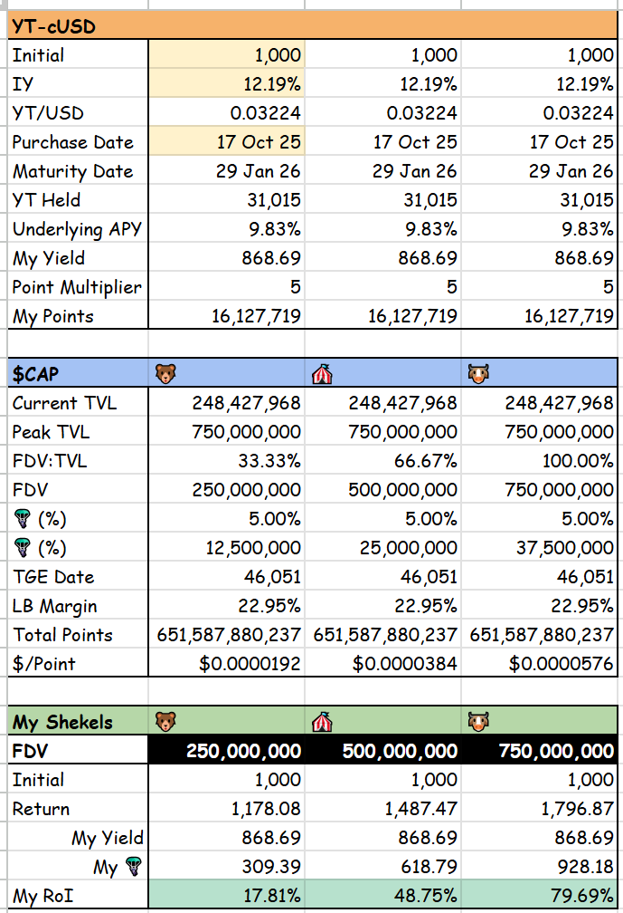

# Pendle YT-stcUSD 保守策略：5倍槓桿、本金回收與收益挂鉤

> **來源**: [@PendleIntern](https://x.com/PendleIntern/status/1979218696498483239) | [原文連結](https://twitter.com/PendleIntern/status/1979218696498483239/photo/1)
>
> **日期**: Fri Oct 17 16:11:24 +0000 2025
>
> **標籤**: `Pendle` `YT策略` `本金保護`

---

> **來源**: [@PendleIntern](https://x.com/PendleIntern) (Pendle Intern)
> **標籤**: `Pendle` `YT-stcUSD` `DeFi策略` `風險管理`

---

## 策略概述

相較於激進的 YT-cUSD 玩法，保守型玩家可以考慮 **YT-stcUSD**：

- **本金回收率**：86% 來自底層收益
- **槓桿倍數**：5 倍（相比 YT-cUSD 的 20 倍）

## 損益平衡點

只要空投收益率（🪂 RoI）**超過 14%**，本金就能回本。

## 策略特點

實習生認為這是**最佳的上漲敞口策略，同時下跌風險有限**。

---

