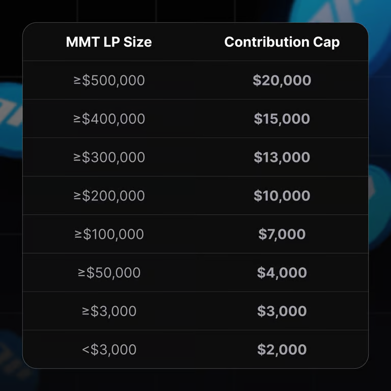

# MMT Finance Buidlpad 打新指南 — Tier 分配與 LP 策略

> **來源**: [@degentalk_hk](https://x.com/degentalk_hk/status/1978686474787623224)
>
> **日期**: 
>
> **標籤**: `打新IEO` `流動性挖礦` `額度最大化`

---

> **來源**: [@degentalk_hk (Degen Talk)](https://x.com/degentalk_hk)
> **日期**: 2024-10-25
> **標籤**: `MMT Finance` `Buidlpad` `IDO` `Momentum` `LP策略`

---

## 打新 Tier FDV

這次的打新規則跟 Falcon 一樣，都是分開了兩個 Tier，分別是 250M 和 350M FDV。

要衝 Tier 1 的要求很簡單：只需要在快照時（Oct 25 香港時間 10AM）存入 $3000+ LP 就可以。不想有無償損失的可以選擇 suiSUDT - USDC pair，記得一定要透過 Buidlpad HODL 頁面去質押。

## 額度的分配

這裡有點複雜，正常來說每個人的額度是 $2000，但有兩個 Campaign 可以提高額度：

### 1. Wagmi1 & Wagmi2 Participants

這個是 Momentum 的官方積分計劃，它會分成 5 個 Tier，最高能拿到 20k 額度，而 Tier 5 的可以拿到 4.5k。

先說結論，如果你本身不是早期用戶，可以直接放棄這個方法，因為現在才衝分的成本太高了。根據統計，大概要用 55 萬存一天才上到 Tier 5。

### 2. Buidlpad HODL

這個非常容易理解，LP 投放越多額度越高。最簡單放 3000u 就能拿到 3000u 額度，錢多的可以放多點，但往上存的性價比會越來越低。當然有足夠閒置資金的往上存肯定都是賺的。

這個沒有時間限制，只需在快照前存入就可以。

## 結論

**建議策略**：
- 3000u LP 放到 Momentum LP 上
- 把全部家人朋友都找來 KYC
- 自己預算一下能有多少個 KYC，就開多少個 Sui wallet，每個都做 3000u LP

**收益預期**：
- 雖然這次打新基本上都肯定是賺錢的，但不要期望收益會比得上上次的 $FF
- 盲猜的話開盤 FDV 就 500M 左右，也就是賺 2 倍
