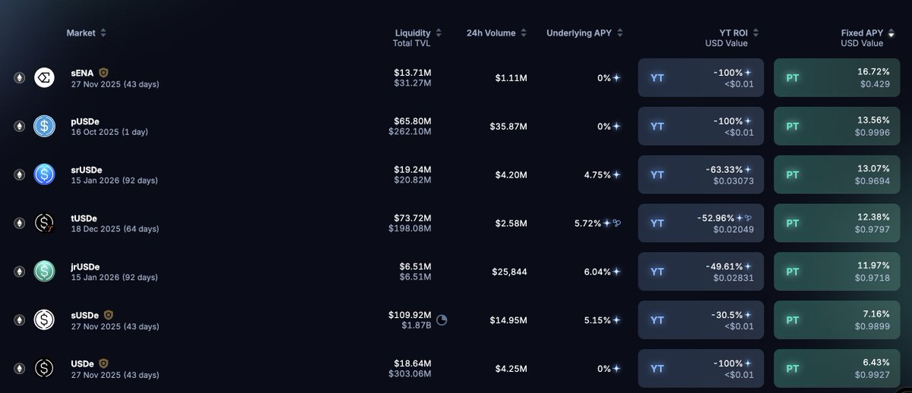
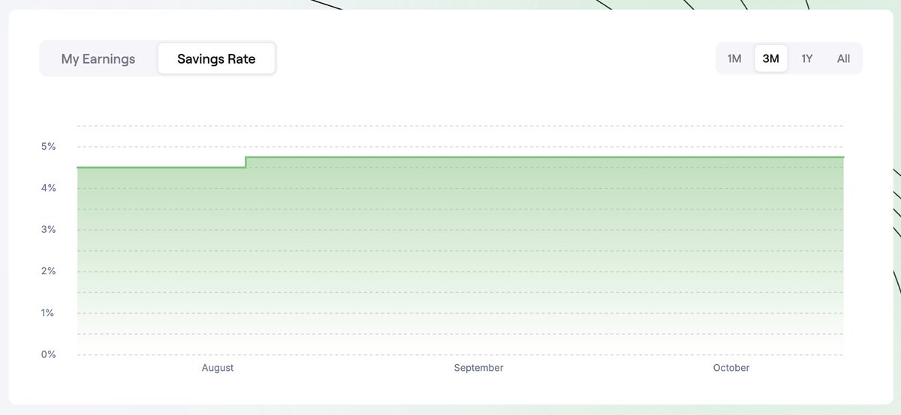
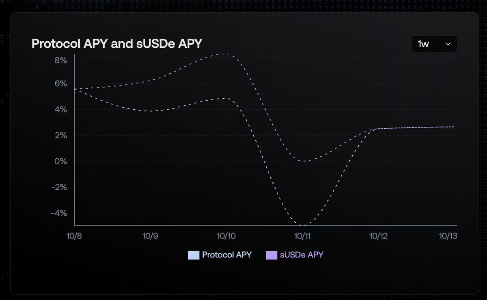
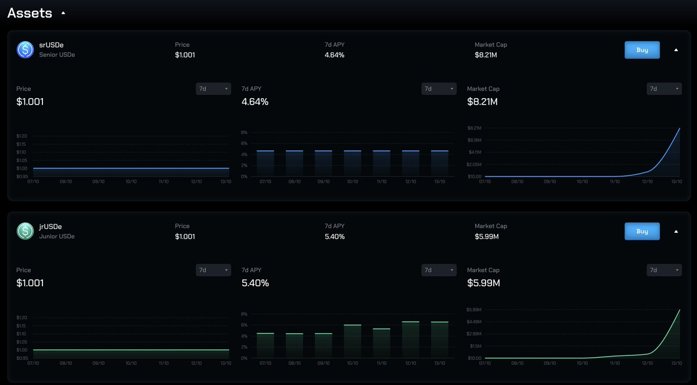

# Strata 產品策略指南：srUSDe vs jrUSDe 風險分層解析

> **來源**: [@0xlemoneth](https://x.com/0xlemoneth/status/1977998123722236235)
>
> **日期**: 
>
> **標籤**: `收益策略` `風險分層` `Strata` `sUSDe`

---

## 產品架構與機制

Strata 將 sUSDe 的利息拆分成兩種風險分層產品：

### srUSDe（Senior USDe - 高級風險分層）
- 超額抵押、可產生收益的美元資產，由 USDe 支撐
- 提供保底的最低收益（Sky Saving Rate，目前 4.75%）
- 受保護但無上限的潛在報酬
- 年化收益區間：Sky Ecosystem 年化 ～ sUSDe 年化之間，波動較穩定
- 積分：60x Strata + 40x Ethena + 穩定利息

### jrUSDe（Junior USDe - 次級風險分層）
- 可對 sUSDe 的年化收益率（APY）進行槓桿放大
- 作為高級分層的流動性保險池，承擔較高風險以換取更高潛在報酬
- 年化收益區間：0% ~ sUSDe 倍數年化之間，波動較大
- 積分：20x Strata + 10x Ethena + 高波動利息

### 運作邏輯

- **基礎資產（srUSDe）vs 保險庫（jrUSDe）**：當收益低時，保險庫必須幫忙支付基礎資產少拿的收益，所以獲得的利息更低；但收益高的時候，就可以獲得被保險人所提供的保險費
- **動態博弈機制**：如果大家都覺得利息會變低，大量買入 srUSDe，沒人買入 jrUSDe，則也沒辦法獲得保險。此時如果有人買入 jrUSDe，當 sUSDe 利息上升，等於大家的保費都給你了，你就會獲得爆炸式年化

## 參與策略重點

### ⚠️ 重點一：不要拿 pUSDe 直接換 jrUSDe / srUSDe

**原因**：
- pUSDe 底層資產是 USDe 和 eUSDe（存在 @etherealdex 的 USDe），可以無損轉換回 USDe
- srUSDe 和 jrUSDe 的底層資產是 sUSDe，常態性有折價（約 0.2%）
- 透過 pUSDe 直接轉換 = 用 USDe 直接 Mint 成 sUSDe，先吃 0.2% 折價

**正確操作流程**：
1. pUSDe → USDe
2. USDe → 二級市場折價購買 sUSDe
3. sUSDe → jrUSDe / srUSDe

實際操作可以看到，採用正確流程會比直接轉換多出 0.2% 的數量。

### ⚠️ 重點二：當前市場環境分析（下週預測）

**不利因素**：
- 大盤不好，資費收入不高，甚至有負數
- 需要提供 Binance 12% 保證年化
- 官方預測下週 sUSDe 年化可能約 3%，實際可能更低

**jrUSDe 收益計算**：
- 根據 srUSDe : jrUSDe TVL 約 4:1 的比例
- jrUSDe 利息 = sUSDe APY% - 4 × (4.75 - sUSDe APY%)
- **下週 jrUSDe 收益基本上是 0**
- 現在買 jrUSDe 等於幫 srUSDe 提供保險，年化收益全給他們，讓他們可以穩定在 4.75%

## Strata vs Pendle 差異

### 核心差異

1. **無到期時間**：不像 Pendle PT/YT 有明確到期日
2. **無明顯花費**：相比購買 YT 不用在入場時就決定 Implied APY

### 風險特性

- Strata：用潛在利息收益去賭利息年化波動
  - jrUSDe = 放大波動
  - srUSDe = 縮小波動
  - 倍數放大效應沒有 Pendle 那麼明顯

- Pendle：入場時間點就決定是否會賺
  - PT/YT 在入場時 Implied APY 就已確定
  - 倍數放大效應更明顯

### 適用場景

Strata 更適合：
- 沒那麼多時間盯盤的人
- 不參與 Pendle 高強度廝殺的人
- 對整體大環境判斷還算正確即可
- 基本上不太會虧到本金（頂多只會少賺利息）

## Pendle YT/PT 分析

### YT 分析（不建議）

**srUSDe YT**：
- 目前 13% 定價有點貴
- 底層是 sUSDe
- 短時間內 srUSDe 利息可能稍稍好於 sUSDe
- jrUSDe 基本上不太會有什麼利息，積分還是別人的 1/3 以下

**tUSDe YT vs srUSDe YT**：
- Terminal YT 也有給予 sUSDe 利息
- Ethena 積分還有 50x
- Terminal 項目天花板大於 Strata
- **結論：買 srUSDe YT 還不如買 tUSDe YT**

### PT 分析（可參考）

- YT 風險較大
- 想要穩定賺錢參與，現在也是購買 PT 的好時機
- srUSDe 13% 已經是不錯的數字
- 到時七天解鎖或折價減少都可以無損出場
- **記得要透過買 sUSDe 去存 srUSDe 再去換 PT，別直接用 Mint 的**

## 操作建議懶人包

### YT
❌ 不要買

### PT
✅ 沒地方放可參考

### LP
✅ Season 0 有參加的可以考慮 LP（關 YT-Mode）

### 加成福利
⭐️ 參加 Season 0 的人可獲得 15% 積分加成，老號有參加的，現在沒其他地方放可以加減參與

### ⚠️ 最重要提醒
**只要參與都不要直接存（Mint）！**

## Terminal.fi 補充

- 沒辦法存 sUSDe 去參與，只能存 USDe
- 想參加 Terminal 就得先吃折價，或在領出後花七天解鎖
- 這也是作者當初 Pendle LP 都不存 Terminal 只存 Strata 的原因
- 主要策略：透過存 Strata LP + Terminal YT 來參與，利用 Strata 收益購買 Terminal YT
- 優勢：既可以隨時無損退出，又可以同時參與
