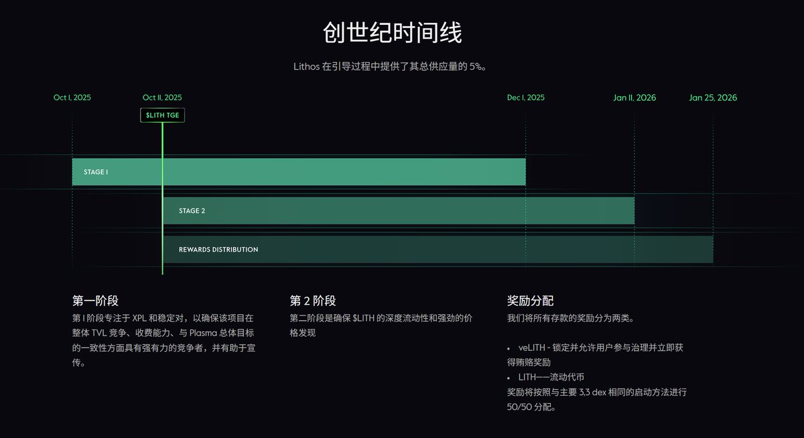
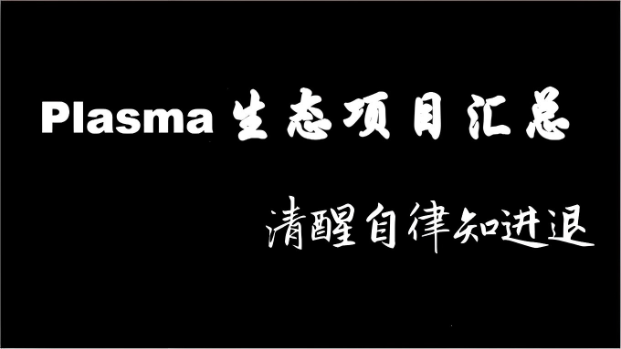

# Lithos：Plasma 原生流動性市場創世空投指南

> **來源**: [@WY_mask](https://x.com/WY_mask/status/1975622356443021587) | [原文連結](https://lithos.to/?referralcode=71zp9lvisal107kvt9)
>
> **日期**: 
>
> **標籤**: `流動性挖礦` `空投機會` `Plasma生態`

---

> **來源**: [@WY_mask (无颜)](https://x.com/WY_mask)  
> **日期**: 2024-10-08  
> **標籤**: `Lithos` `Plasma` `空投` `DeFi` `流動性挖礦`

---

## 專案概述

Plasma 的原生流動性市場 [@lithos_to](https://lithos.to) 已開放，參與創世紀交互可獲得 5% 代幣空投，TGE 時間為 10 月 11 日（可能延遲）。目前主要是外國用戶參與，競爭度相對較低，若獲得官方扶持可能有較高回報。

## 交互步驟

### 1. 註冊登入
打開連結並連接錢包註冊登入：  
https://lithos.to

### 2. 準備 Plasma 鏈資金
- 使用跨鏈橋：https://bridge.plasma.network
- 或從交易所直接提款到 Plasma 鏈

### 3. 兌換 $WXPL
在 Swap 頁面交換 $WXPL 代幣（為下一步添加流動性做準備）：  
https://lithos.to/swap

### 4. 添加流動性池
添加 $WXPL / $USDT 流動性池（也可選擇其他交易對）：  
https://lithos.to/pools

### 5. 查看存款
在 Deposits 頁面查看你的存款狀態：  
https://lithos.to/deposits

### 6. 查看創世紀積分
在 Genesis 頁面查看你的創世紀積分：  
https://lithos.to/genesis

## 官方資料

創世紀獎勵詳細說明文檔：  
https://docs.lithos.to/genesis-rewards

## Plasma 生態項目彙總

### NFT 項目
1. **@pretrillions** - Plasma 上的 NFT 項目，Plasma 團隊多位成員關注  
   https://pretrillions.com

### 基礎設施
2. **Axis (@AxisFDN)** - RWA + DeFi 基礎設施  
   https://axis.foundation

### RWA 項目
3. **Tellura (@tellura_xyz)** - RWA 項目  
   https://tellura.xyz

10. **Mansa Finance (@MANSA_FI)** - 真實世界資產 DeFi 協議  
    https://mansa.fi

13. **Briq Finance (@briqfinance)** - RWA 平台

### DeFi 協議
4. **river (@river0x_)** - DeFi 協議

6. **246 Club (@246_club)** - 借貸協議  
   https://246.club

9. **Ebisu (@ebisu_finance)** - 穩定幣信貸市場  
   https://ebisu.finance

11. **Fuse (@fuseon_finance)** - 集中流動性樞紐  
    https://fuse.finance

12. **Lithos (@lithos_to)** - 原生流動性市場  
    https://lithos.to

### DEX 平台
7. **TrueFlow (@TrueFlowFDN)** - DEX 平台

8. **Formula (@tradeonformula)** - 集中流動性訂單簿 DEX

### AI 項目
5. **Trillia AI (@trilliaxyz)** - AI Agent 項目  
   https://trillia.xyz

### 啟動板（Launchpad）
14. **Sparkle (@LaunchOnSparkle)**  
    https://sparkle.launch

15. **XPLaunch (@XPLaunch_)**  
    https://xplaunch.io

16. **XPLI Launchpad (@XPLI_launchpad)**

17. **Funance (@FunanceFun)**  
    https://funance.fun

18. **Nothing (@nothingfndn)**

### 其他
19. **PLASDOVE (@PLASDOVE)** - Meme 吉祥物  
    https://plasdove.com

20. **Trillady (@TrilladyNFT)** - NFT 項目
