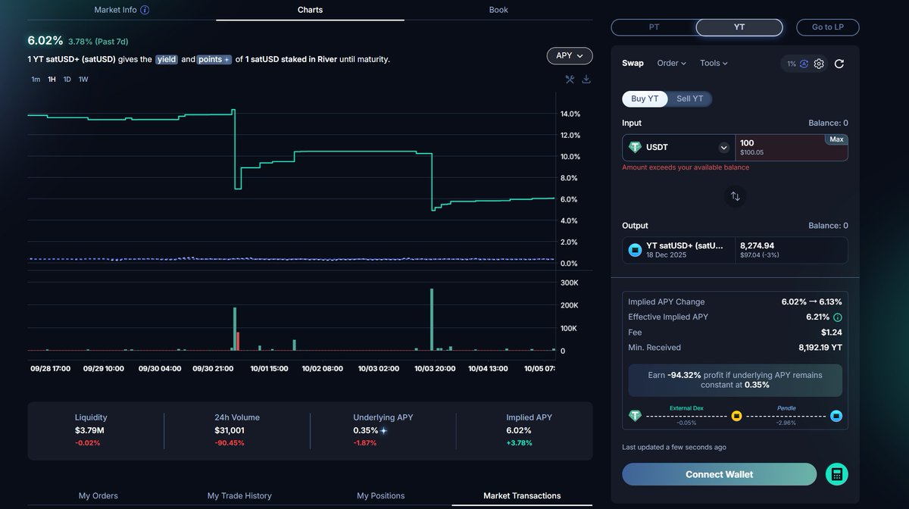
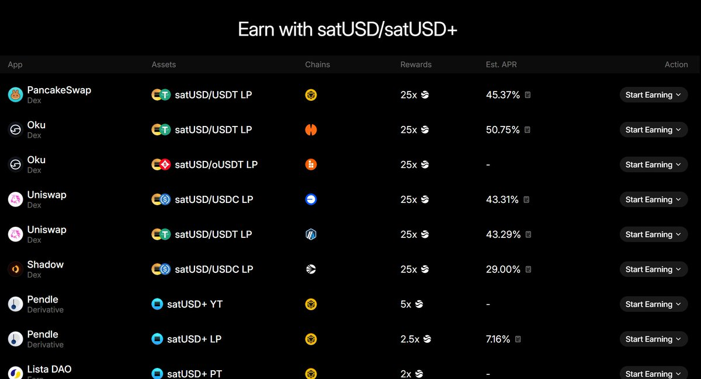
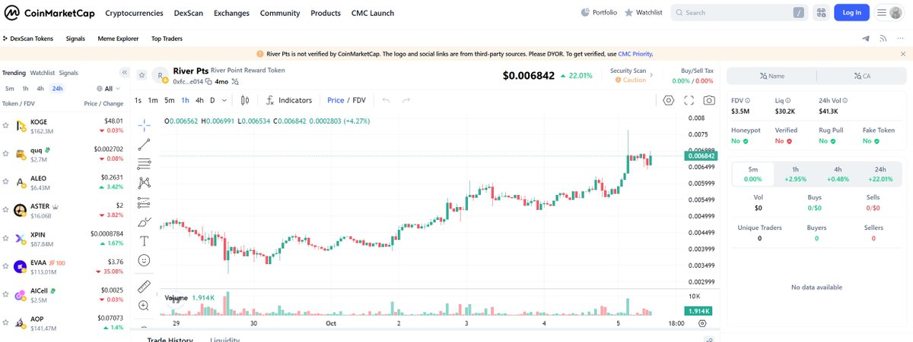

# River Points 收益計算：買入 YT 還是直接購買積分更划算？

> **來源**: [@Eason_2099](https://x.com/Eason_2099/status/1974683679600660546) | [原文連結](https://app.river.inc/fun?ref=Eason_2099)
>
> **日期**: Sun Oct 05 03:50:51 +0000 2025
>
> **標籤**: `River` `Pendle YT` `積分套利`

---

## 專案背景

River（@RiverdotInc）已經 TGE 十多天，價格維持在 2.55U 左右表現堅挺。

根據其代幣經濟學：
- 總量 1 億枚 $RIVER
- 30% 分配給 River 積分持有者
- 積分總量上限 10 億，對應 3000 萬枚 $RIVER
- 按照 180 天後的積分轉化率 0.03 計算

**積分理論價值**：1 積分 = 0.03 River = 0.0765 美元

## 獲得 River Points 的方法

除了嘴擼之外，其他獲得 River Points 的方法：

1. 質押 River Points
2. 參與 DeFi：使用 satsUSD 添加 LP、持有 YT、或存入 Vaults

透過 DeFi 參與，積分乘數從 1.5 到 25 倍：
- LP 積分乘數最高為 25 倍
- YT 為 5 倍

**但考慮到 YT 自身的槓桿倍數，YT 依然是積分效率最高的 DeFi 工具。**

## YT 收益計算分析

### 現況

Pendle 上 River 的 YT（YT-statUSD）的 Implied APY 從前期 14.32% 跌到了 6.02%。

### 購買 YT 的積分收益計算

假設買入 100U：

**YT 積分產出**：
- 可買到 8274 個 YT
- 對應每天產生的分數：8274 × 5 = 41,370

**River 積分發放機制**：
- 每週針對 satUSD 參與 DeFi（LP 或 YT）發放約 200 萬 River Points
- 最終能拿到的積分取決於：你的分數 ÷ 總分數比例

**目前參與 DeFi 的資產總數**：

| 平台 | TVL | 積分乘數 |
|------|-----|----------|
| PancakeSwap（BSC） | 2.15M | 25 |
| OKU（BoB） | 0.36M | 25 |
| Uniswap（Base） | 0.171M | 25 |
| Uniswap（Base） | 0.052M | 25 |
| Pendle（BSC） | 3.79M | 5 |

**每天總分數計算**：
- 主要渠道：(2.15 + 0.36 + 0.171 + 0.052) × 25 + 3.79 × 5 = 68.325 + 18.95 = 87.275M
- 加上其他渠道 buffer 12.73M
- **總計：100M 分數/天**

**100U YT 的積分收益**：
- 每天產生分數：41,370 = 0.04137M
- 佔每天總分數比例：0.04137%
- 每週可獲得：2M × 0.04137% = 827.4 River Points

**到期收益計算**：
- 距離到期日還有 73 天（約 10 週）
- 假設 TVL 保持不變，最多可拿到：827.4 × 10 = 8,274 River Points
- 180 天到期，按最大轉化比例 0.03：8,274 × 0.03 = 248.22 個 River
- 按今天幣價 2.55U 計算：248.22 × 2.55 = 632.961U

**盈虧平衡點**：
- 如果 River 在 180 天後幣價能在 0.4U 以上，就不會虧本
- 0.4U 的幣價對應 FDV 是 40M，大概率可以達到

## 直接購買積分的比較

目前 River Points 市場價格：
- 1 point = 0.006842U
- 8,274 River Points = 56.61U

**結論**：
即使 YT 槓桿再高，最終產生積分的價值，還不如當下直接去 DEX 上購買積分更划算。只需要 56.61U 就可以買到 100U YT 所能產生的最大積分價值。

（註：如果 SatUSD 的相關 DeFi TVL 還會增長，實際 100U YT 獲得的 River Points 還要小於 8,274）

## 底息考量

當前 satUSD 的底息只有 0.35%，少得可憐，因此這裡簡化處理沒有考慮。如果後續 SatUSD YT 的底息能夠有所增長，則可以收回部分本金。

## 最終總結

1. **積分效率**：當前 YT 相對做 LP 以及直接存入 Vault，積分效率是最高的
2. **盈虧平衡**：如果 180 天到期後，River 幣價能在 0.4U 以上，應該不會虧本
3. **二選一建議**：由於當前 River Points 市場上的價格更優，直接去 DEX 上買積分更划算
