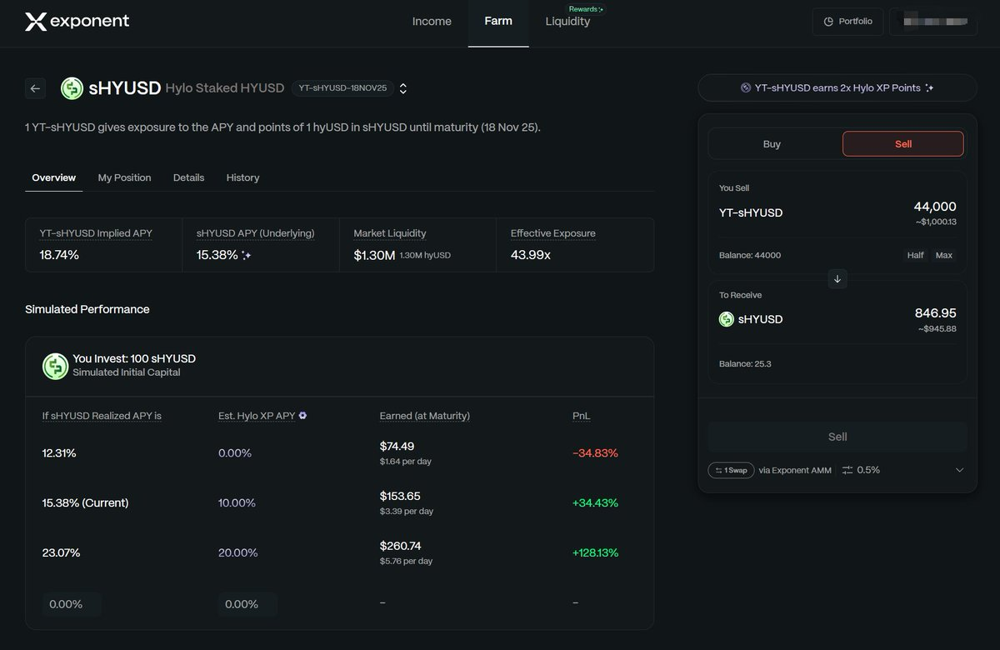
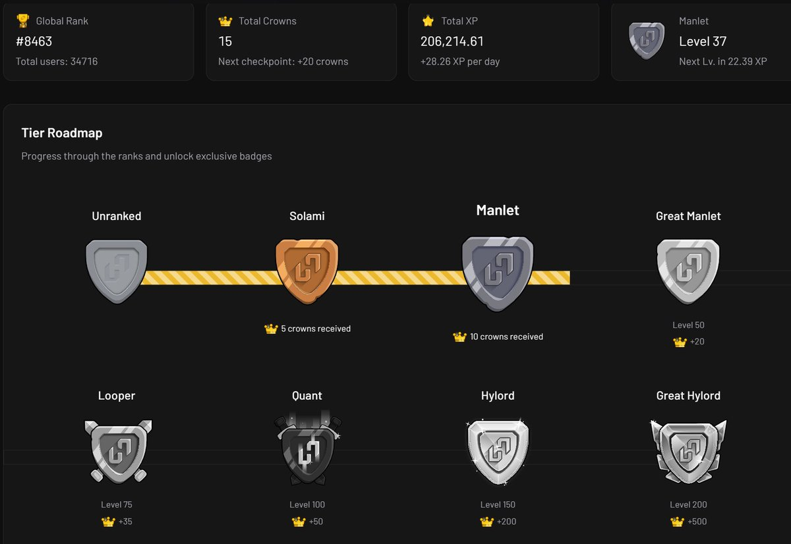

# Hylo YT-sHYUSD 收益策略與 Pendle 代幣拆分機制

> **來源**: [@Zh_Crypto517](https://x.com/Zh_Crypto517/status/1974359468683989057) | [原文連結](https://hylo.so/leverage?ref=N1AT4F)
>
> **日期**: Sat Oct 04 06:22:33 +0000 2025
>
> **標籤**: `YT 收益代幣` `Solana 穩定幣` `Pendle 協議`

---

> **來源**: [@Zh_Crypto517 (Z大詩)](https://twitter.com/Zh_Crypto517)  
> **日期**: 2026-02-18  
> **標籤**: `Hylo` `Pendle` `YT代幣` `穩定幣` `DeFi` `收益策略`

---

## YT 實戰案例：Hylo sHYUSD

我買了 1000u 的 YT-sHYUSD，買入時的數據如下：

- **Implied APY**：18.74%
- **Underlying APY**：15.38%
- **APY 差距**：僅 3.36%，我認為目前被低估 😋

目前每天的積分是 44000，排名升得很快。

🎉 **收益分析**：按照當前底層收益一直持續到到期日，不僅不會虧錢，還能賺 36.7%。後面如果大資金進來會順勢抬高 YT 價格，獲利點更大。

## 關於 Hylo 項目

🤔 這個項目我提過一兩次，不知道為什麼提的人比較少。@web3a99 和 @AirdropAlchemis 倒是提到過。

這是 Solana 上比較新穎的**帶槓桿不清算的穩定幣項目**（劃重點）：

- 融資不高但在默默發展
- 目前 TVL 已經突破 70M
- ✅ 用戶數只有 3.7W，現在參與還算是早期

相關連結：
- 官網：https://hylo.so
- YT 池子：[Pendle YT Pool](https://app.pendle.finance)

---

## 成為蘋果擼毛人第一課：燒 YT

### 什麼是 YT？

🧐 YT 最早來源於 Pendle (@pendle_fi) 這個協議。在這裡就不說什麼「生息代幣」「本金代幣」這些術語。

✅ **用一個簡單的例子來說明**：

你名下有一棟房子 🏠 用來收租，一年預計可以收入 3w（底層收益）。

現在有另外一個人認為你這個房子一年收入不止 3w（假設他認為可以收入 6w）。

於是他就用 4w 買你的「收租權」（這就是 YT）。這樣你們兩個就簽下了一個合同，約定好他按照一年 4w 分 12 個月支付（實際 Pendle 中是每天都有收益）。

**到這裡**：
- 你持有了 **PT**：保本收益 4w
- 他享有了底層資產的收益權 **YT**：後續房子實際上收益是多少得看市場最終表現，盈虧自負，賠賺都有可能

### 為什麼要買 YT？

🤔 有 YT 的項目說明這是個可以通過存款獲取積分的項目。

- 大戶塞的錢多，積分自然多
- 本金不夠的就可以購買 YT

**舉個例子**：

一個項目中每 1u 可以獲得 1 積分/天。可以購買 100u 的 YT 相當於存了 2000u 在項目方那，這樣你不就有 2000 積分/天。這就是 YT 的作用。

⚠️ **要注意的是**：你的 YT 最終價值是歸零的（房子收益權不斷接近合同到期日），所以要做好風險把控！DYOR！🫵

---

上述是我對 YT 的理解，有誤的歡迎大伙來指正 🫡
