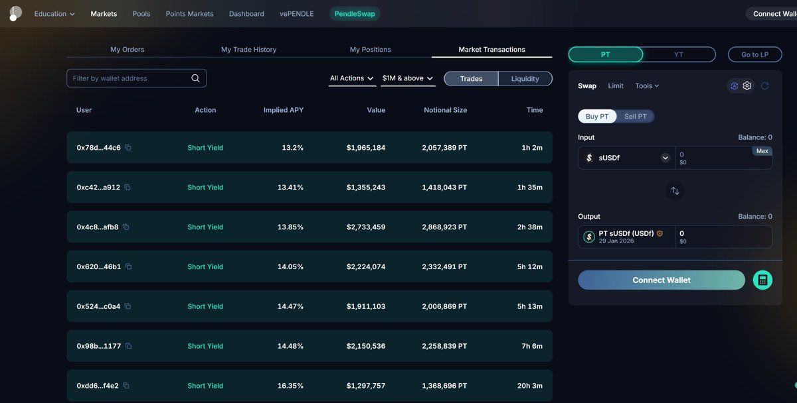
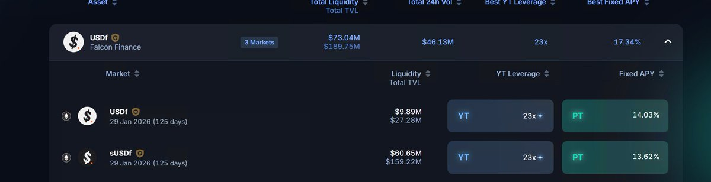

# Pendle YT-PT 對沖套利策略

> **來源**: [@LumaoDoggie](https://x.com/LumaoDoggie/status/1974455195414499414) | [原文連結](https://x.com/awesomeHunter_z/status/1971120186439934288)
>
> **日期**: Sat Oct 04 12:42:56 +0000 2025
>
> **標籤**: `Pendle` `YT-PT對沖` `相對價值`

---

> **來源**: [@LumaoDoggie (撸毛小狗)](https://twitter.com/LumaoDoggie)  
> **標籤**: `Pendle` `YT` `PT` `對沖套利` `DeFi`

---

## 策略原理

在 Pendle 中，如果判斷兩個池子的 YT 價格會朝相反方向變化，可以採用「買入一個 YT + 買入另一個 PT」的對沖策略來盈利。

核心邏輯：判斷的是**相對價格**，而非絕對價格。例如，同樣是明年 1 月到期的兩個池子，相對於 sUSDf 的 YT，USDf 的 YT 被高估了。預期 sUSDf 的 YT 會上漲，USDf 的 YT 會下降。

由於 Pendle 裡無法做空 YT，只能買入對應的 PT（因為 PT 價格和 YT 是相反運動的）。在利息不高的情況下，可以把 PT 放入 Euler 做循環貸增加槓桿。

---

## 實際案例

### 9 月 25 日開倉

**開倉價格**：
- USDf YT：14.03%
- sUSDf YT：13.62%

**操作**：
1. **買入 sUSDf YT**：3,000 U → 獲得 75,118 YT
2. **買入 USDf PT**：72,000 U → 獲得 75,118 PT

**持倉量大致相等**，本金需要 75,000 U。

---

### 情境 1：YT 價格下跌（實際發生）

**一天後價格變化**：
- sUSDf YT：11.9%
- USDf YT：8.71%

**平倉結果**：
- sUSDf YT 賣出：2,647 U（**虧損 350 U**）
- USDf PT 賣出：73,142.2 U（**盈利 1,142 U**）

**淨盈利**：約 600 U（扣除 gas 和 price impact 磨損）

**如果使用槓桿**：
- PT 部分循環貸，本金可減少到約 20,000 U
- 盈利減少到約 300 U（因為 9 月底借貸利息較高）

---

### 情境 2：YT 價格上漲（假設 FF 空投後暴漲）

**假設價格變化**：
- sUSDf YT：20%
- USDf YT：18%

**平倉結果**：
- sUSDf YT 賣出：**盈利 1,246 U**
- USDf PT 賣出：**虧損 750 U**

**淨盈利**：約 400 U（扣除磨損）

---

## 策略優缺點

### 優點

- **雙向盈利**：不管整體 YT 價格上漲還是下跌，只要兩者相對價格符合判斷，就可以盈利
- **大概率事件**：基於兩個池子收益率差異的邏輯推理，相對價格調整是大概率事件

### 缺點

1. **調整週期難以控制**：少則兩天，多則一個月。雖然期間會正常吃 YT 和 PT 收益，但會佔用資金
2. **Pendle 磨損較高**：買入賣出都有約 0.05% 手續費
3. **流動性問題**：USDf 池子較淺（TVL 僅 8M 多），price impact 較大

---

## 操作要點

1. 判斷兩個池子的 YT 價格會**反方向變化**
2. 買入一個 YT + 另一個 PT
3. **最後持倉量大致相等**（確保對沖平衡）
4. 可透過 Euler 循環貸款對 PT 部分加槓桿（需考慮借貸利息）
