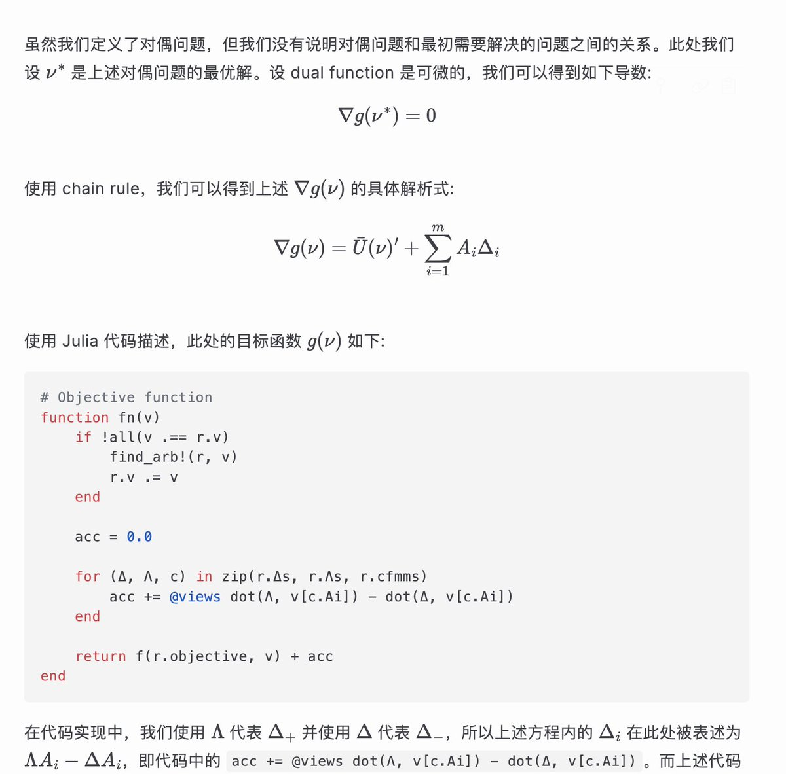

# 凸優化求解 AMM 最佳路由

> **來源**: [@wong_ssh](https://x.com/wong_ssh/status/1973819246561144926) | [原文連結](https://twitter.com/wong_ssh/status/1973819246561144926/photo/1)
>
> **日期**: 
>
> **標籤**: `AMM` `凸優化` `交易路由`

---

> **來源**: [@wong_ssh (WongSSH)](https://twitter.com/wong_ssh)
> **日期**: 2026-02-18
> **標籤**: `AMM` `凸優化` `DeFi` `最佳路由` `數學建模`

---

凸優化求解 AMM 最佳路由不是很難的問題，上週末花時間把論文讀了一遍，今天下午約了清華數學大佬討論了我的筆記的一些疑問，今天晚上把筆記整理成了一篇博客。

相比於論文，我附帶了對應的代碼分析，並且根據情況補充了中間推導過程和背景知識。但本文對數學要求不高，基本大學二年級數學就夠用。

**博客連結**: https://t.co/gzqqVI4Kxh

## 關鍵特點

- 使用凸優化方法求解 AMM（自動化做市商）的最佳路由問題
- 包含完整的代碼分析和數學推導過程
- 補充了相關背景知識，降低閱讀門檻
- 數學要求：大學二年級數學程度即可理解
