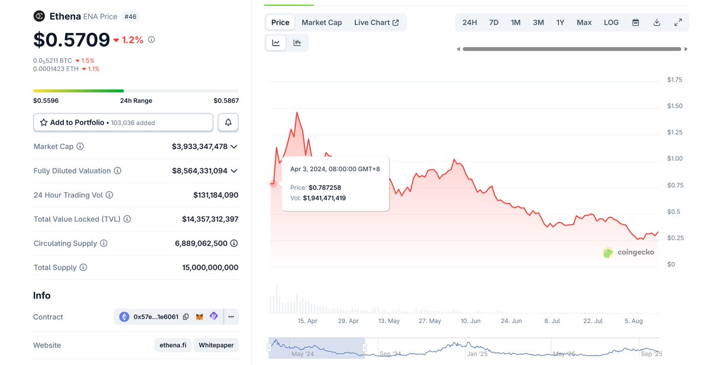

# Falcon Finance $FF 質押 80 倍積分分析：USDf YT 可能被高估

> **來源**: [@LumaoDoggie](https://x.com/LumaoDoggie/status/1972325387368841614) | [原文連結](https://x.com/awesomeHunter_z/status/1971120186439934288)
>
> **日期**: Sun Sep 28 15:39:51 +0000 2025
>
> **標籤**: `Pendle` `積分挖礦` `穩定幣收益`

---

> **來源**: [@LumaoDoggie (撸毛小狗)](https://twitter.com/LumaoDoggie)
> **日期**: 2025-02-18
> **標籤**: `falcon-finance` `usdf` `pendle` `yt-strategy` `積分系統`

---

## 核心結論

$FF 代幣的 80 倍積分，導致 USDf YT 和 sUSDf YT 可能被高估，可以考慮賣出。

---

## 背景：Falcon Finance 質押積分倍數

今天 @falconfinance 公佈了 $FF 代幣的質押功能，質押給 **80 倍積分**（七天促銷期之後）。

---

## 歷史對比：Ethena 2024 年案例

### 市場環境對比

2024 年 4-6 月的行情熱度比現在還要高一些：
- 當時市場貪婪指數：50-80
- 現在：40-60

### Ethena 積分倍數與價格

**ENA 代幣（2024 年 4 月 TGE）**：
- 積分倍數：30X
- 價格區間（4-8 月）：$0.4-0.7，平均取 $0.6
- YT APY：65%-80%

**USDe 穩定幣（同時期）**：
- 積分倍數：20X
- YT APY：25%-45%

**關鍵比率計算**：
用 $0.6 拿到了 30/20 = **1.5 倍穩定幣 YT 的積分**

---

## Falcon Finance 當前數據分析

### $FF 積分效率

- $FF 盤前價格：$0.26
- 積分倍數：80X（代幣質押）vs 60X（sUSDf）
- 積分效率：用 $0.26 可以拿到 80/60 = **1.33 倍穩定幣 YT 的積分**

---

## 兩種可能情況

### 情況 1：$FF 價格低估

從 S2 積分的角度來看，合理價格應該是：
- 1.33/1.5 × $0.6 = **$0.53**

### 情況 2：USDf 積分比例過低

這意味著 **USDf 和 sUSDf 的 YT 可能被高估**。

但有個隱含條件：
- USDf YT 的下降空間有限
- 降到 10% 以下，PT 很少會有人來存
- 當前市場上 10% 以上的活期 DeFi 機會很多

---

## 副作用：USDf 池子 TVL 上不去

**實際數據對比**：
- sUSDe : USDe 池子的 TVL = **5:1**
- sUSDf : USDf 的 TVL = **7:1**

可以看出，**USDf 池子是很小的**。

---

## 市場反應預測

如果 USDf 和 sUSDf 拿的積分比例過低，大家就會去用 $FF 賺 Season 2 的積分。

**可能結果**：
- 拉升 $FF 幣價
- 拉升 $FF 的 YT APY
- 或者兩者皆有

雖然目前沒有公佈 $FF 代幣上 Pendle 的消息，但不會太久（Ethena 是 TGE 之後一週就上了）。

---

## 投資建議

### 當前結論

- **$USDf、sUSDf 的 YT 都有可能高估了**
- 如果喜歡穩定收益，可以部分買一些 **$sUSDf 的 PT**，目前 15% 左右的收益還可以

### 重要提醒

以上只是根據當前資訊的粗略推論。

**可能的變數**：
- 明天開盤後韓所炒作一波 $FF 直接上 $0.6
- 大家 FOMO 去買 sUSDf 的 YT
- 推論就全都不成立

**所以要結合你自己對幣價的預期**。

### 最終建議

根據上篇文章的算法，現在的價格你沒有任何理由買 $USDf 的 YT。

如果你打算博一把積分，也請買 **$sUSDf 的 YT**：
- 雖然槓桿稍微小一點
- 但整體來看划算很多

---

**相關文章**：https://t.co/iLsp7aAXdd
