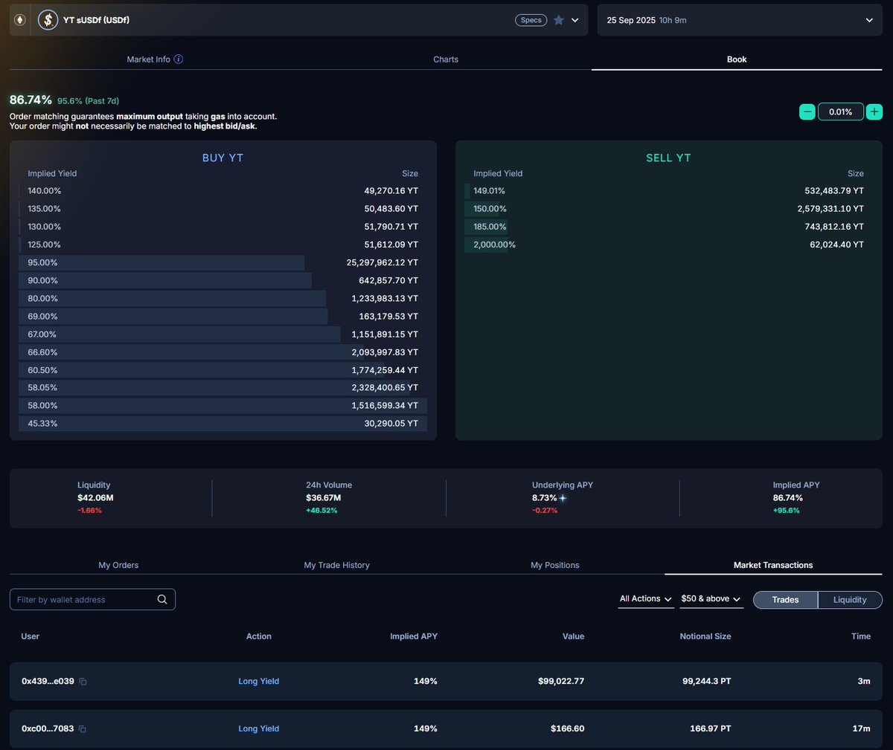

# Falcon sUSDF YT 末日倒計時：150% APY 的機會與風險

> **來源**: [@Eason_2099](https://x.com/Eason_2099/status/1970852932758413538)
>
> **日期**: Wed Sep 24 14:08:50 +0000 2025
>
> **標籤**: `Pendle YT` `Falcon Finance` `積分農耕`

---




> **來源**: [@Eason_2099 (愛DEFI的大米)](https://twitter.com/Eason_2099)
> **日期**: 2025-09-25
> **標籤**: `Falcon Finance` `Pendle` `YT策略` `末日策略` `積分挖礦`

---

## 核心機會

Falcon 的 sUSDF YT(2025/9/25) 進入最後 10 小時倒計時。由於 Falcon 的 TGE 在即，加上昨日 Falcon 在 Buildpad 上超募 28 倍，創造 BuildlPad 上超募和募資金額新記錄，大家對於 Falcon 的估值都比較看好，YT 的買盤依然強勁。

目前 sUSDF YT(2025/9/25) 流動性池子已經全部枯竭，無法再 swap 出 YT，只能掛限價單，等待有賣家賣出 YT 時候成交。而當前的訂單簿上，YT 賣方的 Implied APY 已經高達 150%，但依然不能擋住部分 YT 買家不斷接盤衝了進來。

## 末日 YT 的理論基礎

理論上，末日 YT 是充滿機會的，因為 YT 價格會隨著時間逐漸衰減，PT 價格則隨著時間會逐漸歸為 1（假設本幣是穩定幣,例如 USDF）。

因此到期日 PT 價格為 1，對應 YT 價格為 0：

具體來說：

```
P(t) = 1/(1+r)^(T-t)
```

其中 r 是市場的隱含利率，也就是 Implied APY，T 是到期時間。越靠近到期，折現因子趨近於 1，P(t) → 1

由於 SY = 1 = P(t) + Y(t)，因此：

```
Y(t) = 1 - 1/(1+r)^(T-t)
```

越靠近到期，Y(t) → 0

因此這裡我們可以看到 Y(t) 的價格和兩個變量有關係：

1. **剩餘時間（T-t）**：剩餘時間越小，YT 價格越低
2. **隱含利率 r（Implied APY）**：Implied APY 越大，YT 價格越高

對於我們購買 YT，我們希望剩餘時間越小，但同時希望 Implied APY 也不要太高，也是越小越好。當流動性不足的時候,買方實際成交的價格就取決於掛單賣方給出的 APY。

## 積分快照時間點策略

Falcon 更新積分的時間點，大約是每天 UTC 時間 24 點，對應的是北京時間第二天早上 8 點，剛好也就是 YT 到期時間。

此外，根據 @0xlemoneth 的實測：「在凌晨 2-3 點新增的 YT，當天早上 8 點都會給予積分，等於你只要持有 5 個小時就可以得到一天完整的積分」

因此理論上，如果快照就是 8 點鐘，那麼在 9 月 25 日早上 8 點前，比如 7 點 59 分買入 YT，此時 YT 最便宜，同時也能趕上快照。

但 Falcon 的快照可能實際上要比 8 點要早，因此保險起見，提前幾個小時買入，避免錯過當天的積分快照。比如這時候 2 點鐘買，相當於你只持有了 6 小時，但卻享受了 1 天的積分，等於是打折到了 6/24 = 1/4

但是，如果這時候 Implied APY 非常高，比如 400% 的 Implied APY，這時候剩餘時間縮短帶來的打折，就不一定能覆蓋實際成交的高 Implied APY。

## 博弈總結

YT 的最後一天，就是博弈 AMM 曲線的基準價格隨著時間到期加速衰減，與 YT 買家不斷推高的 Effective Implied APY，這兩者此消彼長，如果能找到相對最優的買入點，那就是機會。

## 實際測算案例

其實大家買入的時候，不妨先測算一下：

比如當前 Effective Implied APY 飆升到了 150%，100U 可以通過限價單主動買入到 92,120 個 YT

這樣你可以獲得積分為：

```
92,120 × 36 = 3,316,320 = 3.31M
```

再考慮底息 8.8%：

```
92,120 × 8.8% ÷ 365 × 10 ÷ 24 = 9.25U
```

對應成本是：

```
100 - 9.25 = 90.75U
```

那麼對應 3.31M，相當於 1M = 27.41U 的積分成本，其實也不低了。

**如果你覺得未來空投 1M 積分能帶來超過 30U 的回報，那你可以考慮買入，如果覺得不能，那就別 FOMO 了。**

---

**投資有風險，請 DYOR！**
