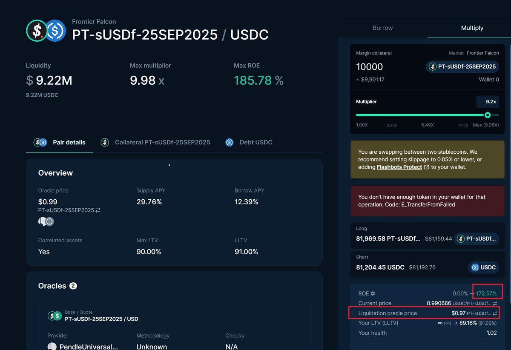
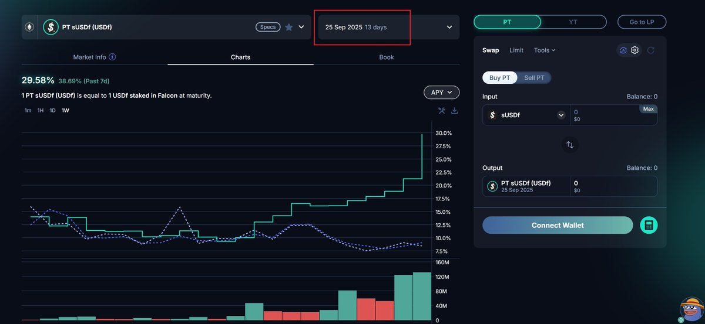

# Falcon sUSDF PT 槓桿耕作策略：13天70%確定性收益

> **來源**: [@LumaoDoggie](https://x.com/LumaoDoggie/status/1966046025480835075) | [原文連結](https://app.pendle.finance/trade/pools/0x45f163e583d34b8e276445dd3da9ae077d137d72/zap/in?chain=ethereum)
>
> **日期**: 
>
> **標籤**: `槓桿耕作` `Pendle PT` `DeFi套利`

---

> **來源**: [@LumaoDoggie (撸毛小狗)](https://twitter.com/LumaoDoggie)
> **日期**: 2024-09-12
> **標籤**: `Falcon Finance` `Pendle` `槓桿耕作` `PT` `sUSDF` `循環貸款`

---

## 策略概述

70% 的低風險、高確定性收益機會，總共可以拿 13 天左右。

**利益揭露**：本文不是廣告，也沒有參加 Kaito 嘴擼，本人與項目利益無關。

## 背景

這兩天 @falconfinance 的 USDf 因為確定要上 BuildlPad，TGE 估計在十月中旬到十月底。所以 9 月 25 日到期的 Pendle sUSDF PT 收益率大漲，已經到 29.5% 左右了。

這時候通過 Euler Finance 上做 Loop 循環貸，借款大概是 13% 左右利率。PT 循環 9 倍左右，帳面收益可以到 170%，一共可以拿 13 天左右這樣的收益。

## 成本分析

Pendle 利率在我們買下去的那一刻就已經確定了。所以計算一下成本：

### 1. USDC 借款利率變動
- 可能會從現在的 13% 升高到 15%
- 但不太可能更高了，更高的話會有很多人過來存款

### 2. USDC 到 USDf 的匯兌損耗
- Pendle 到期後，USDf 匯率肯定會跌一些，但不會跌太多
- 因為 TGE 至少 30 天之後才到，時間還沒到
- swap 回來會有損耗，來回估計千 2 左右
- 9 倍槓桿那就是接近 2%，極端一點算作 3%
- 13 天 3% 磨損，相當於年化 84% 的磨損

### 3. 其他費用
- Pendle 收幾十 U 的手續費
- 循環貸一次有 10U 左右的 gas

### 收益計算
主要變數是上面的 1 和 2 這兩點。那麼磨損最高可能有 100% 左右的年化。170% 收益率減磨損，也就是說，**最保守來算年化也至少有 70%**。

## 風險評估

很多玩循環貸的都知道怕價格波動被清算。這個我們要來算一下。

### 清算風險
- 9 倍循環貸的話，PT 清倉價格在 0.97
- 現在 PT 公允價格是在 0.99
- 因為到期日很近了，只有 13 天不到
- 如果要到 0.97 左右的清倉價格，sUSDF PT 年化需要從今天的 30% 漲到 300%
- **這顯然是不可能的事情**（PT 收益越高，PT 價格越低；到期日越近的，價格波動越小；這些都是類似國債）

### 脫錨風險
- sUSDf 本身可以無損自由兌換成 USDf
- 後者又可以無損兌換成 USDC（等待 7 天）
- 所以無限趨近為 0
- 項目還有一個月可能就 TGE 了，也不用擔心會出什麼幺蛾子
- 真有黑天鵝事件脫鉤了，怕是拼了家底也會幾分鐘之內拉回來

### 安全風險
- Euler、Pendle 都是老牌 DeFi 了
- Falcon 項目本身後台是知名做市商 DWF，家大業大

### 影響本金安全的風險
我們 9 倍槓桿的話，影響本金安全的風險就兩個：

a) Falcon、Pendle、Euler 在這 13 天內被駭客攻擊  
b) USDf 大幅脫錨，並且不在幾小時內恢復

**說實話兩個風險都趨近於 0 了。**

## 操作步驟

### 1. 兌換 USDf
主網上去 OKX 錢包裡用 USDC 換 USDf（沒有費用）

### 2. 兌換 sUSDf
去 Falcon 官網把 USDf 換成 sUSDf

### 3. 購買 PT
去 Pendle 官網上把 sUSDf 換成 PT  
**注意找 9 月 25 日到期那個，千萬別換錯了**  
https://t.co/OlYe8h123g

### 4. 建立循環貸
去 Euler 上找到對應的 sUSDf PT 的池子，建議直接拉到 9 倍槓桿  
https://t.co/3DIJ0HHjSY

### 5. 到期後處理
9 月 25 日到期後直接反向換回來就行了。

## 後續策略

其實更好的辦法是，留著一些 USDf，拿著這些 USDC + USDf 繼續去 Curve 和 Corvex 做 LP 池子：

- 目前有 15% 的 LP 收益
- 加 40X 積分（積分價值目前根據 Pendle YT 估算是在 25% 年化左右）
- 加起來有 40% 年化

到時候我會提前兩天再寫一篇文章。

**PS**: 徽章 badge 什麼的不用刻意去做，那個主要是 KOL 嘴擼需要，咱們這些擼積分的用不上這個。

## 總結

沒什麼好說的，擼就行了。13 天，70%，短平快，確定性極高 + 風險極低的機會。上個月錯過了 Plasma 存款的這次別錯過了。

**注意**：如果你投入資金在 3000U 以下，或者看到此文的時間在 9 月 15 日之後，則不建議再投入了，因為磨損可能大於收益。
