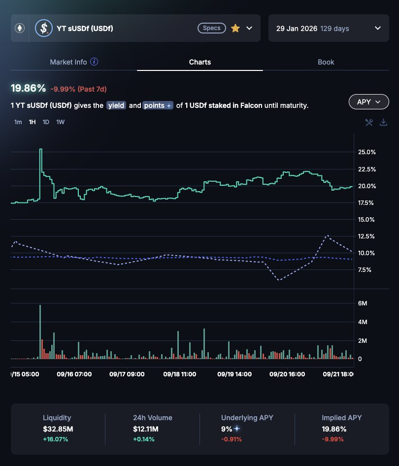
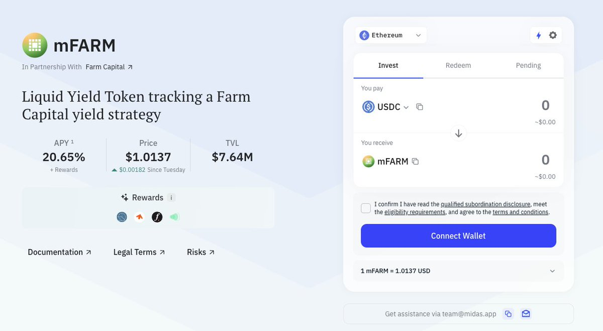

# Falcon Finance sUSDf 策略分析：快照前的低風險配置

> **來源**: [@craigyc_eth](https://x.com/craigyc_eth/status/1969827435899445288)
>
> **日期**: Sun Sep 21 18:13:52 +0000 2025
>
> **標籤**: `DeFi策略` `Falcon Finance` `收益農業`

---




> **來源**: [@craigyc_eth (Craig C.)](https://twitter.com/craigyc_eth)
> **日期**: 2025-02-18
> **標籤**: `Falcon Finance` `sUSDf` `DeFi策略` `低風險配置` `積分農場`

---

## 策略背景

快照臨近，這個時間再重倉賭就不合適了，要賭也要等到發幣之後看著來，現在可以穩健一點做做低風險的策略。以下是圍繞 [@falconfinance](https://twitter.com/falconfinance) 的一些策略想法。

## 一、遠期 sUSDf 池子的雙向策略

### 買入 PT
買 PT 吃 129 天 20% 的年化挺香。

### 掛單策略
我則選擇掛單接一些便宜貨來參與 S2，考慮以下事件對利率的影響：
- 25Sep PT-sUSDf 到期移倉
- 快照發生
- 72x 積分結束

能接到便宜貨就不著急市價吃進。

## 二、更加保守的策略

### 2.1 遠期 sUSDf LP

風險偏好更低可以做遠期 sUSDf LP。

**打開 KYT**：
- 可以吃到 27% 年化 + 72x 積分
- 是 S1 結束前極佳的無損策略

**關閉 KYT**：
- 可以吃到 PT 收益
- 這個池子的利率大概會有所回落
- （USDf LP 一個道理，還能避免積分倍數波動）

### 2.2 PT-USDf + YT-sUSDf 組合

PT-USDf + YT-sUSDf 的組合也能吃到積分 + 年化，還避免了 mint 被算作弊的可能。

**收益公式**：
```
USDf iAPY - sUSDf iAPY + sUSDf uAPY
```

所以在出現錯配時進行最好。

### 2.3 mFARM 資管基金

里昂老師主理的 mFARM [@FarmCapitalXYZ](https://twitter.com/FarmCapitalXYZ)：
- 首月免 fee，後續分潤 20%
- 公開資管地址，透明省心
- 規則和 Midas 上的其他基金一致
- 有其獨特優勢

## 三、Falcon 之外的佈局

我還在以下協議有一定倉位，認為都不是短期內能 TGE 的，當理財做不去賭：
- [@infinifi](https://twitter.com/infinifi)
- [@strata_money](https://twitter.com/strata_money)
- [@Terminal_fi](https://twitter.com/Terminal_fi)

## 碎碎念

Falcon 會在今天晚上正式開啟打新，要是能有不稀釋額度我就塞點，沒有就不摻和，拿不了幾個幣。

快照近了然後就是 Checker、正式發幣。現在最大的阻礙是那個單線程 Dev，工作效率太低了...... 😅
