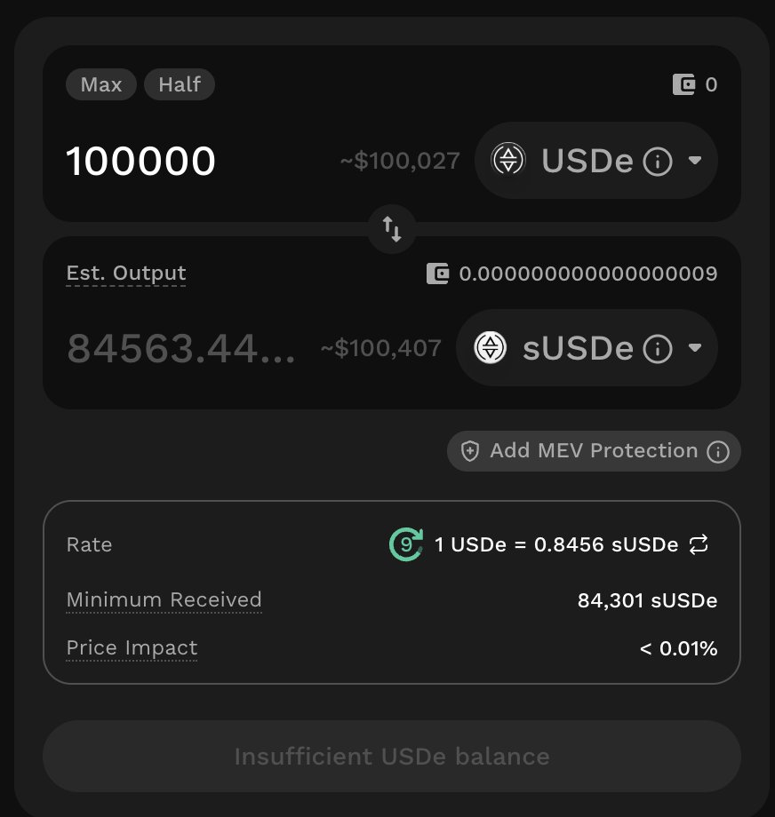
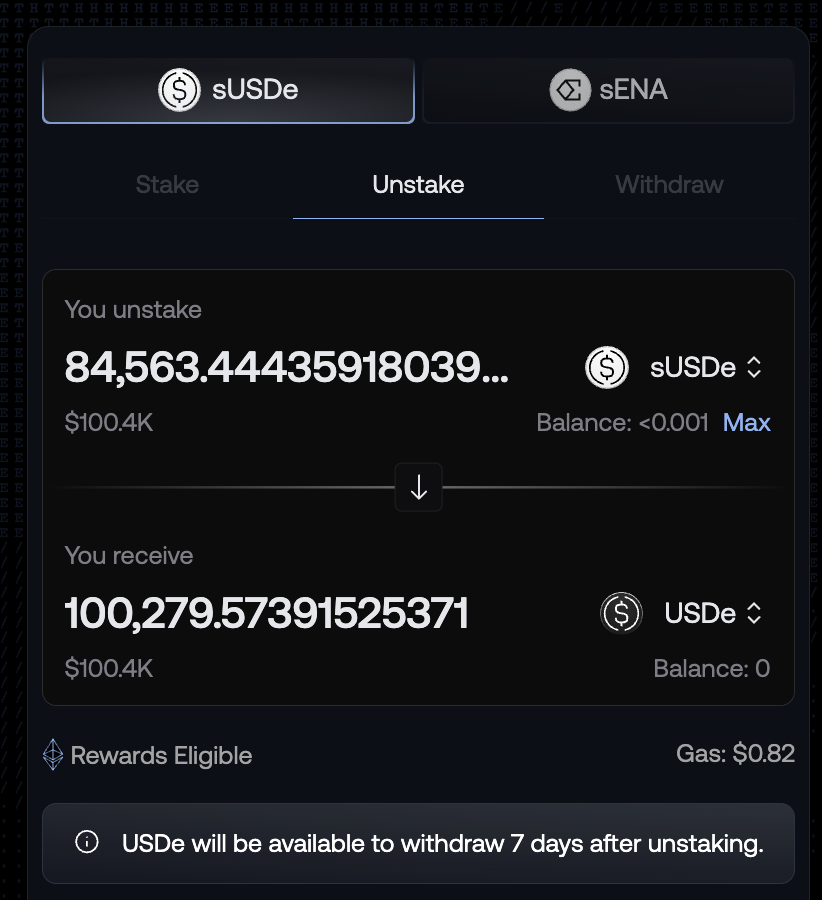

# sUSDe 折價套利機會回到 -0.15%：Pendle PT/YT 到期前的部位操作分析

> **來源**: [@0xlemoneth](https://x.com/0xlemoneth/status/1969778860884635743)
>
> **日期**: Sun Sep 21 15:00:51 +0000 2025
>
> **標籤**: `sUSDe折價` `Pendle到期` `低風險套利`

---

> **來源**: [@0xlemoneth (0xLemon)](https://twitter.com/0xlemoneth)
> **日期**: 2025-09-25
> **標籤**: `Ethena` `sUSDe` `Pendle` `套利` `折價` `PT/YT`

---

最近都在寫 @falconfinance，已經好久沒有發有關於循環貸和 @ethena $sUSDe 相關的文章了。

主要也是因為最近確實有更好的標的,和之前兩個月我都只寫 $ENA + $sUSDe 相關的內容一樣,套利就是當下什麼好就去哪,不用一定要堅持在某個地方。

## 當前市場狀況

不過沒寫不代表沒關注！目前 $sUSDe 的折價又來到了 -0.15% 了,但距離大量的 PT / YT 到期還有 3 天。印象中上次是到期當天才產生折價,這次在現在年化給的不算低的情況下,提早四天就已經折到了 -0.15%,不知道是大家有經驗了還是因為重疊到 S4 結束的關係。

如果是最近因為 @pendle_fi 介紹文才追蹤我的朋友們,也可以看看我從 7 月開始到現在的 $sUSDe 操作策略,總共有四篇分享,這也是我開始寫文章的起點。

## 操作思路

總而言之,持續跟進,本來就知道這時間點一定會產生折價,這也是為什麼最近半個多月都完全沒操作 $sUSDe 的原因。

**耐心等待,直到好的機會到來。**

## 先前套利機會回顧

🚨 低風險套利 200% 年化機會又來了?

隨著今天 @pendle_fi 大量 PT/YT 到期,也讓本來變相鎖倉的 $sUSDe 釋出,這時候如果想出場又不想等 7 天解鎖期,就只能市場上直接砸。

目前 USDE 本位來看的話,折價又到了 0.28% 左右,自己市場上買來解鎖可以獲得:

**0.28% × 52 = 14.56% 年化收益**

剩下的部分就看自己想要:
- 簡單點賺 0.28%
- 更複雜一點的循環貸(要注意的點比較多)

總之套利機會又出現啦！只要你覺得 $sUSDe 是短暫折價,那就可以開始賺錢了！
