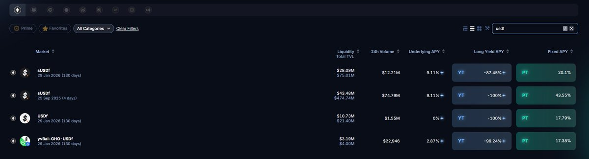
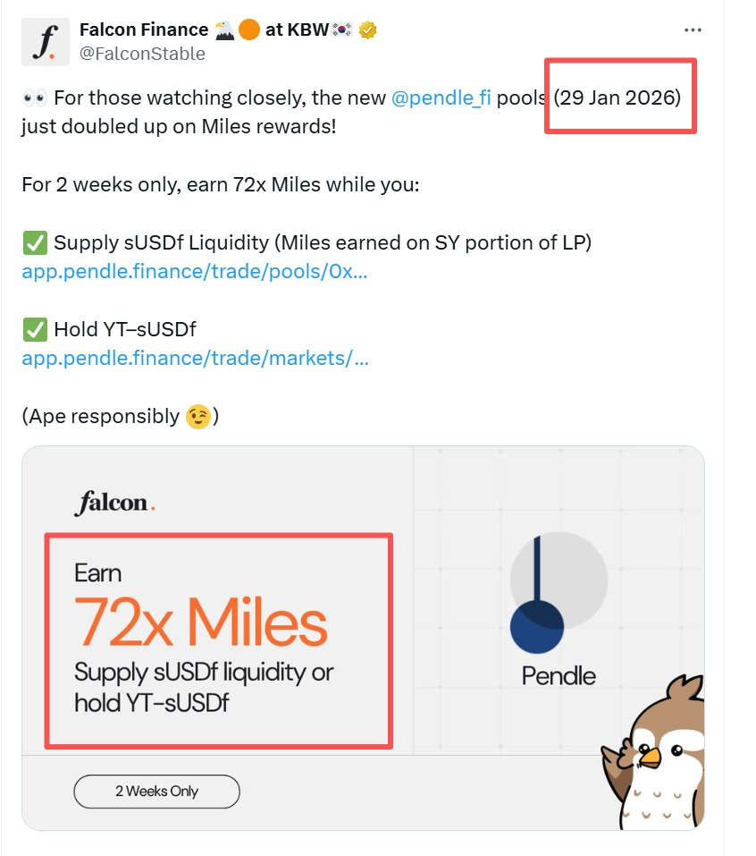
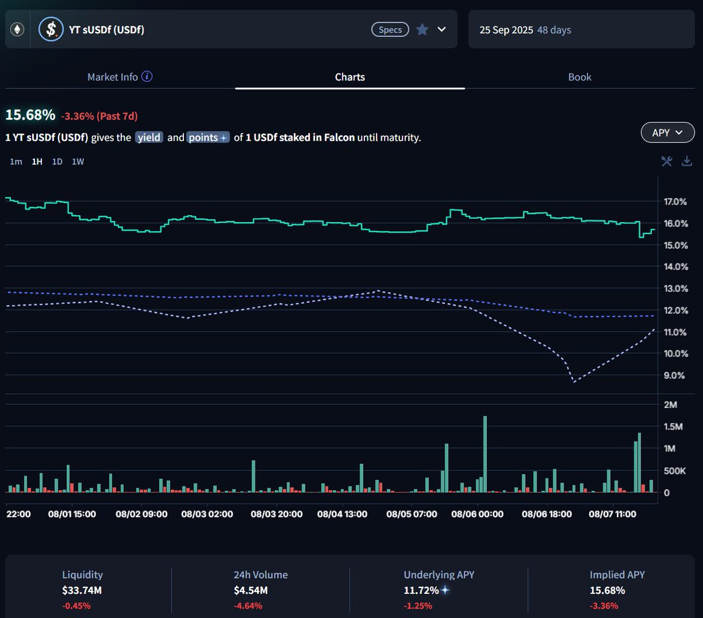
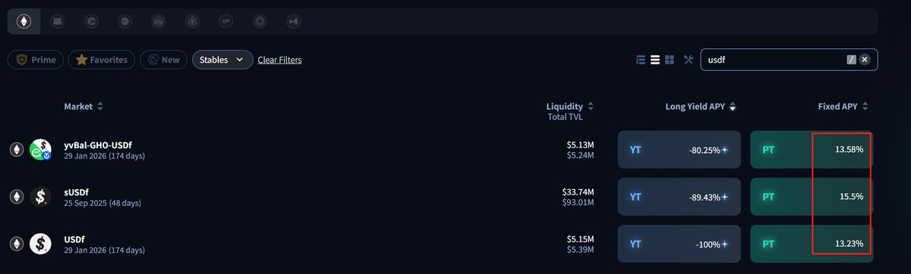
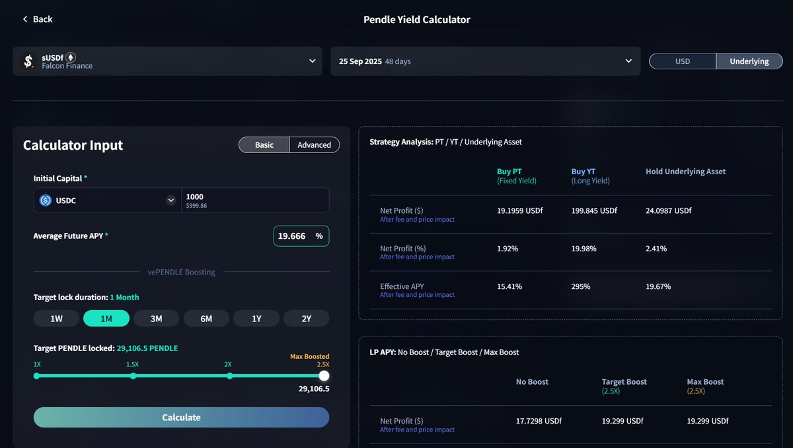
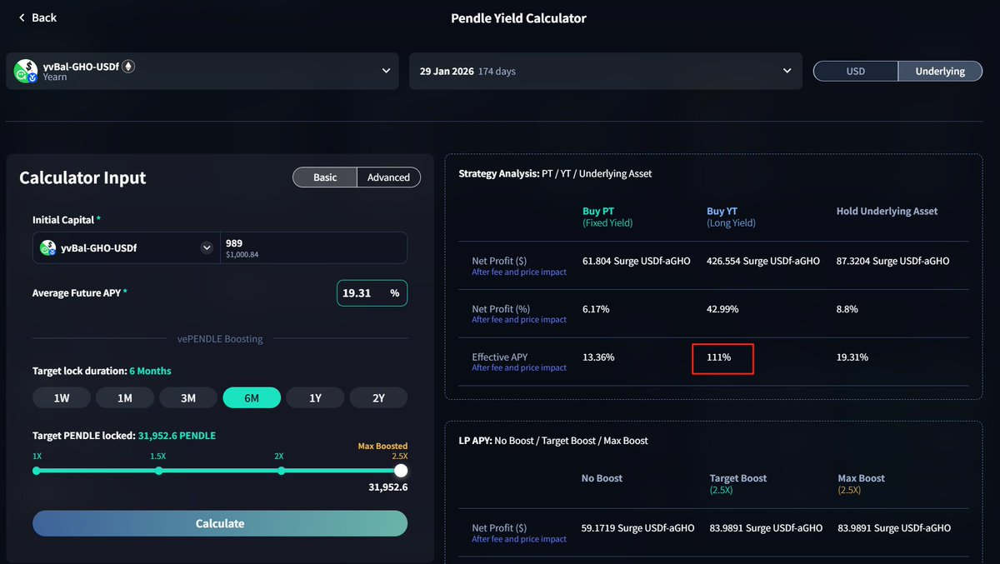

# Falcon YT Pendle 策略對比：sUSDF、USDF、yvBal-GHO-USDF 性價比分析

> **來源**: [@Eason_2099](https://x.com/Eason_2099/status/1969241921542636036)
>
> **日期**: Sat Sep 20 03:27:15 +0000 2025
>
> **標籤**: `Pendle` `Falcon Finance` `YT 策略`

---

## 核心策略對比

玩轉 Pendle，最新一期 Falcon YT 大比拼，sUSDF0925/sUSDF0129/USDF0129/yvBal-GHO-USDF0129，哪家更強！

最近 Falcon Finance @falconfinance 公布了 8.3% 的空投額度，一下子把大家對於 Falcon 空投大肉的預期推向了高潮。Degen 們紛紛餓狼捕食般買入 YT，今年 8 月 7 日我當時評測的最優 YT sUSDF（2025 年 9 月 25 日到期）Implied APY 更是從當時的 11.72% 上漲到了當前的 43.55%，漲得讓人瞠目結舌，令人髮指！

而前期我評測的最差 YT USDF (2026/1/29 日到期) 的 Implied APY 也從前期的 13.23%，漲到了當前的 17.79%

8 月 7 日當時的評測結果是，YT 投資性價比：
sUSDF（2025/9/25）> yvBal-GHO-USDF(2026/1/29) > USDF(2026/1/29)

但俗話說，皇帝輪流做，明年到我家。在 9 月 20 日今天來看，目前涉及 Falcon 的有 4 個 YT，在之前的 3 個 YT 上，新增了 sUSDF(2026/1/29 日到期)

時過境遷，其實情況已經發生改變，到底當下哪個 YT 性價比才是最高呢？

## 縱向對比：不同到期日的 sUSDF

首先，我們來縱向對比不同到期的 sUSDF：sUSDF（2025/9/25）VS sUSDF(2026/1/29)

在相同底息（underlying APY=9.1%）的情況下，sUSDF（2025/9/25）的 implied APY 是 43.55%，意味著給到 36 倍積分的成本是 43.55%-9.1%=34.45%

sUSDF（2026/1/29）的 implied APY 是 20.1%，意味著給到 36 倍積分成本是 20.1%-9.1%=11%。而實際上 Falcon 最近為了鼓勵大家從 Pendle 9 月的池子遷移到明年 1 月的池子，給了 YT sUSDF 臨時 2 週 72 倍積分的 APY（從 9 月 15 日到 9 月 29 日）。這也意味著到 9 月 29 日之前的 36 倍積分 APY 成本還要打折一半，只有 5.5%！

但這裡還需要考慮一點，時間因素：
- YT sUSDF（2025/9/25）因為臨近到期，槓桿倍數更高，積分全部進入一期空投，這個是他的短期優勢
- YT sUSDF（2026/1/29）因為到期時間還有 130 天，大部分積分會進入二期。但我們如果對比另外一個穩定幣項目 Ethena，後面的二期到四期依然風風火火，Falcon 大概率第二期空投應該也不會差多少

因此，綜合來說，YT 性價比：sUSDF（2025/9/25）< sUSDF(2026/1/29)

## 橫向對比：2026/1/29 到期的三個 YT

接下來，我們橫向對比，都是 2026 年 1 月 29 日到期的 sUSDF、USDF、yvBal-GHO-USDF

### sUSDF vs USDF

這次我們來比較一下他們的積分成本：

1）USDF 的 Implied APY 是 17.79%，對應的 60 倍積分成本也就是 17.79%，換算成 36 倍積分成本就是 17.79%×0.6=10.674%

2）sUSDF 的 Implied APY 是 20.1%，當期 underlying APY 是 9.11%，如果是正常 36 倍積分，對應其積分成本 20.1%-9.11%=10.99%。但因為這兩週臨時加倍，實際到 9 月 29 日期間的獲取積分成本要打折一半，5.5% 左右（還可以享受 9 天）

因此結論是，當期如果買入 YT，到 9 月 29 日之前，sUSDF 性價比要高於 USDF，但 9 月 29 日之後，兩者積分成本實際差不多，USDF（10.674%）還要略小於 sUSDF(10.99%)

考慮到，sUSDF（2025/9/25）在 9 月 25 日到期以後，勢必會有一波 YT 用戶，會新買入 1 月份到期的 sUSDF(2026/1/29），屆時 Implied APY 會更高，意味著 sUSDF(2026/1/29）積分成本會進一步推高，屆時就 YT 性價比而言，將會將進一步 sUSDF < USDF。

### USDF vs yvBal-GHO-USDF

再接下來，我們來對比：USDF VS yvBal-GHO-USDF

1）USDF 的 Implied APY 是 17.79%，對應的 60 倍積分成本也就是 17.79%

2）yvBal-GHO-USDF 的 Implied APY 是 17.79%，同時還有底息收入 underlying APY=2.87%，對應的 60 倍積分成本也就是 17.38%-2.87%=14.51%

很顯然，這輪比較，YT 性價比：USDF < yvBal-GHO-USDF

## 綜合結論與操作建議

綜合上面分析，結論就是 YT 性價比：
sUSDF（2025/9/25）< sUSDF(2026/1/29) < USDF(2026/1/29) < yvBal-GHO-USDF(2026/1/29)

### 具體操作建議

1）如果當前持有 YT sUSDF（2025/9/25），可以考慮賣掉，換明年 1 月份的 YT。

2）1 月份的 YT，可以首選買 yvBal-GHO-USDF(2026/1/29)，同時可以短期買入 sUSDF(2026/1/29)，然後在 9 月 29 日左右賣掉。

這裡要特別提醒一點：yvBal-GHO-USDF 這個的 YT 是無法直接用 USDC、ETH 等硬通貨去 Swap 出來的，必須先去 Balancer 上去按比例存入 $GHO + $USDf，完成 Add liquidity 添加生成 LP 以後，才能去兌換 YT。考慮到以太坊上的 Gas 費用，不建議用太小資金去購買 yvBal-GHO-USDF 的 YT，小資金就還是買 USDF(2026/1/29) 算了，省得折騰了。

### 短期買入 sUSDF(2026/1/29) 的理由

之所以短期買入 sUSDF(2026/1/29)，然後很快賣掉：

一方面因為 sUSDF(2026/1/29) 在 9 月 29 日之前可以享受 200% 的積分 boost

另外一方面，正如我前面所分析，sUSDF（2025/9/25）在 9 月 29 日到期以後，勢必會有一波 YT 用戶，會新買入 1 月份到期的 sUSDF(2026/1/29），從而短期拉高 sUSDF(2026/1/29），但實際上 sUSDF 的積分成本相比 USDF 和 yvBal-GHO-USDF 已不具備任何優勢，套利者必然會轉向性價比更高的 USDF 和 yvBal-GHO-USDF。因此屆時，sUSDF 如果拉高，就趕緊逢高出貨換其他 YT 吧

---

## 附錄：8 月 7 日原評測內容

玩轉 Pendle，Falcon YT 大比拼，sUSDF/USDF/yvBal-GHO-USDF，哪家更強！

這幾天推特上的大佬們都在推 Falcon Finance @falconfinance 的穩定幣項目 USDF，這個項目我最早是從小萌總 @MengLayer 推上看到相關介紹，了解到其背後是 DWF 操盤的穩定幣項目，Falcon 結合機構級交易策略，通過多元化抵押品和先進套利算法，提供穩定回報。初步判斷應該有點搞頭！

於是 Falcon 上線 Pendle @pendle_fi 以後，5 月初的時候我買了點 sUSDF 的 YT，當時 Pendle 上介紹這個 YT 的時候，只標明了 YT 有底層收益，但沒有標有 Falcon 的積分，去 discord 問 Mod 也一直含含糊糊，但因為此時底層收益一直在 10% 左右，買入 YT 的成本 12% 左右，感覺實際成本也不高，就準備賭一下後續是否會給 YT 持有者回溯 Falcon 積分。果然後面項目方給了 YT 持有者積分回溯，頓時 sUSDF 的 YT 變成香餑餑。

接下來，我一直想再補些 sUSDF 的 YT，但可惜 Implied APY 就一直沒怎麼下來，期間 USDF 經歷了脫錨事件，大戶出逃砸 PT，更是導致 YT 短期拉高。直到今天 sUSDF 的 YT 的 Implied APY 還是有 15.68%，掛了幾週的限價單一直沒有機會低位成交，鬱悶啊。

既然 sUSDF 的 YT 價格有些高了，於是我又去比較了 Falcon 另外兩個 YT 項目，一個是底層不含利息的 USDF(2026/1/29 日到期），另外一個是底層含利息的 yvBal-GHO-USDF(2026/1/29 日到期)。兩者的 Implied APY 分別是 13.23% 和 13.58%

那這三個 Falcon 的 YT，當下投資哪個更划算呢？

### 簡單比較方法

我這裡給個非常簡單的比較方法，方便 Degen 們自己也能輕鬆對比分析：

首先，我們假設持有 USDF(2026/1/29 日到期）的 YT holder 到期不虧不賺，那麼空投積分 APY，也就是 Point APY 應該等於它當前的 Implied APY，也就是 13.23%。而對於 USDF YT 投資者最終的 Effective APY=0

接下來，我們把這個假設再帶入另外兩個 YT 的 Pendle 計算器測算一下他們的收益：

**1）sUSDF(2025/9/25 到期)**

當前 underlying APY 是 11.72%，假設後續保持不變。

由於 sUSDF 的積分倍數是 36 倍，而 USDF 的積分倍數是 60 倍，因此同等面值的 sUSDF 的積分效率相對於 USDF 的 0.6 倍。對應 Point APY=13.23%×0.6= 7.94%

因此 Average Future APY = underlying APY + Point APY = 11.72%+7.94%=19.66%

將這個數字 19.66% 輸入計算器中的 Average Future APY。假設 YT 投資成本 1000U，對應 sUSDF YT 最後的 Effective APY 是 295%

**2）yvBal-GHO-USDF(2026/1/29 日到期)**

當前 underlying APY 是 6.08%，假設後續保持不變。

因為 yvBal 的積分倍數同樣也是 60 倍，因此 yvBal 的積分效率相對於 USDF 一樣，也是 13.23% 的 Point APY。

因此 Average Future APY = underlying APY + Point APY = 6.08%+13.23%=19.31%

將這個數字輸入計算器中的 Average Future APY。假設 YT 投資成本 1000U，對應 YT 最後的 Effective APY 是 111%

### 8 月 7 日結論

因此，在假設 Point APY = USDF YT 的 Implied APY = 13.23% 的前提下，三個 YT 的 Effective APY，分別是：
- USDF: 0%
- sUSDF: 295%
- yvBal-GHO-USDF: 111%

Degen 們，應該不難做出選擇了吧，當下肯定不要買 USDF 的 YT 哈，如果 Point APY 小於 13.23%，那是要虧本的！

而 yvBal-GHO-USDF 的 Effective APY 其實也是小於 sUSDF 的，同時這個的 YT 是無法直接用 USDC、ETH 等硬通貨去 Swap 出來的，必須先去 Balancer 上去按比例存入 $GHO + $USDf，完成 Add liquidity 添加生成 LP 以後，才能去兌換 YT。對於資金小的 Degen 們，想想這來回折騰的以太坊的 Gas 費，心裡就更哇塞了。

### 風險提醒

最後，想提醒一下大家，當前 Falcon 的確很火熱，但幾個 YT 都處於高位，不建議過於 FOMO，如果實在要買 YT，那建議還是選 sUSDF 吧。

還有，如果你實在看不順眼那個 USDF 的 YT，那就空它吧！怎麼空？買他的 PT 唄，等 USDF 的 YT 收益率跌下來，你購買的 USDF 的 PT 價格也就上來了，這時候就可以高位賣掉，或者持有到期坐收 13.23% 的 APY。

最後的最後，還要提醒一下大家，買 Falcon YT 前記得要先去 Falcon 網站註冊哈：https://t.co/TpgJd2U08c，否則 YT 積分沒法及時累積到賬戶上。祝大家在 Falcon 項目投資上，最後都能有好的收穫！
