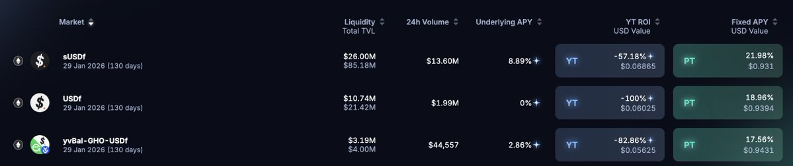
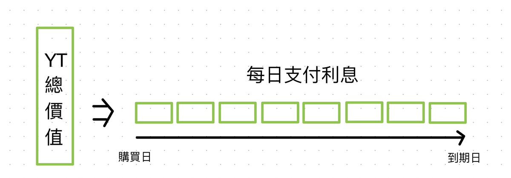
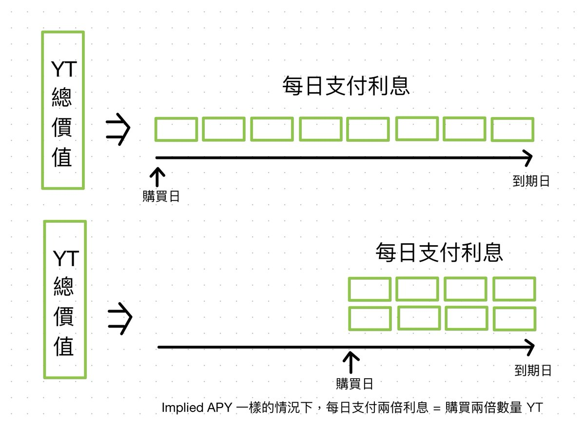
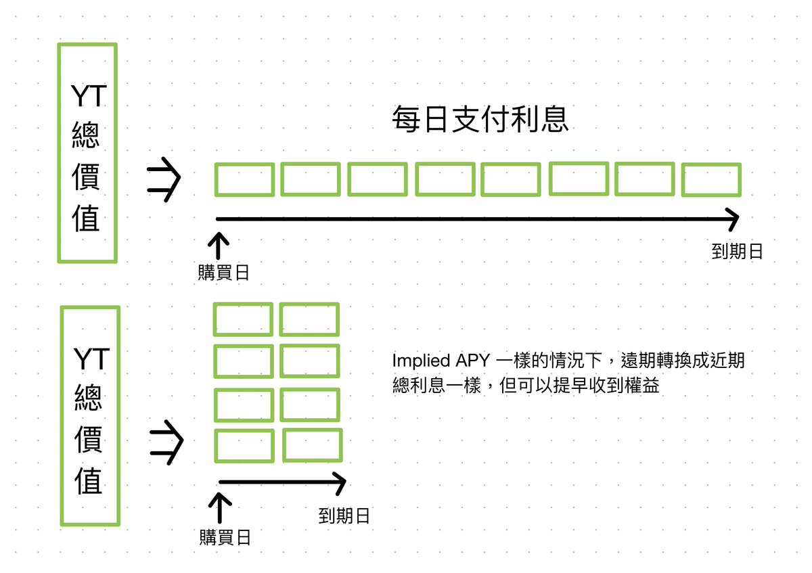
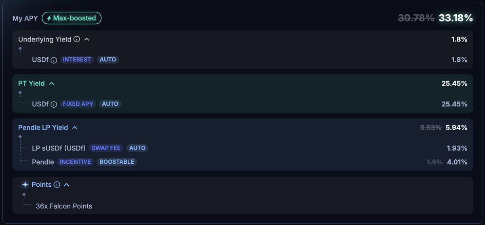

# Pendle YT 概念圖解與迷思破解

> **來源**: [@0xlemoneth](https://x.com/0xlemoneth/status/1969334453500854408)
>
> **日期**: Sat Sep 20 09:34:56 +0000 2025
>
> **標籤**: `Pendle` `YT 策略` `積分優化`

---

## 核心概念

### YT（權益代幣）定價機制

在購買 YT 時，實際上是**按照 Implied APY 租借底層資產**，持續到到期日為止，保留所有持有期間的權益。到期日時租借費用付完，資產還回，YT 價值歸零。

**定價公式範例**：
- Implied APY = 20%
- 到期日剩餘 100 天
- 購買 10,000 YT

每日租借費用 = (10,000 × 20%) / 365 = 5.48
預收 100 天利息 = 5.48 × 100 = 548（YT 總價）+ 手續費

### 末日 YT 現象

**為何接近到期日時 Implied APY 飆高？**

越接近到期日：
- 支付利息的天數縮短
- 即使 Implied APY 很高（每日利息高），總價仍不高
- 相同金額可買到的 YT 數量大幅增加
- LP 池提供的 YT 數量固定（由池內 SY 數量決定）
- 小金額即可撬動大量 YT → Implied APY 波動劇烈

## 重要發現：購買時機與收益關係

### 相同 Implied APY 下的時間等價性

**核心結論**：只要 Implied APY 相同，不論何時購買，到期日獲得的積分/收益完全相同。

**數值範例**（Implied APY = 20%）：

| 購買時間點 | 投入金額 | 每日支付 | 可購買 YT | 總持有天數 | 積分總量 |
|-----------|---------|---------|----------|-----------|---------|
| 到期前 100 天 | 2,000 U | 20 U | 36,500 YT | 100 天 | 2.19 億分 |
| 到期前 50 天 | 2,000 U | 40 U | 73,000 YT | 50 天 | 2.19 億分 |

**計算邏輯**：
- 36,500 YT × 100 天 = 73,000 YT × 50 天
- 對於固定積分項目（如 $usdf 每天 60x、$usde 每天 60x），最終積分完全相同

### 遠期 YT 投資考量

以 Falcon Finance 1/29 到期超遠期 YT 為例（130 天到期）：

**不適合場景**：
- **衝 TGE 前積分**：購買時預付 130 天利息，但若 TGE 後 Implied APY 下降，賣出時後續利息回收變少，效率不佳

**適合場景**：
- **衝 TGE 後第二期積分**：不用急於現在購買，除非預期 130 天內 Implied APY 不會再低於當前值

**核心策略**：到期日前任一時間點購買，在到期日結果相同，**不用 FOMO 跟風搶購**。

## 案例分析：$susdf vs $usdf

### $susdf 遠期池（72x 回歸 36x 後）

- Implied APY：22%
- 假設長期底層回報：9%
- 實際利息成本：13%
- 積分倍數：36x
- **每 1% 利息成本對應積分**：36x / 13% = **每 1% 成本換 2.77x 積分**

### $usdf（60x 積分）

- 利息成本：19%
- 積分倍數：60x
- **每 1% 利息成本對應積分**：60x / 19% = **每 1% 成本換 3.16x 積分**

**性價比對比**：
- $usdf 相對 $susdf 打了 **85 折**（3.16 / 2.77 ≈ 1.14）
- 同金額購買 19% YT 比 22% YT 數量更多（資金使用率更高）
- 底層資產收益雖降低歸零風險，但同時降低資金使用率（對純買分策略不利）

**結論**：若目標是購買積分，現階段 $usdf 性價比更高。

## 遠期與近期 YT 的 Implied APY 差異

**為何遠期 Implied APY 通常較低？**

策略拆解：
1. 賣出遠期 YT（= 買入遠期 PT）
2. 用相應金額購買近期 YT
3. 結果：將未來所有權益濃縮到近期

**邏輯**：
- 積分類資產越早拿到越好
- 若兩池 Implied APY 相同 → 可無損將遠期積分匯聚到近期
- 若遠期 Implied APY 較低 → 支付價差來換取權益時間提前

## LP 組池策略

### 純積分策略最佳方案

如果目標只是透過 Pendle 拿 60x 積分，而不想處理 YT 複雜機制：

**推薦方案**：組 LP + 開啟 **YT-Mode**

優點：
- 最大化積分倍數
- 只需承擔進出點的無常損失（相對購買 YT 小很多）
- 避免 YT 時間價值歸零風險

### LP 收益結構（三部分）

1. **PT 部分隨時間增值**：由拆 SY → PT + YT 後賣 YT 獲得（若開 YT-Mode，此部分轉為 YT 持有）
2. **流動性手續費**：提供交易對流動性賺取
3. **Pendle 代幣獎勵**：
   - 無質押 vePendle：1x 基本倍數
   - 質押加權最高：2.5x（需提供流動性比重 = 質押 Pendle 比重）

### Falcon 9/25 池實例拆解

**池內構成**：80% PT + 20% SY  
**當前 YT 收益率**：32%

| 收益來源 | 計算方式 | 年化收益 | 備註 |
|---------|---------|---------|------|
| 賣 YT 成 PT | 32% × 0.8 | **25.45%** | 開 YT-Mode 則無此收益 |
| Pendle 獎勵 | 無質押加權 | **1.6%** | 官網顯示 4.01% 需質押加權 |
| 協議底層收益 | 9% × 0.2 | **1.8%** | 僅 SY 部分享有 |

**積分計算（未開 YT-Mode）**：
- 投入 1,000 sUSDF
- 實際擁有 SY：200 sUSDF（20%）
- 每日積分：200 × 36x = **7,200 分**

**積分計算（開啟 YT-Mode）**：
- 保留完整 SY 部分的 YT
- 每日積分：1,000 × 36x = **36,000 分**

### YT-Mode 關鍵提示

**必須開啟場景**：
- 目標是積分而非收益的項目
- 例：Strata，單純持有 30x 分數，透過 Pendle 有 60x 積分
- 若不開 YT-Mode → 將 YT 積分賣成收益 → 與初衷背道而馳

## 實用技巧：降低手續費

### 遠期 YT 手續費優化

**問題**：遠期 YT 手續費受到期日影響，每單位 YT 手續費較昂貴（如 1/29 到期 Falcon YT 直接購買手續費達 1% 以上）

**解決方案**：使用**掛單**方式
- 可設定購買總額 + Implied APY
- 手續費由吃單方支付
- 節省顯著成本（1% 以上）

## 技術備註

**Implied APY 實際計算**：採用 `e^Yield - 1` 無限複利公式，與直接平均分配每日利息略有差異。但因百分比不大且時間較短，影響微小，本文概念講解忽略此差異。
