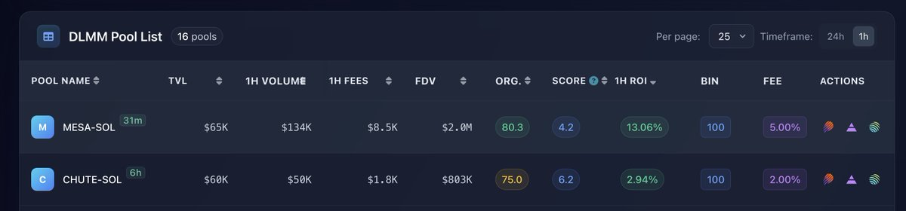
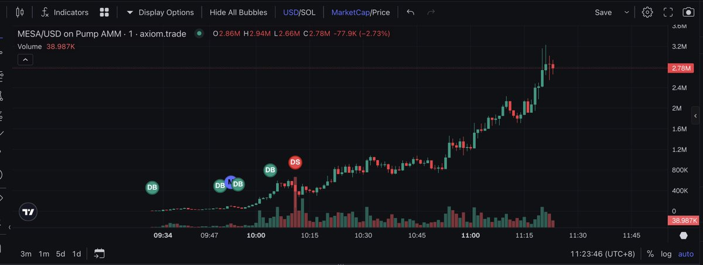
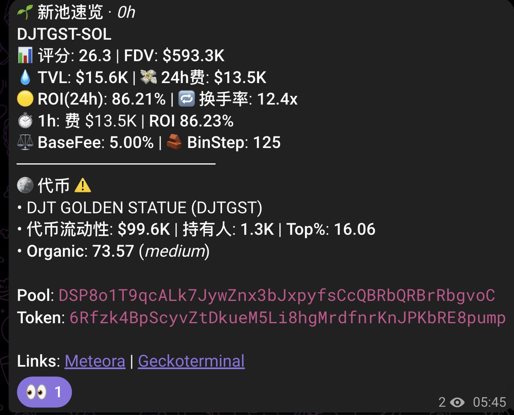
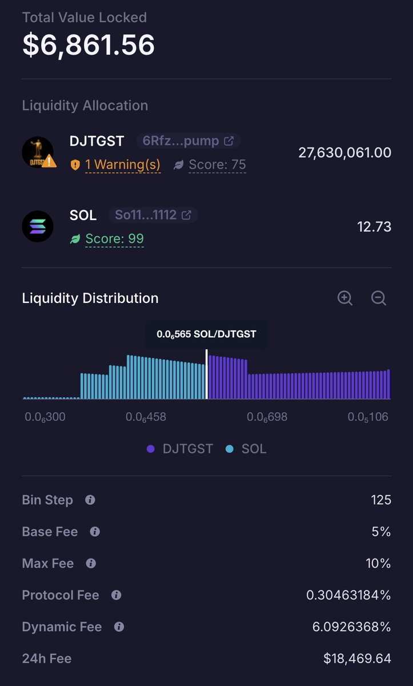
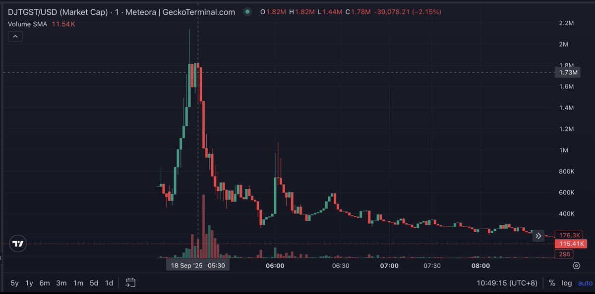

# LP 池子高效篩選策略 — 1 小時 ROI 優先

> **來源**: [@gm365](https://x.com/gm365/status/1968879083158151470) | [原文連結](https://twitter.com/gm365/status/1968879083158151470/photo/1)
>
> **日期**: Fri Sep 19 03:25:28 +0000 2025
>
> **標籤**: `LP策略` `資金效率` `快進快出`

---

> **來源**: [@gm365](https://twitter.com/gm365)
> **日期**: 2025-02-18
> **標籤**: `LP池子` `ROI` `流動性挖礦` `篩選策略`

---

## 少即是多

剛才給網站添加了新的過濾條件：

1️⃣ 1 小時 fees > $100
2️⃣ 1 小時 ROI > 0.1%

現在打開網站，基本頁面就可以瀏覽完畢，而且默認排序為：

**1 小時 ROI 倒序**

基本上，第一眼就能看到最有 LP 價值的那一個或幾個池子。

## 核心策略

既然快進快出，那麼就不必關注太長的時間窗口，只爭朝夕。

## 篩選參數

| 指標 | 閾值 |
|------|------|
| 1 小時手續費 | > $100 |
| 1 小時 ROI | > 0.1% |
| 排序方式 | 1 小時 ROI 倒序 |
