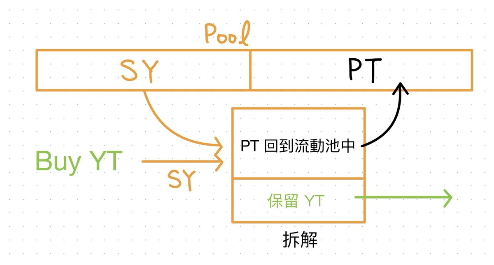
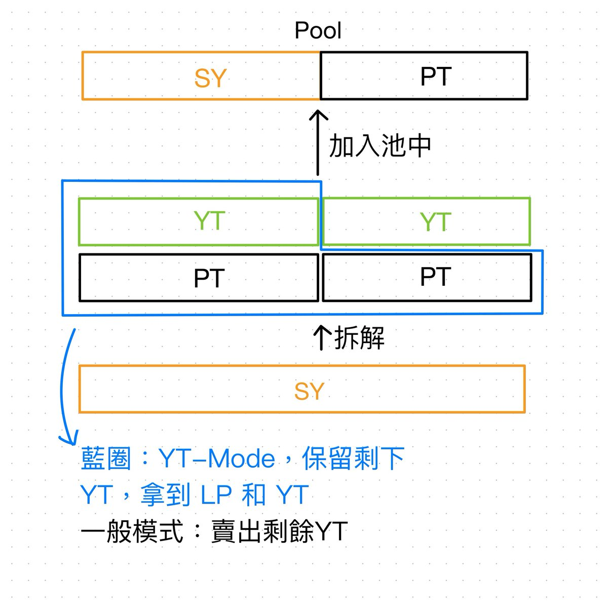

# Pendle 機制詳解：PT、YT、LP 與 Implied APY

> **來源**: [@0xlemoneth](https://x.com/0xlemoneth/status/1967969280605274486)
>
> **日期**: 
>
> **標籤**: `Pendle` `流動性挖礦` `收益農業`

---

> **來源**: [@0xlemoneth (0xLemon)](https://twitter.com/0xlemoneth)
> **日期**: 2025-09
> **標籤**: `Pendle` `DeFi` `YT` `PT` `LP` `Implied APY` `Falcon Finance`

---

## 背景

最近因為 @falconfinance 的火熱，@pendle_fi 的討論度也大增，9/25 到期的 $susdf 池子每天都幾千萬交易量,甚至突破一億大關。

Pendle 是這一輪最大的創新之一,但由於其概念複雜,對於新手加入不是很友善。本文將詳細介紹 Pendle 的核心機制。

## Pendle 三種資產類型

代幣在 Pendle 上會被分成三種資產:

### SY (Standardized Yield)
- 底層資產在 Pendle 上的包裝版本
- 隨時可以 1:1 兌換回底層資產
- 或是拆解成 1 PT + 1 YT

### PT (Principal Token) - 本金代幣
- 持有直到到期日可以 1:1 換回 SY 代幣
- 通過購買時折價買入,折價即為持有到到期日的收益
- 價值隨時間逐漸趨近於 1 (到期時等於 1)

### YT (Yield Token) - 權益代幣
- 持有 YT 即等於持有一個 SY 資產
- 享受其持有權益(積分、質押獎勵等,不同項目不同)
- 到期時價值歸零(因為預付利息已經花完)

## Implied APY 的含義

Pendle 的資產價值都會受到時間影響,因此通常都使用 Implied APY 來表示,去除了時間的影響因素,對於判斷價格高低較方便。

### PT Implied APY
- 計算公式: (折價賺取部分 / PT 購買價格) / 到期日
- 等於你從購買直到到期日每天可以獲得的年化收益

### YT Implied APY  
- 代表你"租借"這個資產所需要付的利息
- 在購買時一次預付完所有時間的利息
- 所以到期時你就得把資產還回去
- 而你持有的 YT 價值就隨著每天幫你付利息花完歸零了

## 資產定價機制

### 為什麼用 SY + PT 組成 AMM 池?

因為 YT 和 PT 的價格相差巨大,一個是本金,一個只是利息,所以無法透過這兩種資產來組成 AMM v2 池(池內兩種資產的價值要相等)。

在組 LP 時,是透過 SY + PT 來組成:
- 因為 **SY = PT + YT**
- SY 內建了 YT 價值
- 透過這兩種資產在池內的比值,就可以決定 YT 的價值

### 定價邏輯

雖然看起來很複雜,但其實這些都只是為了定價 YT 的價值:
- 只要決定了 YT 價值,就等於決定了 PT 價值
- 因為兩者相加必為 1
- 所以 PT 的價值可以看成是被動決定的,只要拿 **1 - YT 價值** 即可

## YT-Mode 機制詳解

### 什麼是 YT-Mode?

現在很多項目都會鼓勵你存入 Pendle,因為 Pendle 是一個資產沉澱的好去處。透過和 Pendle 的合作,可以大大的提升項目的 TVL。所以項目方都會給予 Pendle 資產最大的積分倍數,吸引用戶儲存資產。

### 哪些資產能擁有權益?

在 Pendle 中,能擁有權益的資產是:
- YT 本身
- LP 中的 SY 部分

註: LP 中的 PT 部分等於是把 YT 拆了賣給別人,在別人身上持有,所以這部分的權益是給買了 YT 的人。

### YT-Mode 的作用

YT-Mode 決定你要不要把本來身上的部分 SY 拆成 PT + YT 後, YT 要不要賣掉繼續去組成池子:

**開啟 YT-Mode**:
- 會把這部分 YT 留下來
- 你組進池子內的資產比值 = 池子本來的比值
- 在你組完之後因為比值不變,因此不會影響 YT 的價格
- **如果你的資產量大或是池子比較小,最好打開 YT-Mode 避免大幅度影響價格**

**關閉 YT-Mode**:
- 會把 YT 賣掉組成更多 LP
- 可能會影響池子的 YT 價格

## 組 LP 的收益來源

組 LP 的收益主要分成三個部分:

### 1. PT 部分隨時間增值帶來的收益
- 由你拆 SY 變成 PT + YT 後賣 YT 得來
- **如果你開了 YT-Mode,實際上是沒有這段收益的**(變成 YT 持有在你身上了)

### 2. 提供流動性帶來的手續費收益
- 來自交易手續費分潤

### 3. Pendle 提供的 PENDLE 代幣收益
- 如果你沒有質押 vePendle 的話只會有 1x 基本倍數
- 隨著你在池內提供的流動性比重 = 你質押的 PENDLE token 相對總質押比重,會逐步提升到最高 2.5x
- 不過這部分一般人很難達到
- **官網首頁顯示的是 2.5x 過的,所以實際上你還是要點進去看才準**

## 實際案例：Falcon sUSDf 9/25 池

以最近火紅的 @FalconStabl 9/25 池來舉例:

### 池子組成
- 池內 80% 都是 PT
- 目前 YT 收益率為 32%

### 收益拆解

**PT 增值收益**:
- 組成 LP 光賣成 PT 就可以獲得相對於本金約 **32% × 0.8 = 25.45%** 收益

**Pendle 代幣收益**:
- 沒有質押加權的話是 **1.6%**
- 不是顯示的 4.01%

**SY 協議收益**:
- SY 部分擁有的協議 9% 年化
- 因為 SY 只佔了 20%
- 相對於本金是 **9% × 0.2 = 1.8%**

### 積分計算

提供 LP 的積分也是由 SY 來計算的:
- 如果你放了 1000 sUSDf,但**沒有開 YT-Mode**
- 則你一天只會有 200 sUSDf 可以賺取 36 分
- 等於一天只有 **7200 分**

### YT-Mode 的重要性

**如果主要是想要積分,而不是為了收益**: YT-Mode 絕對要開,不然積分會被你賣成收益了。

**案例**: 
- 前幾天的 @strata_money
- 單純持有只有 30x 分數
- 但透過 Pendle 有 60x 積分
- 很多人是為了積分才存 Pendle 的
- 如果又把 YT 積分賣了,就和原本的初衷背道而馳了

## 總結

以上就是 Pendle 的基礎概念。要先了解了之後看到其他人的分享才能了解裡面的操作邏輯。

Pendle 絕對是這輪最大的創新之一,不了解可惜!
